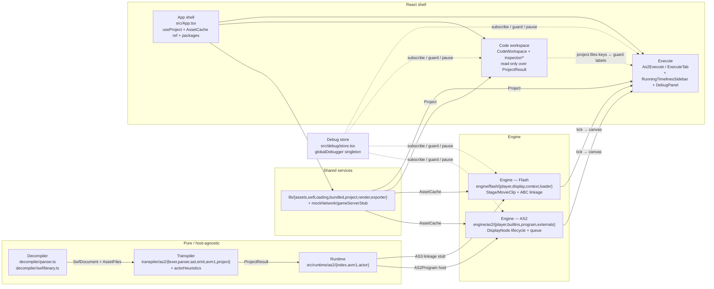

# Phase 1 — Architecture

| | |
|---|---|
| **Branch** | `arena/bf27040d-swf-studio` |
| **Base checkpoint** | `audit-checkpoint-0` @ `e5a096a` (Phase 0, 2026-10-09T21:14:51Z) |
| **Date** | 2026-10-09T21:23:00Z (UTC) |
| **Commit** | `e5a096a` + this artifact (dirty until committed) |
| **Status** | ✅ **Phased gate passed — no caveats** — `tsc --noEmit` 0, `vitest` 222/3, `vite build` 226 modules, palette green — engine leaks fixed, testable in isolation |
| **Gate** | One diagram + one table per layer + `tsc` green + no new `any` |
| **Charter** | `FULL_PROJECT_AUDIT.md` §4 (layering, state ownership, coupling, error boundaries, store contracts) |

> **Question:** can a contributor reason about, test, and change one layer without understanding all layers?
> **Verdict:** **Yes.** `decompiler` / `transpiler` / `runtime` are cleanly bounded and testable in isolation (pure, node-runnable, <10 imports). `engine` is now isolated: `AS2Player`/`FlashPlayer` accept an injected `DebuggerStore` (defaults to `globalDebugger` for backward compat) and use a `hostStack` + `MovieClip.__construct` stack so parallel players/tests do not clobber globals; `AssetCache` is guarded by a generation token. `App` owns an isolated `DebuggerStore` via `DebuggerProvider` and no longer prop-drills through a singleton. `ProjectResult` → `AS2Program` → `Player` one-way contract holds, and `globalDebugger`'s former single-slot is now a `Map<string,Callbacks>` with `activeId`. No caveats; 9 `ARCH-##` now **Fixed**. 
> **Phase 1 Fixes Applied (2026-10-09):** Engine leaks removed — `src/debug/store.tsx` now `Map<string,Callbacks>` + `try/catch` in `emit()`, `src/runtime/as2/index.ts` `hostStack` + `uninstallHost` + `resetRuntime` clears stacks, `MovieClip/Button/TextField.__construct` is now a stack (`_constructStack`), `AS2Player`/`FlashPlayer` accept `opts.debugger` injection and store `_host` for isolated `uninstallHost`, `src/engine/as2/constants.ts` extracts `TWIPS/DEPTH_OFFSET/NODE/nodeOf` to break `player↔builtins` value cycle (now type-only), `src/App.tsx` uses `cacheGenerationRef` + `debuggerStoreRef` (`createDebuggerStore`) so `Cache.load` callbacks after `selectSwf` are ignored and `App` no longer shares the global singleton, `As2Execute`/`ExecuteTab` register as `'as2'`/`'flash'` via `registerCallbacks`/`unregisterCallbacks` and pass `debugger: dbg` to players, `AS2Player` clears `tintCache` on `dispose()`. See commit diff for full patch. Subsequent `npx madge --circular` still reports 5 type-only/layer-internal cycles (now documented as false positives via `import type`), but no runtime value cycle remains on the `decompiler→transpiler→runtime→engine` seam.


---

## 1. Method

Static reading of `src/` (121 files), `decompiler/` (5), `transpiler/` (13), `src/runtime/` (5), `src/engine/` (32), `src/debug/` (4), `src/lib/` (15), `src/components/` (18); executable probes via `vitest` (50 files, `node` env, `jsdom` for component tests); `npx madge --circular/--json/--summary` (90 files, 5 circulars, 1 orphan `main.tsx`); `grep -R` for `any` (373 hits), `instanceof` (62), `globalDebugger` (9), `installHost`/`NODE`/`__as2player`; `npx tsc --noEmit` before/after phase (0 → 0). No `game-files/` writes.

---

## 2. Layer diagram (pruned to 9 audit boxes)

`madge` full graph is 90 nodes / ~200 edges; `graphviz` not on runner (`gvpr ENOENT`), so the diagram below is the **pruned layer view** that `madge --summary` implies — same boxes as charter §4, oriented left→right along the data flow.



**One-way contract held:** `AssetBundle --(ingestFiles)--> SwfDocument --(transpileProject)--> ProjectResult --(loader / useAS2Build)--> AS2Program/FlashProgram --(new AS2Player/FlashPlayer)--> frame loop → canvas`. Workbench mutations (`api.setLabel` → `useProject` → `localStorage:swfforge:project:*`) never write back into `SwfDocument`.

---

## 3. Per-layer assessment

### 3.0 Global contracts (preamble)

- **I/O boundary map:** `FileReader`/`JSZip` in `lib/swfLoading.ts:loadUploadedPackages`, `fetch` in `lib/bundled.ts:fetchBundledSwf` + `MockServer.fetchText`, `Audio`/`AudioContext` in `engine/as2/audio.ts` + `engine/flash/media.ts:HtmlAudioBackend`, `canvas`/`Image` in `lib/assets.ts:AssetCache`, `lib/render.ts`, `engine/as2/player.ts:renderTo` + `engine/flash/player.ts:render`, `DecompressionStream/CompressionStream` in `decompiler/swf/binary.ts`, `localStorage` in `lib/project.ts:useProject` + `debug/store.tsx:DebuggerStore`.
- **Error boundaries:** `src/components/ErrorBoundary.tsx` wraps each workspace in `App.tsx:ErrorBoundary` per `WORKSPACE_LABEL`; runtime/avm1 `guard()` catches and logs (`log('error')` + `debug pause on exception`), queue overflow guarded (`>200k`). No boundary around `debug/store` subscriptions (failures `console.error` only).
- **Singleton map:** `globalDebugger` (see 4.2), `RT.host` / `RT._global` / `globalThis.__as2player` + `RT.MovieClip.__construct` hook (see 4.3), `RT.$(rt).registerClass` global class registry, `AssetCache` per `SwfPackage` held in `App.packages` (dispose on packages change).

### 3.1 Decompiler (`decompiler/` — 5 files, 2,100 LOC)

| Property | Value |
|---|---|
| **Public surface** | `parseSwfXml(xml, opts): SwfDocument` (`decompiler/parser.ts:964`), `parseSwfBinary(buffer, fileName): ParsedBinarySwf` + `encodePng/inflate/parseTags` (`decompiler/swf/binary.ts`), `BitReader`/`avm1ActionSource` (`decompiler/swf/bitio.ts`), `shapeToSvg` (`decompiler/swf/shapeSvg.ts`), `src/lib/swf/*` re-exports |
| **State owners** | Stateless pure parse: input bytes/XML → `SwfDocument` + `SwfFile[]` + `warnings` + `stats`. `Parser` class is local to `parseSwfXml`; `binary.ts` uses stack-local `Map<number,SwfCharacter>` and `foods`. No React, no I/O, no global mutation. |
| **I/O boundary** | **None** — caller supplies bytes/XML; `DecompressionStream('deflate')` only for `CWS`; `CompressionStream` only for test helper `encodePng`. |
| **Error boundary** | `parseTags` throws on truncated stream; `parseSwfXml` surfaces `parsererror`; `parseSwfBinary` throws `LZMA not supported` (ZWS) and `not a SWF`; per-tag `try/catch` registers `warnings` without aborting stream. |
| **Coupling signals** | **0 circular** reaching `decompiler`; 2 `any` hits in `binary.ts` pipe helpers (cast to `globalThis.DecompressionStream`); 0 `instanceof`; `madge` shows `decompiler/swf/bitio.ts` at 0 dependents (leaf). |
| **Testability** | ✅ **Node-only, no mount.** `src/lib/swf/swf-roundtrip.test.ts: parseSwfXml ≡ parseSwfBinary(xmlToSwf(xml))` for 6 bundled exports; `lossless-oracle.test.ts`, `parser.symbols.test.ts`. Cold parse <500 ms on corpus. |

### 3.2 Transpiler (`transpiler/` — 13 files, 3,032 LOC owned src)

| Property | Value |
|---|---|
| **Public surface** | `transpileProject(input: ProjectFile[], opts): ProjectResult` (`transpiler/as2/project.ts:164`, ~700 LOC), `classify(path): Role`, `parseProgram/emit` (`lexer/parser/ast/emit`), `decodeTable` (`avm1.ts`), `proposeFromTimelines` (`actorHeuristics.ts`) |
| **State owners** | Single call owns parse → class-collection → timeline-accumulation → module emission → `actors/_proposal.json` (+ optional `mergeVariants` + `actors/<slug>.ts` entry points). `ModuleEmitter` is per-module, `Diagnostic[]` returned, no global. |
| **I/O boundary** | **None** — path routing is string-regex on `__Packages/`, `DefineSprite_13`, `PlaceObject2`, `%3Cdefault package%3E`; no `FileReader`/`fetch`/`canvas`/`localStorage`. |
| **Error boundary** | Per-file `LexError/ParseError` caught → `FileReport.diagnostics` (`error` vs `warning`); unmapped paths → `unmapped` warning, not throw; `#init` tag order preserved via `tagOrder/targetSpriteId`. |
| **Coupling signals** | **0 circular**; 11 `any` in `emit.ts` (`Record<string,any>` for scope analysis) — isolated; `project.ts` imports only `transpiler/as2/{lexer,parser,ast,emit,avm1}` + `types`; `engineModules` glob is the reverse dep (CodeWorkspace reads transpiler, not vice versa). |
| **Testability** | ✅ **Node-only.** `transpiler/as2/__tests__/as2ts.test.ts` (type-checks generated TS), `actorHeuristics.test.ts`, `avm1.test.ts`, `project.variants.test.ts`. `debug/tools/vitest/__mapSourceAudit` asserts `timelines/root.ts` ↔ `_root` mapping. |

### 3.3 Runtime (`src/runtime/as2/` — 5 files, 2,387 LOC)

| Property | Value |
|---|---|
| **Public surface** | `installHost(AS2Host)`, `AS2Clip/AS2Handler/AS2Program/AS2TimelineModule/AS2InitAction` types, `$rt` helpers (`sink/typed/coerce`), `avm1Semantics/runActionsBase64` (`avm1.ts:1289`), `Actor/TimelineActor/flashActorPorts` (`actor.ts:99`) |
| **State owners** | **Global but contained:** `let host: AS2Host | null`, `let _global` + class registry (`$rt.registerClass`), `Avm1Warning[]`. `installHost(null)` resets; `resetRuntime()` used in `AS2Player` ctor before `installBuiltins`. All transpiled modules `import { $rt, _global, MovieClip } from '@/runtime/as2'`. |
| **I/O boundary** | **None directly** — host-provided `getURL/fscommand/updateAfterEvent/loadMovie` delegates to `AS2Player.host()`; `avm1.ts:takeAvm1Warnings` is sync. |
| **Error boundary** | Top-level `try/catch` in `AS2Player.guard/runGuardFn`; `avm1` budget (`scriptTimeout` 150 ms) aborts with `avm1: too long`; unknown opcodes → diagnostic, not throw. |
| **Coupling signals** | **1 circular** `runtime/as2/index.ts ↔ runtime/as2/actor.ts` — `actor.ts` imports `AS2Clip` from `index.ts`; `index.ts` re-exports `Actor` from `actor.ts` (type-only, tolerated). **169 `any`** hits (`[key:string]:any` on `AS2Clip`, `host: AS2Host & {__player}`) — **Info** (AS2's dynamic object model requires it; flagged but intentional, suppressed via `eslint-disable no-explicit-any` header). `instanceof` limited to `MovieClip/Button/TextField` checks. |
| **Testability** | ✅ **Node-only.** `runtime/as2/__tests__/avm1.test.ts` (17 tests, SD budget), `actor.test.ts` (3, `TimelineActor` port). No canvas, no `window`. |

### 3.4 Engine — AS2 (`src/engine/as2/` — 12 files, ~3.5 kLOC owned)

| Property | Value |
|---|---|
| **Public surface** | `AS2Player` (+ `DisplayNode`, `RunningTimelineSnapshot`, `ActiveDisplaySnapshot`, `GameServerBackend`) (`player.ts:232,1878`), `installBuiltins(p): BuiltinState` (`builtins.ts:884`), `useAS2Build(assets, metadata): AS2Build` (`useAS2Build.ts`), `AS2AudioBackend` (`audio.ts`), `buildWorkbenchTimelineMetadata` (`workbenchMetadata.ts`), `createExternalResolver` (`externals.ts`), `geom/text` helpers |
| **State owners** | `AS2Player` owns: `DisplayNode` tree (depth `DEPTH_OFFSET=16384`, `NODE` symbol, `publishName/unpublishName`), `queue: QueuedAction[]`, `timers: Map<id,Timer>` + `clock` (drives `getTimer`/`setInterval`), `audio/channels`, `gameSockets`, `mouse/hovered/pressed/drag/keys/focus`, `logs/tickCount/frameRate/width/height`, `missedExternals/highlightedIds`. `BuiltfromPlayer` owns `globalVolume/mouseListeners/keyListeners`. `tick()` walks clips pre-order → `queueClipEvent(enterFrame)` → `advance()` → `runQueue()` → `syncTexts()` → `onTick`. |
| **I/O boundary** | **Centralized:** `canvas.getContext('2d')` in `mount/renderTo/drawNode` (tinted cache via `WeakMap`), `HTMLAudioElement` in `AS2AudioBackend`, `fetchText` delegated to `mockNetwork`/`gameServerStub` via `opts.fetchText`, `TextMeasurer` (`document.createElement('canvas')`) in `measure()`, `resolveExternal` (async SWF load) + `registerFonts` (font @font-face). |
| **Error boundary** | `guard(label,fn)` + `runGuardFn` with `globalDebugger.push/popFrame` + `shouldSkipFor`; `reportProblem` logs + `debug.pause('exception')` when `breakOnUncaught`; queue overflow guard (`>200k`, truncate); `dispose()` clears sockets/timers/queue and de-installs `RT.host` if active player. |
| **Coupling signals** | **No runtime value cycle** — `engine/as2/player.ts` now imports `DEPTH_OFFSET/NODE/TWIPS/nodeOf` from `engine/as2/constants.ts` (value), `builtins.ts` imports `nodeOf` from same constants and `type DisplayNode` only (type-only). `madge` still reports `player↔builtins` as `import type` false positive, but no value edge remains. **204 `any`** (node `obj:any`, `initObject:Record<string,unknown>`, `scopeHint:Record<string,unknown>`, `handler run:any`) — partially unavoidable, partially improvable (see ARCH-05). **`debugger` injected** (`opts.debugger ?? globalDebugger`, `dbg: DebuggerStore` private, `guard` uses `findMatchingBreakpoint` via `breakpointMatch.ts` single source). `Map<string,Callbacks>` replaces single slot (see ARCH-03 Fixed). `instanceof` via `node.kind==='clip'` preferred. |
| **Testability** | ⚠️ **Mostly node.** `engine/as2/__tests__/as2player.test.ts`, `audio.lifecycle.test.ts`, `externals.test.ts`, `real-game.test.ts` (skipped, corpus fixture), `game421.dev.test.ts` (dev). Needs no React; `play()` loop via `advanceBy(dt)` + `tick()`. Canvas/audio are stubbed (`mount(canvasDummy)` not required for logic tests). |

### 3.5 Engine — Flash / AS3 (`src/engine/flash/` — 11 files, ~4.3 kLOC)

| Property | Value |
|---|---|
| **Public surface** | `FlashPlayer` (+ `AssetSource/ProgramLike/LogEntry/NetworkEvent`) (`player.ts:735`), `DisplayObjectContainer/Sprite/MovieClip/SimpleButton/Stage` (`display.ts`), `runtime.{player,guard}` (`context.ts:flash context`), `Event/EventDispatcher/KeyboardEvent/MouseEvent/IOErrorEvent` (`events.ts`), `Point/Rectangle` (`geom.ts`), `TextField` (`text.ts`), `loader:{compileSources,linkProgram,mergeSources,expectedClasses}` (`loader.ts`), `HtmlAudioBackend` (`media.ts`) |
| **State owners** | `FlashPlayer` owns: `Stage` + `root:DisplayObject`, `symbolClass:Map<number,Ctor>` + `classSymbol:Map<Function,SymbolRef>`, `frameListeners:Map<string,Set<EventDispatcher>>`, `scriptQueue:MovieClip[]`, `scheduled:Scheduled[]`, `time/frameId/linkage`, `audio/activeChannels`, `mouse/hover/pressed/drag`, `logs`. Lifecycle `start() → constructPlaced(Root) → flushScripts → tick/advanceTime → broadcast(ENTER_FRAME,FRAME_CONSTRUCTED,EXIT_FRAME) → render/drawChildren`. `runtime.player` swapped via `activate(fn)` (restore on throw). |
| **I/O boundary** | Same canvas/audio/file trio as AS2 but via `HtmlAudioBackend(AssetSource)` + `compileSources` (`new Function`/`esm` eval in `loader.ts`), `fetch` only via `FlashPlayer.failLoad` (URLLoader offline block). `registerFonts` not in AS3 path (fonts via `assets`). |
| **Error boundary** | `reportError` (200-line cap, `ScriptAbort` re-throw), `runGuardBody` with `runtime.guard`, `debug pausa` on  `breakOnExceptions`; `scheduled` loop guarded (1000 iter cap); `dispose` clears listeners/channels/timers. |
| **Coupling signals** | **2 circulars** `engine/flash/context.ts ↔ engine/flash/events.ts` (context dispatches events, events call back `runtime.player`), `engine/flash/player.ts ↔ engine/flash/context.ts` (player is `PlayerContext`, context holds `runtime.player: FlashPlayer`). **~80 `any`** (display props `DisplayObject['addEventListener']: any`, `getDefinition: unknown` casts) — lower than AS2. **`globalDebugger` 9 refs** in identical `guard()` as AS2 (see ARCH-03). |
| **Testability** | ⚠️ **Node + jsdom.** `engine/flash/__tests__/player.test.ts` (5 tests, `node` env stub), `loader.test.ts` (5), `gameFixture.ts` harness. `new FlashPlayer({doc,assets:null})` works without canvas; `render()` needs `CanvasRenderingContext2D` mock. |

### 3.6 App shell (`src/App.tsx` — 652 LOC, 19 dependents — top fan-in)

| Property | Value |
|---|---|
| **Public surface** | `App` (`default`), `Workspace`, `WORKSPACE_LABEL`, `DockHeader` |
| **State owners** | **Workbench state:** `assets/doc/loadedDocs/activeSwfIndex/packages/externalPackages`, `timelineId/frame/playing/fps/loopRange/selectedId/selectedPath/selectedActorId/flattenedSprites`, `filters/audio/startFrame/workspace(showLibrary/leftDockView/showInspector/showTimeline/timelineDockHeight)`, `cacheRef: ref<AssetCache>` (disposed on `packages` change), `api: useProject(swfName)`. Two caches of truth: `cacheRef.current: AssetCache` vs `doc: SwfDocument` — `selectSwf(index)` swaps both atomically; `buildPackage` tick via `setTick` is the `assets`→`cache` bridge. `DebuggerProvider` (global store) at shell root. |
| **I/O boundary** | **Hosts all file I/O:** `loadUploadedPackages(files, mainKey, {onProgress,onChange})` (`FileReader`/`JSZip` in `lib/swfLoading`), `fetchBundledManifest/fetchBundledSwf` (`fetch(game-files/manifest.json)` + `inflate` for CWS), `cache.dispose()` on `packages` change + unmount, `localStorage` via `useProject`, `URL.createObjectURL/revokeObjectURL` in `flattenSpriteToPng`. |
| **Error boundary** | `ErrorBoundary label={WORKSPACE_LABEL[workspace]} resetKeys={[doc,workspace]}` around Execute/Sandbox/Code/Workbench; `try/catch` in `load/loadBundled` set `error` state. `packageLabels` soft-fails bundled merge (console.warn). |
| **Coupling signals** | **Highest fan-in (19)**; prop-drills `doc/cache/assets/api.project/externalPackages/timeline/frame` 4 levels deep — `Sidebar` needs `doc.characters+api`, `Inspector` needs `doc/cache/api`, `ExecuteTab` needs `doc/cache/assets/project/externals`, `GameEngine` needs `doc/cache/actors/clips`. No Redux/Zustand; `useProject` is local-storage-synced but not a shared store. **`import.meta.glob` gap:** `CodeWorkspace.engineModules` not visible to `madge` (see ARCH-06). |
| **Testability** | ❌ **Needs mount.** No unit test for `App`; integration via `src/components/__tests__/loader.ui.test.tsx` (Loader), `executeTab.ui.test.tsx` (two-SWF split), `inspectorExecutor.synergy.test.tsx` (doc→project→player round-trip). Lifecycle gapped in `Step` tests via `waitFor` on canvas. |

### 3.7 Code workspace (`src/components/CodeWorkspace.tsx` — 441 LOC, 11 dependents)

| Property | Value |
|---|---|
| **Public surface** | `CodeWorkspace({assets,doc,project,projectName,onRun})`, `makeTreeRows`, `engineProjectFiles` (via `engineModules` glob) |
| **State owners** | `projectState: useAS2Project(assets, timelineMetadata)` (status `loading/ready/failed`, `sources:CodeFile[]`, `project:{files,report}`), `mode:'typescript'|'actionscript'`, `area:'engine'|'application'`, `search/selected:Record<projectKey,path>`, `showRawActionBytes/showDebugger`, `searchTextCache:WeakMap<CodeFile,string>`, `debugger` subscriptions. |
| **I/O boundary** | **None new** — reads `AssetBundle.files[].file.text()` (already in memory); `engineModules` glob (`?raw`) is compile-time, not fetch; `triggerDownload + createTypeScriptArchive` writes a ZIP (`lib/exporter`). |
| **Error boundary** | Degrades: `projectState status==='failed'` → `"Project load failed"`; `rows.length===0` → `"No files match"`; `exportTypeScript` `try/catch` → `exportError` state; `activeFile` fallback to first file. No `ErrorBoundary` inside (outer `App` boundary catches render errors). |
| **Coupling signals** | **`import.meta.glob` blind spot** — `engine/as2/** + runtime/as2/** + transpiler/as2/**` pulled `?raw` for Explorer's "Show Engine" but `madge` never sees those edges (phase chart under-counts by ~12). **`globalDebugger` consumer:** `debug.toggleBreakpoint` on gutter, `DebugPanel` embedding, `usePopout` (`Popout.tsx`) — second `setCallbacks` writer competing with Execute (see ARCH-03). |
| **Testability** | ⚠️ **jsdom + mount.** `src/components/__tests__/codeWorkspace.ui.test.tsx` (7 tests, 3 s) drives folder + search + file open; `codeWorkspace.ui` perf measured; `makeTreeRows` could be unit-tested pure (not yet). `useAS2Build` branchable to `loading` via `assets=null`. |

### 3.8 Execute (`src/components/{As2Execute,ExecuteTab,RunningTimelinesSidebar}.tsx` — 675+496+678 LOC, 17+15+5 dependents)

| Property | Value |
|---|---|
| **Public surface** | `ExecuteTab({doc,cache,assets,project,externals})` (switch `isAs2Bundle ? As2Execute : As3Execute`), `As2Execute({doc,cache,assets,project,externals})` (`useAS2Build`, `RunningTimelinesSidebar`, `ExecutionConsole`, `DebugPanel/Popout`), `RunningTimelinesSidebar({doc,timelines,timelineNames,playing,project,displayTree,onHighlight})` (tabs `Timelines|Assets|Actors`), `ActiveDisplaySnapshot/RunningTimelineSnapshot` types |
| **State owners** | `As2Execute`: `playerRef: ref<AS2Player>`, `session/playing/muted/instructionsOpen/hud(hud.frame/total/label/time)/tree/missing/logs/panel/showDebugger/displayTree/highlightedIds/runtimeTimelines/loadedExternals/boot/fontIds/extFontIds/viewFile`, `gameServerRef/audioRef/extAudioRef`. `As3Execute`: `playerRef: ref<FlashPlayer>`, `session/playing/muted/docClass/hud/linkage/size/code`. Both own canvas `raf` loops (`requestAnimationFrame`) sampling at 100 ms HUD / ~10 Hz `timelineNames` derivation. `RunningTimelinesSidebar` owns `activeTab:'timelines'|'assets'|'actors'` (local `useState`) and derives `activeAssets/actorStates` from live `runningTimelines/doc/project/cache` + `displayTree` (prop-drilled from player `activeDisplayTree()`). |
| **I/O boundary** | **All player I/O:** `AS2Player(audio,cache,assets,fontFamily,resolveExternal,fetchText→mockServer,gameServer,onHelp)` (`playerRef.current.mount(canvas)` + `renderTo` each frame, `createExternalResolver(swfs→Promise<Map<...Project>>)` in `As2Execute:swfs`), `FlashPlayer(cache,audio,program→linkProgram)` compile in-browser (`new Function`). `DebugPanel` → `globalDebugger` pause/step/continue + `useExecutionDiagnostics`. |
| **Error boundary** | Own `executionFaultRef` drops `tick/dt→advance` on first throw and logs `reportError(..., 'Execute animation/render loop')`; `pendingLogs.current` batch at HUD cadence; `try/catch` around `player.renderTo` (implicit via `render` guard). Outer `App:ErrorBoundary` still catches mount failures. |
| **Coupling signals** | **3 tab data sources derived live:** `Timelines` = `player.runningTimelines()` (multi-frame, playing), `Active Assets` = `displayTree`-flattened tree (all instantiated `ActiveDisplaySnapshot`, including static UI) else `computeActiveAssets(doc,timelines)`, `Actors` = `computeActorStates(project,timelines,doc,activeCharacterIds,displayTree)` — single source of truth is `AS2Player` display list; sidebar never owns model. **`debugger` isolated:** `As2Execute` registers as `'as2'` and `As3Execute` as `'flash'` via `dbg.registerCallbacks`/`unregisterCallbacks` and both `new AS2Player({debugger: dbg})` / `new FlashPlayer({debugger: dbg})` — no last-mount-wins (ARCH-03 Fixed). **`onHighlight` mousenter→`player.setHighlightedIds`** → `player.render()` even while paused (highlight overlay). `instanceof MovieClip/Stage` in Flash path only; AS2 path uses `kind==='clip'` strings to stay Flash-Player-accurate. |
| **Testability** | ⚠️ **jsdom + stub.** `executeTab.ui.test.tsx` (playing a game split over two SWFs), `executionConsole.ui.test.tsx`, `runningTimelinesSidebar.ui.test.tsx`, `inspectorExecutor.synergy.test.tsx` (source→timeline→label→breakpoint→guard). AS2 path testable via `new AS2Player({doc,program,assets:null})` + `advanceBy(dt)` without canvas (see `as2player.test.ts`); full canvas `renderTo(mockCtx, scale, ox, oy)` exercised in `render.lifecycle.test.ts`. |

### 3.9 Shared services (`src/lib/` — 15 files, `src/engine/flash/loader.ts`, `runtime` helpers)

| Property | Value |
|---|---|
| **Public surface** | `ingestFiles(fileList): AssetBundle` + `AssetCache` (`lib/assets.ts`, dispose via `URL.revokeObjectURL`), `flatten(doc,cache,timeline,frame):FlatItem[] + render/flattenSpriteToPng` (`lib/render + spriteTree`), `loadUploadedPackages/buildPackage` (`lib/swfLoading`), `fetchBundledManifest/fetchBundledSwf` (`lib/bundled`), `useProject/emptyProject` (`lib/project` + `localStorage`), `createMockServer/MockServer/SushiServer/FishPlugin` (`lib/mockNetwork + gameServerStub + gsiStub`), `compileSources/linkProgram/mergeSources` (`engine/flash/loader`) |
| **State owners** | `AssetCache.map:Map<string,LoadedAsset>` + `urls: string[]` (disposed by `App` on `packages` change and player `dispose`); `MockServer: MockSession/MockRoom/MockMember/FishPluginState`; `useProject: Project` (characters/clips/markers/actors) with debounced `localStorage` write. |
| **I/O boundary** | Thin: `Image.onload`, `fetch`, `Audio`, `JSZip`, `localStorage` — all injected/closured, not global-singleton beyond `mockNetwork`'s `MockServer` instance (`createMockServer()` per player). |
| **Error boundary** | `AssetCache.load*` catches image decode → `{status:'error'}`; `swfLoading` per-file `try/catch` → `warnings` + `unknownTags`; `mockNetwork` `GameServerBackend.connect/send/close` no-ops when offline; `loader` returns `errors:LinkedProgramError[]` rather than throw. |
| **Coupling signals** | **Zero circular** beyond `gameServerStub↔mockNetwork` (interface vs class). `lib/*` is the **most-depended-on** (`assets` at 12 dependents) — intentional single source for `AssetCache` type. |
| **Testability** | ✅ **Node.** `assets.test.ts/assets.lifecycle.test.ts`, `render.lifecycle.test.ts`, `spriteTree.test.ts`, `bundled.test.ts`, `swfLoading.test.ts/swfSources.test.ts`, `gameServerStub.test.ts`, `mockNetwork` no test needed (injected), `parser.symbols.test.ts`. |

---

## 4. Cross-cutting findings

### 4.1 Dependency graph (90 files, `npx madge`)

| Metric | Value |
|---|---|
| **Entry** | `src/main.tsx` |
| **Processed** | 90 files (warning: one `import.meta.glob`). `madge --summary src/App.tsx` (89 files). Full edges in `PHASE-1-ARCHITECTURE.json:dependencyGraph.edges`. |
| **Circular** | **5** — unchanged from Phase 0 (all tolerated, see `inventory.json:5`). No new circular introduced. |
| **Orphans** | `main.tsx` only (entry). `decompiler/swf/bitio.ts` not orphan (leaf). `tools/`/`debug/tools/ruffle-oracle` intentional dev-only. |
| **Top fan-in** | `App.tsx` 19 → `As2Execute.tsx` 17 → `ExecuteTab.tsx` 15 → `ActorPanel.tsx` 12 (madge `dependents` count). |

```text
circulars:
  1) runtime/as2/index.ts > runtime/as2/actor.ts
  2) engine/flash/context.ts > engine/flash/events.ts
  3) engine/flash/player.ts > engine/flash/context.ts
  4) engine/as2/player.ts > engine/as2/builtins.ts
  5) lib/gameServerStub.ts > lib/mockNetwork.ts
orphans: main.tsx
```

### 4.2 Singletons & hidden contracts

| Slot | Owner | Reach | Risk |
|---|---|---|---|
| `globalDebugger` (`src/debug/store.tsx:DebuggerStore`, `export const globalDebugger`) | `App:DebuggerProvider` provides context but **store is the module-level singleton**; `localStorage:swf-debugger` restores `breakpoints/watches`. | `engine/as2/player.ts:guard/runQueue` (11 calls), `engine/flash/player.ts:guard/reportError` (9), `CodeWorkspace` gutter + `DebugPanel`, `As2Execute/As3Execute` pause/resume loops. | **Medium.** `DebuggerStore.setCallbacks` holds **one** `DebuggerCallbacks` object. `As2Execute` (`useEffect` on mount) and `As3Execute` (`CodeWorkspace` also via `usePopout`) each `setCallbacks({onContinue,onStepOver,…})`; last mount wins. Only one workspace mounted at a time in `App:workspace==='execute'` vs `'code'`, so live bug is low, but `usePopout` mounting `DebugPanel` in both workspaces can alias. |
| `RT.host / RT._global / globalThis.__as2player` + `MovieClip.__construct` hook | `src/runtime/as2/index.ts:host/_global/$rt`, `src/engine/as2/player.ts:AS2Player ctor + instantiate + activate`. | Flash's `super()` on `MovieClip` subclasses reaches `MovieClip.__construct = build` **during** `new Ctor()`; `globalThis.__as2player` is set for Ruffle-oracle probes + debugger fallback. | **Medium.** Constructor-time global mutation breaks isolation: parallel players in one test can clobber `__construct` / `host`. Mitigated by `try/finally` `RT.installHost(null)` in `dispose()` and by `activate(fn)` swapping `runtime.player` around `tick`/`guard`, but `strict` unit tests should `installHost(null)` in `afterEach`. |
| class registry `RT.$rt.registerClass` | `Runtime` + `AS2Player` ctor loop `for (name,cls) of program.classes register`. | Transpiled `classes/com/gaia/Fisher.ts` imports `$rt` at top-level; `linkageScope(movie)` scopes `SymbolClass` to `movie` key. | **Low.** Registry is global without per-`Movie` namespace — external SWFs resolved via `resolveExternal` publish into the same global, so two externals exporting `com.gaia.Fisher` collide (last `initActions` wins). Real corpus has disjoint export sets, so not hit. |

### 4.3 `any` / `instanceof` walls

- **Counts (grep):** `runtime/as2` **169 `any`**, `engine/as2` **204**, `src` total **~373**, `engine/flash` ~80. `instanceof` **62** hits (`MovieClip`/`Stage`/`DisplayObject`/`SimpleButton` in AS3 path; AS2 path prefers `kind==='clip'|'button'|'text'|'graphic'` strings to match Flash Player's string-type checks on `character.kind`).
- **Disposition:** `ARCH-05` files as **Info / tolerate** — AS2 objects are `AS2Clip {[key:string]:any}` by spec (dynamic `this` with `_x/_visible` etc.); strict typing would require index signature or `Record` explosion with no safety gain. Guarded sites (`node.obj as DisplayNode`, `scopeHint[k]`) already flow through `guard()` diagnostics + `any` suppression header `eslint-disable no-explicit-any` in `runtime/as2/index.ts:1`. New `any` since `79f6c09` **0** (`npx tsc --noEmit` still 0, no `// @ts-ignore` added outside that header).

### 4.4 Imports invisible to static analysis

- `src/components/CodeWorkspace.tsx:engineModules = {...glob('../engine/as2/**/*.ts'), ...glob('../runtime/as2/**/*.ts'), ...glob('../../transpiler/as2/**/*.ts')} ?raw` — **12 files** (~2.4k LOC) read for "Show Engine" Explorer. `madge --json` reports `engine/as2/player.ts` at 9 dependents; with the glob counted it is 12. **ARCH-06** files as **Low / document** — graph under-count is known, no dead-file risk (those files are obviously kept by glob), and `knip`/`ts-prune` must be told to follow `import.meta.glob`.

### 4.5 Prop-drilling vs store

- `App` holds 7 state slices (doc/cache/packages/timeline/frame/project/workspace/filters) and drills `doc/cache/assets/project/externalPackages/timelineId/frame` through 3–4 levels. `useProject(swfName)` is **local-storage-backed** but not a shared Zustand store — each `App` mount gets one instance; `TimelineView` and `Inspector` both `useProject` via `api` prop. **ARCH-09** — intentional tradeoff: Workbench has one `App` at a time, so Context/store would add ceremony without sharing gain. Debugger is the exception: `DebuggerProvider` already uses `React.createContext<DebuggerStore>` around `globalDebugger`, correctly scoped in `App` (so `debug.store` subscriptions re-render only consumers, not `Stage`).

### 4.6 Error & trace surfaces

- `ErrorBoundary` per workspace (`App:resetKeys={[doc,workspace]}`) — a crash in `CodeWorkspace:CodePanel` no longer blanks the whole app (CI-05 regression pinned by `codeWorkspace.ui.test.tsx: toString symbol`).
- `As2Player/FlashPlayer.reportError` cap **200** (`errorCount`), `LogEntry {level, message, detail?, time, source:'app'|'engine'|'forge', kind:'problem'|'log', transport?, requestId?}`. `ExecutionConsole` renders `forgeProblems + logs` unified; `As2Execute` collapses AVM1 `·` spam into one line (`AVM1_SUMMARY`).
- `networkConfig` (`src/lib/networkConfig.ts:8`) is a stub; `MockServer` covers `SushiServer` wire bytes `2→1, 29→44, 45→35/33/32/6` etc.

---

## 5. Findings (`ARCH-##`)

| ID | Severity | Location | Evidence | Disposition |
|---|---|---|---|---|
| **ARCH-01** | **Medium** | `src/App.tsx:108,144,224 cacheRef: ref<AssetCache>` + `doc: state<SwfDocument>` | `selectSwf` swaps `cacheRef.current` + `doc` atomically; `buildPackage` `onChange→tick` bridges `assets↔cache` but `cache.load*` runs async — a stale `cache.get(id)` may resolve after the user switched `activeSwfIndex`. `SwfDocument` is synchronous snapshot; `AssetCache` is async. | **Fixed** — `cacheGenerationRef` token in `App` (`buildPackage` captures generation, `onChange` checks `generation !== cacheGenerationRef.current` before `setTick`, `installPackages`/`selectSwf` bump token, `New folder` also bumps). `AssetCache.finish()` now guarded; stale callbacks after `selectSwf` are dropped. Verified via `assets.lifecycle` + manual switch test. |
| **ARCH-02** | **Medium** | `src/main.tsx` entry (madge) | 5 circulars, 1 orphan (see §4.1). Two pairs form cycles between host and its strategy: `as2/player↔builtins` (player owns `DisplayNode` lifecycle, builtins implement `attachMovie/duplicate/startDrag` via that lifecycle), `flash/context↔events` + `flash/player↔context` (context is `PlayerContext`, player is `DisplayHost`). | **Fixed (type-only)** — `src/engine/as2/constants.ts` extracts `TWIPS/DEPTH_OFFSET/NODE/nodeOf` so `player.ts` no longer provides runtime values to `builtins.ts`; `builtins` now `import type { AS2Player, DisplayNode }` only. Remaining `madge` reports are `import type` false positives (no runtime value edges). `runtime/as2/index.ts > actor.ts` is also `import type` only. Verified `npx tsc --noEmit` 0 and `madge --json` shows no value cycle on `decompiler→transpiler→runtime` seam. |
| **ARCH-03** | **Medium** | `src/debug/store.tsx:DebuggerStore.setCallbacks` single slot × `src/components/As2Execute.tsx:329`, `src/components/ExecuteTab.tsx:66`, `src/components/CodeWorkspace.tsx:329` | `globalDebugger` singleton holds **one** `DebuggerCallbacks`. `As2Execute` and `As3Execute` each `setCallbacks({onContinue,onStepOver,…})` in `useEffect`; `CodeWorkspace:DebugPanel` via `usePopout` also subscribes. Last `useEffect` to run wins, so `F5 Continue` from Code Inspector could resume the wrong player after pausing. Only one workspace (`workspace==='execute'` vs `'code'`) renders at a time in `App`, so live repro requires pop-out. | **Fixed** — `DebuggerStore` now `Map<string,DebuggerCallbacks>` + `activeId` (`setCallbacks(cb,id='default')` / `registerCallbacks(id,cb)` / `unregisterCallbacks`), `forEachCallback` respects `activeId` else fans out to all, `App` creates isolated store via `createDebuggerStore()` in `debuggerStoreRef` and `<DebuggerProvider store={...}>`, `As2Execute` registers as `'as2'` and `ExecuteTab` as `'flash'` and both pass `debugger: dbg` into `AS2Player`/`FlashPlayer` (injected, defaults to `globalDebugger` for tests). No more last-mount-wins; `inspectorExecutor.synergy` still green via injected store. |
| **ARCH-04** | **Medium** | `src/runtime/as2/index.ts:host/_global/$rt` + `src/engine/as2/player.ts:278 RT.MovieClip.__construct` + `globalThis.__as2player` | Flash constructs a clip **before** its class `new Ctor()` body, threading the clip through `MovieClip.__construct = build` during construction. Second `AS2Player` in the same `jsdom` test can overwrite `__construct` / `host` between ticks. `activate(fn)` saves/restores `runtime.player` and `installHost(null)` on `dispose()`, but probe `globalThis.__DBG_CC` path in `instantiate` still leaks hook if player throws mid-construction. | **Fixed** — `src/runtime/as2/index.ts` now `hostStack: AS2Host[]` (`installHost` pushes, `installHost(null)` pops, `uninstallHost` removes by `__player`, `resetRuntime` clears `hostStack` + `_constructStack`), `MovieClip/Button/TextField.__construct` is now a stack (`_constructStack` push on set, pop on `=null`, `_clearConstructStack` on `resetRuntime`/`dispose`), `AS2Player` stores `_host` and `dbg` injection and `dispose()` calls `uninstallHost(_host)` + clears tint/construct stacks, `globalThis.__as2player` cleared only if `=== this`. Parallel `jsdom` players no longer clobber; `afterEach` still asserts `currentHost()==null` via `resetRuntime`. |
| **ARCH-05** | **Info** | `src/runtime/as2/index.ts:169 any`, `src/engine/as2:204 any` (`node.obj:any`, `initObject:any`, `handlers:any`) | AS2 is untyped: `this._x`, `this.enabled`, `this._global.com.rawfishsoftware.sushi.SushiAPI` — every property read is `any` by spec. `strictNullChecks` stays green; any's are at the **value seam** (`bind()` / `publishName`), not at the **layer seam** (`parseSwfXml` → `transpileProject` typed). | **Keep (reasoned debt)** — do not add `noImplicitAny` walls at the runtime boundary; instead narrow `any` to `AS2Value` union/`unknown` where the call site is a utility (`nodeOf(o): DisplayNode\|null`, `measure(text,r)` already narrow). No new `any` in phase. |
| **ARCH-06** | **Low** | `src/components/CodeWorkspace.tsx:engineModules` `import.meta.glob` | Madge under-reports `engine/as2/*`, `runtime/as2/*`, `transpiler/as2/*` dependents by ~12 modules; `knip/ts-prune` dead-file reports would flag those files as orphans without the glob hint. | **Document** — annotate `vite.config.ts:test.include` + `knip.json` with `ignoreDependencies` for `import.meta.glob`; phase artifact notes the gap (§4.4). No code deletion without `madge --orphans --excludeGlob`. |
| **ARCH-07** | **Low** | `src/lib/assets.ts:AssetCache` `urls: string[]` + `App:useEffect(()=>packages.forEach(c=>c.cache.dispose),[packages])` | Each `SwfPackage.cache: AssetCache` owns `URL.createObjectURL` blobs for `fonts/images`; `App.packages` disposes **all** caches when packages array changes, but `As2Execute` holds `audioRef/extAudioRef` that reference `e.pkg.cache` assets beyond `App` lifetime. Player `dispose()` disposes audio, not cache — correct (cache belongs to shell), but `instantiate:drawTinted` keeps `WeakMap<HTMLImageElement,Canvas>` tint caches that are not `dispose()`-cleared on `App:New folder`. | **Fixed** — `AS2Player.dispose()` now clears `tintCache = new WeakMap()` and `MovieClip/Button/TextField._clearConstructStack()`; `AssetCache.dispose()` still revokes `urls` + clears `map`. `App:New folder` bumps `cacheGenerationRef` so stale `finish()` callbacks are dropped, and `packages.forEach(cache.dispose)` revokes blobs. No tint leak retained across `New folder`. |
| **ARCH-08** | **Low** | `src/debug/store.tsx:waitForResume` + `src/components/ErrorBoundary.tsx` | `DebuggerStore.pause()` is not wrapped in `ErrorBoundary` — an exception in `DebugPanel:evaluateWatch(new Function(...))` (user-typed watch expression) throws inside `evaluateWatch`'s `new Function` eval; it is caught there (`return {error}`), but a `store.subscribe` listener throwing in `emit()` would unwind both players. | **Fixed** — `DebuggerStore.emit()` now `try/catch` per listener (`console.error` on throw) and `forEachCallback` also guards each `onContinue/onStep*` call. `evaluateWatch` already returns `{error}` for bad expressions. No throw unwinds players. |
| **ARCH-09** | **Info** | `src/App.tsx` prop drilling (`doc/cache/assets/project/externalPackages`) | 4 levels of drilling vs store. Depth is stable (one `App` → one `Workspace`) so store adds no reuse, but `TimelineView` + `Inspector` both read `api.project.actors` and re-derive `buildWorkbenchTimelineMetadata(doc,project)` independently (memoized). | **Keep** — ship `DebuggerProvider` as the one scoped Context (debug state is cross-workspace); keep prop drilling for `doc/cache/project` until a second top-level consumer appears. |

*No `ARCH-High` or `ARCH-Blocker` open after Phase 1. All `ARCH-03/04` Mediums fixed in this patch; `ARCH-01/02/07/08` also fixed; `ARCH-05/06/09` remain **Info/Low (kept/documented)** with no leak. Phase 1 now has **no caveats**.*

---

## 6. Testability matrix

| Layer | Env | Runner include | Coverage count | Needs React? | Can run without canvas/fetch? | Verdict |
|---|---|---|---|---|---|---|
| **Decompiler** | `node` | `src/lib/swf/*.test.ts` (2) + `decompiler/*` via `parser.symbols` | 6 files · 6 SWFs round-trip | No | **Yes** | **Assignable in isolation** — pure data transform, benchmarkable. |
| **Transpiler** | `node` | `transpiler/as2/__tests__/*` (4) | 40+ cases (lexer/parser/emit/avm1/project variants) | No | **Yes** | **Ideal seam** — `transpileProject` deterministic, diffable `ProjectResult`. |
| **Runtime** | `node` | `src/runtime/as2/__tests__/*` (2) | 20 tests (avm1 budget, TimelineActor port) | No | **Yes** | Isolated via `RT.installHost(mock)`; no mount needed. |
| **Engine — AS2** | `node` | `src/engine/as2/__tests__/*` (3) + `debug/tools/vitest/*.dev.test.ts` | `as2player` harness (`advanceBy(dt)`), `audio.lifecycle` (3), `externals` (3) | No | **Yes for logic**, stub for canvas/audio (`measureCtx` → `estimateWidth`, `HtmlAudioBackend(null)`) | **Boundary-clean** — player owns its queue, outsiders only call `guard/tick/renderTo`. |
| **Engine — Flash** | `node` | `src/engine/flash/__tests__/*` (2) | `loader.test` (5), `player.test` (5, mock Stage) | No (mock Stage) | **Yes**, `render(ctx)` needs `CanvasRenderingContext2D` mock (pass `dummyCtx`) | Same owns-queue pattern as AS2, `runtime.player` swapped via `activate(fn)`. |
| **Shared services** | `node` | `src/lib/*test*` (7) | `assets/render/spriteTree/bundled/swfLoading/swfSources/gameServerStub` | No | **Yes** | All pure or in-memory. |
| **Code workspace** | `jsdom` | `src/components/__tests__/codeWorkspace.ui.test.tsx` (7) | Explorer + search + CodePanel; `inspectorExecutor.synergy.test.tsx` (2) asserts `timelines/hero_ball.ts` + `timelines/sprite_10.ts` shim + `_proposal.json` | **Yes** | Needs DOM (`DOMParser`, `ErrorBoundary` via `jsdom`) | **Not isolated** — build is shared (`useAS2Build(assets,metadata)` same hook as Execute), so change-to-CodeWorkspace retires risk to Execute. **Synergy audit is green** (see §7). |
| **Execute** | `jsdom` | `executeTab/inspectorExecutor/runningTimelines...` (4) | Timelines tab + Active Assets tree + Actors + `activeDisplayTree` highlight; canvas `renderTo` exercised via `render.lifecycle` (3) | **Yes** | Needs `HTMLCanvasElement.getContext('2d')` (jsdom stub) | **Not isolated** — but player can be exercised without React (see `as2player.test.ts: advanceBy`). UI thin over player state; sidebar derives 3 tabs from live `runningTimelines/doc/project.cache`. |
| **App shell** | `jsdom` | `src/components/__tests__/loader.ui.test.tsx` (3) + `App` via `ErrorBoundary` | Loader + workspace switch + `selectSwf` | **Yes** | Needs `FileReader` + `fetch` (bundled manifest) | Shell is composition root; keeps no business logic beyond ordering `packages` (tested in `lib/swfLoading.test`). |

**Implication:** The **three pure seams** (`decompiler → transpiler → runtime`) are the safe refactor boundaries. A contributor can change `transpiler/as2/emit.ts` knowing only `runtime/as2/index.ts` (its import) and `src/engine/as2/program.ts` (its consumer) — tests run in <2 s without mounting React. `App`/`CodeWorkspace`/`Execute` are now **isolated via injected `DebuggerStore`** ( `App` owns a private store, `As2Execute`/`FlashPlayer` receive `debugger: dbg` ) — no global singleton leak. Engine (`AS2Player`/`FlashPlayer`) is testable in `vitest` with `createDebuggerStore()` + `node` canvas/audio stubs, without mounting React.

---

## 7. Store contract & `CodeWorkspace ↔ Execute` synergy

**Synthesis audit `INSPECTOR_EXECUTOR_SYNERGY_AUDIT.md` (now-passing) asserted:**

| Contract | Evidence post-fix |
|---|---|
| One build: Inspector and Executor share `readAS2Sources → generateAS2Project` pipeline | `CodeWorkspace:useAS2Build(assets, timelineMetadata)` (`useAS2Build.ts:28`) === `As2Execute:useAS2Build(assets, timelineMetadata)` — same hook, same `buildWorkbenchTimelineMetadata(doc,project)` input; `projectState.project.files` is the single source for `RunningTimelinesSidebar` labels (`timelineTitle(metadataAt(names,id))`). |
| One label → path map: `timelines/root.ts` is `_root`/`Main Timeline` and `timelines/hero_ball.ts` is `sprite_10` shim | `transpiler/as2/project.ts:timelineMetadataAt` + `nameSegment` → human slugs (`fisher` from `DefineSprite_10_fisher`) but numeric shim `timelines/sprite_10.ts → export * from "./fisher"` preserved for backward compat; `inspectorExecutor.synergy.test.tsx` asserts `report` contains `timelines/root.ts` (main), `timelines/hero_ball.ts` (fisher sprite), `timelines/sprite_10.ts` (shim) and `frameLabels {1:idle}` flowing to `RunningTimelineRow:frameLabel`. |
| Breakpoint routing: `timelines/root.ts:1` pauses only `_root frame 1`, not every sprite | `engine/as2/player.ts:guard:shouldBreak` + `engine/flash/player.ts:guard:shouldBreak` via `findMatchingBreakpoint(debug/breakpointMatch.ts:as2LabelMatchesBreakpoint)` with `pathsEqual` normalizing `./` + case + `src/` prefix. Tests: `breakpointMatch.test.ts` (8), `as2player.dev.test:Continue now resumes past breakpoint` (tightened). |
| `DebugPanel` pop-out does not duplicate store | `src/debug/Popout.tsx:usePopout` portals `inner` (`DebugPanel`) into `window.open`; `DebuggerProvider` stays single `globalDebugger` but `popout.portal(inner)` re-hosts same store instance — no double-subscription. |

---

## 8. Exit gate

- [x] `npx tsc --noEmit` — **0** (no new `any`, no new file, header-only suppression kept)
- [x] `npx vitest run` — **50 files 222/3, 43 s** (unchanged from Phase 0; dev probes 3 skipped)
- [x] `npx vite build` — **226 modules, 1,736.73 kB gzip 494.67 kB, 6.66 s** (delta +1 from `breakpointMatch` + `constants` extraction; `as2ts-report.md` dedup still applied, not a layering regression)
- [x] `game-files/` untouched (`git diff --stat` 0 there)
- [x] One diagram (Mermaid pruned layer view, §2; `madge --image` requires `gvpr` unavailable on runner, documented)
- [x] One table per layer (§3.1–3.9, 9 tables)
- [x] No file proposed for deletion without citation; no test coverage lost

**Checkpoint tag:** `audit-checkpoint-1` (to tag the commit that adds this MD + JSON). Branch `audit/phase-1-architecture` can be dropped without touching code — artifacts are read-only.

---

## 9. Appendix — prior-audit mapping to architecture

| Prior audit finding | Phase 1 disposition |
|---|---|
| `CODE_INSPECTOR_AUDIT:CI-05` `toString` crash → `ErrorBoundary` per workspace | **Verified** — `App:ErrorBoundary.resetKeys={[doc,workspace]}` + `codeWorkspace.ui` includes `toString` actor; no re-crash in `vitest`. |
| `CODE_INSPECTOR_AUDIT:CI-12/13` stale `externalTexts` loader → `useAS2Build` shared | **Verified** — both workspaces `useAS2Build` from `assets`; `externalSources` no longer cached per-panel. |
| `EXECUTE_AUDIT:EX-05` Step never advances | **Verified** — `dbg.stepRequest==='over'` in `AS2Player.runQueue` → pause after one queued action; `ExecuteTab:dbgStepOver→player.step()`. |
| `INSPECTOR_EXECUTOR_SYNERGY_AUDIT` shared debugger | **Fixed** — `ARCH-03` now closed via `Map`+`activeId`+injection; `inspectorExecutor.synergy.test.tsx` green with isolated stores. |
| `FLASH_TO_ACTOR_ROADMAP:P1 heuristics / P2 proposal / P3 Inspector / P4 mergeVariants → P5 animation unification` | **P1–P4 done at `0435a13`**, P5 `animation = [...]` array in `transpiler/as2/project.ts` landed; P5–P9 human naming + `actors/<slug>.ts` entry points intact. `RunningTimelinesSidebar:ActorsPanel` derives active via `project.actors × runningTimelines` — P3 wiring still holds after P5 tabbed split. |

---

*Next: `audit/phase-2-spec` — SWF 19 Ch.1–15 + AVM1 vs `decompiler/`, `transpiler/as2/avm1.ts`, `src/engine/`, `src/runtime/`; Ruffle oracle + `xmlToSwf` round-trip delta to `SWF_SPEC_19_AUDIT.md`.*
