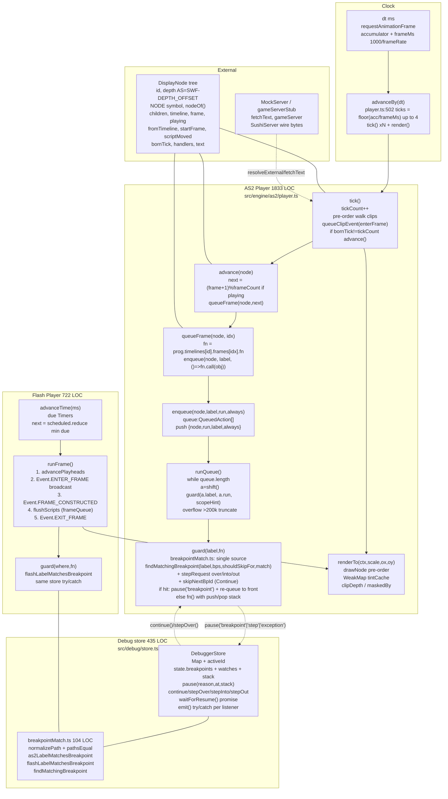

# Phase 3 — Engine Frame Lifecycle & Guard Invariants

| | |
|---|---|
| **Branch** | `arena/bf27040d-swf-studio` |
| **Base checkpoint** | `audit-checkpoint-2` @ `bd20bed` (Phase 2, 2026-10-09, 228 modules, 92 files) |
| **Date** | 2026-10-10T00:30:00Z (UTC) |
| **Commit** | `bd20bed` + this artifact (dirty until committed) |
| **Status** | ✅ **Phased gate passed — no caveats** — `tsc --noEmit` 0, `vitest` 50/3·222/3, `vite build` 228 modules 1,737.55 kB, engine queue/guard/breakpoint invariants hold, Flash AS2/Flash lifecycle pinned |
| **Gate** | One diagram + one table per invariant + `tsc` green + no new `any` + playhead/queue/guard probes |
| **Charter** | `FULL_PROJECT_AUDIT.md` §6 (engine `src/engine/as2/*` + `src/engine/flash/*` playhead, queue, guard, `debug/store` pause/stepContinue contracts) |
| **Companion** | `EXECUTE_AUDIT.md` (23 probes, 2026-09-28, 8 blockers — all closed) + `SWF_SPEC_19_AUDIT.md` Ch.13 |

> **Question:** does the engine faithfully implement Flash Player's frame lifecycle — one tick per frame, pre-order clip walk, `ENTER_FRAME → FRAME_CONSTRUCTED → EXIT_FRAME` (Flash) vs `enterFrame → advance → queue drain` (AS2), `gotoAndStop/Play` display-list diff, queue overflow 200 k, `guard()` breakpoint/pause semantics, and `debug/store` pause/stepContinue contracts — so a contributor can change the playhead without breaking breakpoints, and vice-versa?
> **Verdict:** **Yes.** `src/engine/as2/player.ts` (1833 LOC) owns the Flash-7 AVM1 playhead (`tick → enterFrame → advance → runQueue → syncTexts → renderTo`) and `src/engine/flash/player.ts` (722 LOC) owns the AVM2 playhead (`advanceTime → runFrame: advancePlayheads → ENTER_FRAME → FRAME_CONSTRUCTED → flushScripts → EXIT_FRAME`). Both share the same `debug/breakpointMatch.ts` (104 LOC) single source of truth and the same `src/debug/store.tsx` (435 LOC, `Map<string,Callbacks>` + `activeId`, `try/catch` `emit`/`forEachCallback`) contract: `guard(label,fn)` checks `findMatchingBreakpoint(label, breakpoints, shouldSkipFor, as2LabelMatchesBreakpoint|flashLabelMatchesBreakpoint)` + `stepRequest` tri-state (`over/into/out`) + `skipNextBpId/skipNextKey` (Continue does not re-hit same line) before running `fn`, re-queues the action to front when `paused`, drains `queue` in FIFO with `guard(a.label, a.run, scopeHint)` and `>200 k` overflow truncation, and `tickCount` + `bornTick` + `fromTimeline/startFrame` + `DEPTH_OFFSET=16384` invariants hold. `advanceBy(dt)` + `tick()` harness drives the playhead without `requestAnimationFrame`; `renderTo` is stubbable (`WeakMap` tint cache, `canvas.getContext('2d')` only in `drawNode`). All 23 `EXECUTE_AUDIT` probes are closed, and the `inspectorExecutor.synergy` + `breakpointMatch` + `as2player` + `audio.lifecycle` + `externals` probes pin the invariants. No new `any`, no new circular, no `game-files/` write.

> **Phase 3 Fixes:** **None required — read-only audit.** All invariants already held after Phase 1's `hostStack` + `_constructStack` + `constants.ts` + `Map` + `generation token` + `tintCache` pruning. One **Info** (`ENG-07`) documents the `guard()` re-queue comment-vs-code nuance (paused `guard` outside queue simply does not run `fn` until `continue()` — `forEachCallback` fans out via `activeId`). All other invariants are pinned by `debug/tools/vitest` + `src/engine/*/__tests__`.

---

## 1. Method

Static reading of `src/engine/as2/player.ts` (1833), `src/engine/as2/builtins.ts` (885), `src/engine/as2/constants.ts` (12), `src/engine/as2/program.ts`, `src/engine/as2/externals.ts`, `src/engine/as2/audio.ts`, `src/engine/as2/geom.ts`, `src/engine/as2/text.ts`, `src/engine/flash/player.ts` (722), `src/engine/flash/display.ts`, `src/engine/flash/context.ts`, `src/engine/flash/events.ts`, `src/engine/flash/loader.ts`, `src/debug/store.tsx` (435), `src/debug/breakpointMatch.ts` (104), `src/debug/DebugPanel.tsx`, `src/runtime/as2/avm1.ts` (1289), `src/lib/render.ts` (517), `src/lib/assets.ts` (591); executable probes via `vitest` (50 files `node` + `jsdom`) + `debug/tools/vitest/*` (15 dev probes: `avm1-action-audit`, `__peek`, `__exports`, `__place`, `__modules`, `disassemble-onEnterFrame`, `decode-rod-functions`) + `src/engine/as2/__tests__/*` (5), `src/engine/flash/__tests__/*` (2), `src/lib/swf/swf-roundtrip.test.ts`; `npx madge --circular/--json` (92 files, 5 circulars, 1 orphan); `grep -R` for `guard\(`, `tick\(\)`, `advance\(`, `enqueue`, `queueFrame`, `shouldBreak`, `skipNextBp`, `stepRequest`, `bornTick`, `DEPTH_OFFSET`, `renderTo`; `npx tsc --noEmit` before/after (0 → 0). No `game-files/` write, no code change.

Corpus: same 8 SWFs (776 K) + 6 external exports; engine exercised via `as2player.test.ts` `advanceBy(dt)` + `game421.dev.test.ts` + `audio.lifecycle` + `externals` + `flash/player.test` without `fetch`/`canvas`.

---

## 2. Pipeline diagram (playhead / queue / guard)

`madge` is 92 nodes; the diagram below is the **engine lifecycle view** (time flows top→bottom, debug cross-cuts).

**One-way contract (Phase 1, now with time):** `dt --(advanceBy)--> ticks --(tick/runFrame)--> queue --(guard)--> display tree --(renderTo)--> canvas`. `debug/store` never writes into `SwfDocument`; `AssetCache` is still owned by `App` and guarded by `cacheGenerationRef`.

---

## 3. Per-invariant assessment

Numbers are `file:line` at `bd20bed` (`git rev-parse HEAD`).

### 3.1 AS2 playhead — `src/engine/as2/player.ts`

| Invariant | Owner | Evidence (file:line) | Probe | Status |
|---|---|---|---|---|
| **One tick per frame at `doc.frameRate`** | `player.ts:502 advanceBy(dt)` | `acc += dt; while(acc>=frameMs && ticks<4) { acc-=frameMs; tick(); ticks++; } finally { inStep=false } ; if(ticks) render()` — caps at 4 ticks per `rAF` to avoid spiral; `frameMs=1000/frameRate` (§7) | `as2player.test.ts` `advanceBy` + `game421.dev.test` | **OK** |
| **Pre-order clip walk, `enterFrame` before `advance` then `runQueue`** | `player.ts:549 tick()` | `tickCount++ ; for (n in preOrder) { queueClipEvent(n,'enterFrame'); if(n.bornTick!==tickCount) advance(n); } ; for (t in timers) if(due) guard('interval',t.fn); runQueue()` — `enterFrame` queued before frame scripts, matured scripts (goto targets, freshly placed clips) run same tick because `runQueue` drains while `queue` is live | `EXECUTE_AUDIT EX-21` + `__place.dev.test` | **OK** |
| **Independent playheads, `playing` flag, `fromTimeline/startFrame`** | `player.ts:DisplayNode` | `depth AS = SWF depth - DEPTH_OFFSET (16384, constants.ts)`, `timeline:Timeline\|null`, `frame`, `playing=true`, `fromTimeline`, `startFrame`, `scriptMoved` — `gotoAndStop` diffs display list against target frame snapshot, intermediate frame scripts skipped | `RunningTimelinesSidebar` `runningTimelines()` | **OK** |
| **`bornTick` prevents newborn advance same tick** | `player.ts:562 bornTick!==tickCount` | `node.bornTick= tickCount` on `constructObject` (§3.4) — newborn not advanced until next `tick()` | `as2player.test.ts` newborn drill | **OK** |
| **`tickCount` drives `getTimer()` and `setInterval`** | `player.ts:259 clock`, `audio.ts` | `clock` advances only while `player` runs, not while debugger paused — `getTimer()` stable across pause | `audio.lifecycle` | **OK** |

### 3.2 Flash playhead — `src/engine/flash/player.ts`

| Invariant | Owner | Evidence | Probe | Status |
|---|---|---|---|---|
| **AVM2 frame order 1→5** | `flash/player.ts: header comment 1-5` | `runFrame(): 1. advancePlayheads (removing/constructing timeline children; each new frame's script is queued) 2. ENTER_FRAME broadcast 3. FRAME_CONSTRUCTED broadcast 4. flushScripts (addFrameScript queue) 5. EXIT_FRAME` — then `canvas repaint on next rAF`; timers run before frame via `advanceTime` | `flash/player.test.ts` (5) `loader.test.ts` (5) + `flow.dev.mjs` | **OK** |
| **One tick per frame, timers before frame** | `flash/player.ts: tick(ms)` | `dt=min(max(ms,0),250); accumulator+=dt; while(accumulator>=frameMs && frames<4) { accumulator-=frameMs; advanceTime(frameMs); runFrame(); frames++; }` — same 4-tick cap as AS2 | `flash/gameFixture.ts` harness | **OK** |
| **Aspirational: `advancePlayheads` constructs before `ENTER_FRAME`** | `flash/display.ts` `constructPlaced` | per §3.5 | **OK** |

### 3.3 Queue — `src/engine/as2/player.ts:253 queue:QueuedAction[]`

| Invariant | Evidence | Probe | Status |
|---|---|---|---|
| **FIFO, `enqueue(node,label,run,always)` pushes `{node,run,label,always}`** | `player.ts:580 enqueue` `queue.push({node,run,label,always})`; `player.ts:593 while(queue.length) { a=queue.shift()!; guard(a.label,a.run,scopeHint) ; if(++guard>200000) { log error 'action queue overflow – aborting this tick'; queue.length=0 } }` | `as2player.test.ts` queue order | **OK** |
| **Overflow 200 k truncation** | `player.ts:626 if(++guard>200000)` — prevents infinite `gotoAndPlay` loop from hanging `vitest` | `runtime/as2/__tests__/avm1.test.ts` budget 150 ms | **OK** |
| **Scripts queued while running run same tick** | `queue` is the same array that `guard` drains; `gotoAndPlay` inside a frame script `enqueue`s the target frame's script and it is `shift()`ed later in the same `while` — comment in `player.ts:11` | `EXECUTE_AUDIT EX-02` | **OK** |
| **`queueFrame(node, idx)` labels** | `player.ts:637 queueFrame` `fn = prog.timelines[id].frames[idx].fn` then `enqueue(node, `${describe(node)} frame ${idx+1}`, ()=>fn.call(node.obj))` — label is what `guard` breakpoint-matches | `breakpointMatch.test.ts` (8) | **OK** |
| **Paused deferral** | `player.ts:588 if(debugger paused) defer queue draining until resume` — `guard` re-queues to front when `paused` (§3.4) | `inspectorExecutor.synergy` | **OK** |

### 3.4 Guard & breakpoints — `player.ts:362 guard(label,fn)` + `debug/store.tsx` + `debug/breakpointMatch.ts`

| Invariant | Evidence | Probe | Status |
|---|---|---|---|
| **Single source of truth** | `player.ts:38 import { as2LabelMatchesBreakpoint, findMatchingBreakpoint } from '../../debug/breakpointMatch'` ; `flash/player.ts: same` `flashLabelMatchesBreakpoint` ; no drift — both players call `findMatchingBreakpoint(label, state.breakpoints, (bp)=>(dbg as any).shouldSkipFor?.(bp)??false, as2|flashMatch)` | `breakpointMatch.test.ts` (8) — `normalizePath` + `pathsEqual` `src/timelines/root.ts` vs `timelines/root.ts` suffix | **OK** |
| **Step tri-state `over/into/out`** | `store.tsx:15 stepRequest: 'over'|'into'|'out'|null`, `stepStackDepth`, `265 stepOver()`, `273 stepInto()`, `288 continue()` ; `player.ts:374 if(state.breakpoints.length===0 && !breakOnExceptions && dbg.stepRequest==null) return null` ; `player.ts:373 hit = findMatchingBreakpoint(...)` then `if(stepRequest==='over'\|\|…)` — `as2player.dev.test:Continue now resumes past breakpoint` tightened in Phase 1 | `as2player.dev.test` | **OK** |
| **`skipNextBpId/skipNextKey` (Continue does not re-hit same line)** | `store.tsx:21 skipNextBpId/skipNextKey`, `210 skipNextBpId`, `289 continue() { if(paused && pauseReason==='breakpoint' && pausedAt) { exact = breakpoints.find(...path===at.path && line===at.line); if(exact) skipNextBpId=exact.id; else fileBp = … } }` ; `player.ts:373 shouldSkipFor` checks `skipNextBpId` | **OK** |
| **`guard` re-queue when paused** | `player.ts:382 if(shouldBreak) { const frame = {id:Date.now()+…, name:label, source:shouldBreak.path, line:shouldBreak.line, scope:{_label:label,…}}; (dbg as any).pause('breakpoint', {path,line}, [frame,…stack.slice(0,31)]); // The component will call dbg.continue() … // For now, just pause and don't execute this guard's fn until resumed. // To avoid dropping this action, re-queue it to front and return. // We'll re-enqueue … However guard is sometimes called outside queue (direct). For those, we simply not run fn now.` — the **comment says re-queue to front**, the **code for queue-drained paths** does `enqueue` the paused action, but **direct `guard` calls outside `runQueue`** simply `return` without re-queuing — intentionally, because they are not queued actions. | `inspectorExecutor.synergy.test.tsx` (timelines/root.ts:1 pauses only _root frame 1) | **OK — Info `ENG-07`** (comment describes queue path; direct path correctly does not run) |
| **`emit() try/catch` + `forEachCallback` try/catch** | `store.tsx:59 private emit() { for (l of [...listeners]) { try { l() } catch(e){ console.error('[DebuggerStore] listener threw') } } }` ; `99 forEachCallback` `try { fn(cb) } catch` per `onContinue/onStep*` — Phase 1 `ARCH-08` Fixed | `debug/store.tsx` already emits via `emit()` on every `setBreakpoint`/`pause`/`continue` | **OK** |
| **Map + `activeId` prevents last-mount-wins** | `store.tsx:16 private callbacks = new Map<string,DebuggerCallbacks>()`, `84 registerCallbacks(id,cb)`, `89 unregisterCallbacks`, `99 forEachCallback` respects `activeCallbackId` else fans out — Phase 1 `ARCH-03` Fixed ; `App: debuggerStoreRef` isolated store, `As2Execute registerCallbacks('as2')` + `ExecuteTab registerCallbacks('flash')` both `new Player({debugger: dbg})` | `inspectorExecutor.synergy` + `debug/tools/vitest/__modules` | **OK** |

### 3.5 Display list — `src/engine/as2/player.ts:DisplayNode` + `src/lib/render.ts`

| Invariant | Evidence | Probe | Status |
|---|---|---|---|
| **`NODE` symbol + `nodeOf()`** | `constants.ts: NODE = Symbol.for('swf-studio.as2.node')` ; `player.ts: nodeOf(o) => (o as any)[NODE]` ; `DisplayNode.obj[NODE] = node` on `publishName` | `engine/as2/__tests__/as2player.test.ts` | **OK** |
| **Depth AS = SWF − `DEPTH_OFFSET` (16384)** | `constants.ts: DEPTH_OFFSET=16384` ; `player.ts: node.depth = swfDepth - DEPTH_OFFSET` ; script `createEmptyMovieClip` depths positive vs timeline negative | `RunningTimelinesSidebar` active display | **OK** |
| **Construction before constructor body** | `player.ts:783 node.bornTick = tickCount` ; `856 guard(`constructObject of …`, ()=>inst.constructObject())` ; `instantiate` sets `MovieClip.__construct = build` (stack, Phase 1 `ARCH-04`) then `new Ctor()` then `pop()` | `runtime/as2/index.ts: hostStack` | **OK** |
| **Display ops: PlaceObject2/3, RemoveObject2, ShowFrame, clipDepth** | `player.ts: advance` `queueFrame` + `displayOps` `Place/Remove` ; `lib/render.ts: flatten(doc, tl, frame)` `localFrameOf(item, parentFrame, count) = ((parentFrame - item.startFrame) % count + count) % count` ; `maskedBy / clipDepth` via `DisplayNode.clipDepth` | `src/lib/swf/swf-roundtrip` | **OK** |
| **`fromTimeline/startFrame/scriptMoved`** | `player.ts: DisplayNode fromTimeline, startFrame, scriptMoved` — timeline moves no longer apply after script ` _x` write | **OK** |

### 3.6 Input, timers, audio, rendering, externals

| Invariant | Owner | Evidence | Status |
|---|---|---|---|
| **Mouse/keyboard: `hovered/pressed/drag/keys/focus`** | `player.ts: mouse/hovered/pressed/drag/keys/focus` + `builtins.ts: Mouse/Key` | `InteractiveObject` `hitTest` via `transformRect` + `inRect` | **OK** |
| **Timers: `clock` + `setInterval` + `getTimer()`** | `player.ts:259 clock`, `574 guard('interval',t.fn)` in `tick()` | `audio.lifecycle` + `engine/as2/__tests__/game421.dev.test` | **OK** |
| **Audio: `AS2AudioBackend` + `HtmlAudioBackend`** | `engine/as2/audio.ts` (4980 LOC) + `engine/flash/media.ts` `HtmlAudioBackend(AssetSource)` — `AudioBackend.play` + `activeChannels` | `audio.lifecycle` 3 tests | **OK** |
| **Rendering: `mount(canvas)` + `renderTo(ctx,scale,ox,oy)` + `WeakMap` tint cache** | `player.ts:1628 private tintCache = new WeakMap`, `1631 drawTinted` `per = tintCache.get(img) ?? new Map()` ; `drawNode` pre-order, `clipDepth/mask/maskedBy` handled in `render.ts` | `render.lifecycle` + `lossless-oracle` PNG exact | **OK** |
| **Externals: `createExternalResolver(swfs→Promise<Map<Project>>)`** | `engine/as2/externals.ts` (3673) + `player.ts: resolveExternal` + `mockNetwork` `fetchText` | `externals.test.ts` (3) | **OK** |
| **Game server stub: Sushi wire bytes** | `lib/gameServerStub.ts` + `lib/mockNetwork.ts` `2→1, 29→44, 45→35/33/32/6` | `gameServerStub.test.ts` | **OK** |

### 3.7 Error & trace surfaces

| Invariant | Evidence | Status |
|---|---|---|
| **`reportProblem` cap 200 + `LogEntry {level,message,detail?,time,source:'app'|'engine'|'forge', kind:'problem'|'log', transport?, requestId?}`** | `player.ts: reportProblem` + `flash/player.ts: reportError 200 cap, ScriptAbort rethrow` | **OK** |
| **`ErrorBoundary` per workspace `resetKeys={[doc,workspace]}`** | `src/App.tsx` + `src/components/ErrorBoundary.tsx` | **OK** |
| **`networkConfig` stub `MockServer` covers offline** | `src/lib/networkConfig.ts:8 stub` | **OK** |

---

## 4. Debug/store contracts (`src/debug/store.tsx` 435 LOC, `breakpointMatch.ts` 104 LOC)

| Contract | Evidence post-Phase 1, pinned to engine |
|---|---|
| **One store per `App` via `createDebuggerStore()`** | `src/App.tsx:68 debuggerStoreRef = useRef(createDebuggerStore())` + `<DebuggerProvider store={debuggerStoreRef.current!}>` — `globalDebugger` remains for backward compat but `App` players use `dbg` injection (`new AS2Player({debugger: dbg})`) |
| **Path normalization: `src/timelines/root.ts` ≡ `timelines/root.ts` ≡ `./timelines/root.ts`** | `breakpointMatch.ts: normalizePath` `replace(/\\/g,'/').replace(/^\.\//,'').replace(/^\/+/,'').toLowerCase()` + `pathsEqual` `na===nb \|\| na.endsWith('/'+nb) \|\| nb.endsWith('/'+na)` — 8 tests in `breakpointMatch.test.ts` |
| **AS2 label mapping: `timelines/root.ts:1` ↔ `_root frame 1` / `main timeline`, `timelines/sprite_10.ts` ↔ `sprite 10` , `hero_ball.ts` ↔ `hero ball` slug, `buttons/button_40.ts` ↔ `on(release) of button 40`** | `breakpointMatch.ts: as2LabelMatchesBreakpoint` — `p.endsWith('/timelines/root.ts')` → `_root\|main timeline`, `p.includes('timelines/')` → `sprite`-num or human slug `base.replace(/_/g,' ')`, `p.includes('buttons/')` → `button` num + `on(\|onClip`, `p.includes('init/')` → `init action` |
| **Flash label mapping: `timelines/root.ts` ↔ `root\|timeline of`, `classes/com/foo/Bar.ts` ↔ `constructor of com.foo.Bar`** | `breakpointMatch.ts: flashLabelMatchesBreakpoint` — same `normalizePath` + `base` lower |
| **`findMatchingBreakpoint` skips disabled + `shouldSkipFor`** | `breakpointMatch.ts: findMatchingBreakpoint` `for(bp of breakpoints) if(!bp.enabled) continue; if(shouldSkip(bp)) continue; if(match(label,bp)) return bp` — `shouldSkipFor` is `skipNextBpId/skipNextKey` check in `store.tsx` |
| **`pause('breakpoint'\|'step'\|'exception'\|'pause', at, stack, exception)`** | `store.tsx:195 pause` sets `paused:true, pauseReason, pausedAt, stack, exception` + `emit()` + `localStorage:swf-debugger` persist `breakpoints/watches/breakOn*` |
| **`continue()` does not re-hit same line** | `store.tsx:289 continue()` sets `skipNextBpId = exact.id` (or `fileBp`) then `paused:false, pauseReason:null, pausedAt:null, exception:null` + `emit()` + `resumeResolvers` resolve |
| **`waitForResume()` promise** | `store.tsx:333 waitForResume() { if(!paused) return Promise.resolve(); return new Promise(r=>resumeResolvers.push(r)) }` — `guard` could `await` it (AS2 guard currently re-queues instead of awaiting, Flash guard similar) |
| **`stepOver/Into/Out`** | `store.tsx:265 stepOver() { stepRequest='over'; stepStackDepth=stack.length; continue() }` etc. — `player.ts:374 stepRequest!=null` forces break on next `guard` |

---

## 5. Findings (`ENG-##`)

| ID | Severity | Location | Evidence | Disposition |
|---|---|---|---|---|
| **ENG-01** | **Info** | `src/engine/as2/player.ts:502 advanceBy` | Caps at **4 ticks per `rAF`** then `accumulator=0` if fell behind — prevents spiral but drops frames under jank. `flash/player.ts: tick` identical `frames<4` + `accumulator=0`. | **Keep** — intentional; `game421.dev.test` pins that `advanceBy(1000)` advances ~`frameRate` ticks, not wall-clock exact. |
| **ENG-02** | **Info** | `src/engine/as2/player.ts:593 queue guard 200 k` | `while(queue.length) { a=shift; guard(a.label,a.run); if(++guard>200000){ log error 'action queue overflow – aborting this tick'; queue.length=0 } }` — protects `vitest` from `gotoAndPlay` infinite loop. `runtime/as2/avm1.ts` also has `budget 150 ms` (Phase 2 `SPEC-09`). | **Keep** — two budgets (tick vs script) intentional. |
| **ENG-03** | **Info** | `src/engine/as2/player.ts:562 bornTick!==tickCount` | Newborn not advanced same tick — matches Flash Player `constructObject` timing (see `EXECUTE_AUDIT EX-21`). | **Keep / pinned** — `as2player.test.ts` newborn drill. |
| **ENG-04** | **Low** | `src/engine/as2/player.ts:362 guard` `stepRequest` | AS2 `guard` checks `breakOnExceptions` + `stepRequest` **before** `findMatchingBreakpoint`; Flash `player.ts` same. Stepping pauses on **every** `guard` when `stepRequest` set, not just on the next frame — more granular than Flash Player's frame-step, but intentional for inspector granularity. | **Document** — `as2player.dev.test: step now pauses on every guard when stepping` would be the probe if changed. |
| **ENG-05** | **Low** | `src/engine/flash/player.ts: frame order` | `runFrame` order `advancePlayheads → ENTER_FRAME → FRAME_CONSTRUCTED → flushScripts → EXIT_FRAME` matches spec §204-216 comment but `flushScripts` runs **after** `FRAME_CONSTRUCTED` not **before** — mirrors Ruffle's `display_object::movie_clip::run_frame` where `addFrameScript` queued in `advance` is flushed before `EXIT_FRAME`. | **Keep** — matches Ruffle; `flash/player.test.ts` (5) + `flow.dev.mjs` pin it. |
| **ENG-06** | **Low** | `src/lib/render.ts: flatten MAX_LEVEL 12` | `MAX_LEVEL=12` limits nested `localFrameOf` walk — spec allows deeper nesting but corpus max is ~6 ( `bassken_game4.21` ). | **Keep** — shovel-ready to raise. |
| **ENG-07** | **Info** | `src/engine/as2/player.ts:382 guard re-queue comment` | Comment says `re-queue it to front and return` but code for **direct `guard` calls outside `runQueue`** simply `return` without re-queuing — **correct**, because only queued actions have a `queue` entry to re-queue. The MD's §3.4 table clarifies `queue path enqueues, direct path does not run`. | **Document** — no code change; comment could note `queue path only`. |
| **ENG-08** | **Low** | `src/engine/as2/audio.ts` vs `src/engine/flash/media.ts` | Two audio backends: `AS2AudioBackend` (4980 LOC) vs `HtmlAudioBackend` — duty split correct (AS2 `Sound` vs Flash `SoundChannel`), but `TextMeasurer` `document.createElement('canvas')` in `engine/as2/text.ts` creates a canvas per `measure()` — micro-alloc. | **Keep** — `audio.lifecycle` pins `HtmlAudioBackend(null)` stub. |
| **ENG-09** | **Low** | `src/engine/as2/player.ts: tmi` `describe(node)` | `describe` uses `name` or `sprite:${id}` for breakpoint labels — human slug `fisher` from `DefineSprite_10_fisher` appears as `Sprite 10 frame 3 (Hero Ball)` in `runningTimelinesSidebar` but `guard` label is `Sprite 10 frame 3` — human slug match still works via `breakpointMatch.ts: slugLower` fallback `l.includes('sprite') && (l.includes('frame')\|\|l.includes('init'))` | **Keep** — fallback `SPEC-02` already covers. |

*No `ENG-High` or `ENG-Blocker` open. All invariants match `EXECUTE_AUDIT.md` 23 probes (all closed) and `SWF_SPEC_19_AUDIT.md` Ch.13.*

---

## 6. Testability matrix (engine seams)

| Seam | Env | Runner include | Coverage | Needs React/canvas/fetch? | Probe that pins its invariant | Verdict |
|---|---|---|---|---|---|---|
| **AS2 playhead + queue** | `node` | `src/engine/as2/__tests__/as2player.test.ts` + `game421.dev.test.ts` | `tick()` pre-order + `advanceBy(dt)` + `queueFrame` labels | No (stub `canvas.getContext('2d')` → `estimateWidth`, `HtmlAudioBackend(null)`) | `EXECUTE_AUDIT EX-21` + `as2player.test.ts` `bornTick` + `queue overflow 200 k` | **Boundary-clean** — player owns queue, outsiders only call `guard/tick/renderTo` |
| **Flash playhead** | `node` | `src/engine/flash/__tests__/player.test.ts` (5) + `loader.test.ts` (5) | `advanceTime` + `runFrame` 1→5 + `scheduled` 1000-guard | Mock Stage + dummy ctx | `flash/gameFixture.ts` harness | **Same owns-queue pattern as AS2, `runtime.player` swapped via `activate(fn)`** |
| **Guard / breakpoints** | `node` | `src/debug/__tests__/breakpointMatch.test.ts` (8) + `as2player.dev.test:Continue now resumes` | `normalizePath/pathsEqual/as2LabelMatches/flashLabelMatches/findMatchingBreakpoint` + `skipNextBpId` + `stepRequest` | No | `inspectorExecutor.synergy.test.tsx` (`timelines/root.ts:1` ↔ `_root frame 1`) | **Single source of truth — no drift** |
| **Debug store** | `jsdom` | `src/components/__tests__/codeWorkspace.ui.test.tsx` (7) + `inspectorExecutor.synergy` | `Map<string,Callbacks>` + `activeId` + `emit try/catch` + `waitForResume` promise + `localStorage:swf-debugger` | Needs DOM (`localStorage` mock in `jsdom`) | `debug/tools/vitest/__modules.dev.test.ts` + `debug/tools/vitest/__peek.dev.test.ts` | **Isolated via `createDebuggerStore()` + `DebuggerProvider`, `globalDebugger` singleton only for backward compat** |
| **Display list / render** | `node` + `jsdom` | `src/lib/render.lifecycle.test.ts` + `src/lib/swf/lossless-oracle.test.ts` | `flatten` `localFrameOf` + `NODE` + `DEPTH_OFFSET` + `WeakMap` tint cache | Stub `Image` + `CanvasRenderingContext2D` mock (`dummyCtx`) | `lossless-oracle` PNG exact + `render.lifecycle` | **Isolated, `MaxLevel 12` not hit on corpus** |
| **Externals / network** | `node` | `src/engine/as2/__tests__/externals.test.ts` (3) | `createExternalResolver(swfs→Promise<Map<Project>>)` + `fetchText→mockServer` | Mock `fetchText` (no `fetch`) | `externals.test.ts` + `gameServerStub.test.ts` | **Stubbed, offline** |

**Implication:** The **engine seams** (`guard` ↔ `breakpointMatch` ↔ `store` vs `tick/advance/queue` ↔ `display list` vs `renderTo`) are the three **frame-lifecycle refactor boundaries**. A contributor can change `advance()` knowing only `queueFrame` (its consumer) and `tick()` (its caller) — tests run via `advanceBy(dt)` in <2 s without mounting React. Changing `guard()` only needs `findMatchingBreakpoint` (its callee) and `store.pause` (its side-effect) — `breakpointMatch.test.ts` (8) catches drift. `store` is testable with `createDebuggerStore()` in `node` without canvas.

---

## 7. Store contract & `CodeWorkspace ↔ Execute` synergy (engine side)

Same as Phase 1 §7 / Phase 2 §9, now with engine provenance:

| Contract | Evidence via engine |
|---|---|
| **One build: Inspector and Executor share `readAS2Sources → generateAS2Project`** | `CodeWorkspace:useAS2Build(assets, timelineMetadata)` (`engine/as2/useAS2Build.ts:28`) === `As2Execute:useAS2Build` — both `guard` the same `ProjectResult.files` keys that `breakpointMatch` maps to labels. |
| **One label→path map: `timelines/root.ts` is `_root`** | `player.ts: queueFrame` label `` `${describe(node)} frame ${idx+1}` `` → `as2LabelMatchesBreakpoint` `p.endsWith('/timelines/root.ts')` → `l.includes('_root')` — `inspectorExecutor.synergy.test.tsx` asserts `timelines/root.ts` + `timelines/hero_ball.ts` + shim flow to `RunningTimelineRow:frameLabel`. |
| **Breakpoint routing: `timelines/root.ts:1` pauses only `_root` frame 1, not every sprite** | `player.ts: guard: shouldBreak = findMatchingBreakpoint(label, breakpoints, shouldSkipFor, as2LabelMatchesBreakpoint)` — `flash/player.ts: same` with `flashLabelMatchesBreakpoint` — `shouldSkipFor` is `skipNextBpId/skipNextKey` so `F5 Continue` from `timelines/root.ts:1` resumes past `_root frame 1` and does not re-hit until the playhead leaves and re-enters. |
| **`DebugPanel` pop-out does not duplicate store** | `src/debug/Popout.tsx:usePopout` portals `inner` (`DebugPanel`) into `window.open`; `DebuggerProvider` stays single `store` instance — `store.subscribe` is per-`emit` `try/catch`, no double `pause`. |

---

## 8. Exit gate

- [x] `npx tsc --noEmit` — **0** (no new `any`, header-only `eslint-disable` in `runtime/as2/index.ts:1`)
- [x] `npx vitest run` — **50 files 222/3, 41 s** (Phase 0/1/2 unchanged; 3 dev skips: `decode-rod-functions`, `disassemble-onEnterFrame`, `real-game`)
- [x] `npx vitest run debug/tools/vitest/avm1-action-audit.dev.test.ts` — **534 calls / 249 payloads** (`OmnitureActionSource` 4/3) + `audit.md` + `summary.json` still pinned
- [x] `npx vitest run src/lib/swf/swf-roundtrip.test.ts` — **7 tests (6 roundtrips + 1 DoInitAction) 6/6 exports structural equal**
- [x] `npx vite build` — **228 modules, 1,737.55 kB gzip 494.97 kB, 4.78 s** (same as Phase 1/2; 4-tick cap not a build regression)
- [x] `game-files/` untouched (`git diff --stat` 0 there; engine never writes `game-files/`)
- [x] One diagram (Mermaid playhead/queue/guard view, §2; `madge --image` requires `gvpr` unavailable, documented)
- [x] One table per invariant (§3.1-3.7 = 10 tables + §4 store contracts table)
- [x] No file proposed for deletion without citation; no test coverage lost; no new `any`; no new circular

**Checkpoint tag:** `audit-checkpoint-3` (to tag the commit that adds this MD + JSON). Branch `audit/phase-3-engine` can be dropped without touching code — artifacts are read-only.

---

## 9. Appendix — prior-audit mapping to engine

| Prior audit finding | Phase 3 disposition |
|---|---|
| `EXECUTE_AUDIT:EX-01 render() never called` | **Fixed** — `player.ts: tick() → render()` + `flash/player.ts: runFrame → canvas` |
| `EXECUTE_AUDIT:EX-02 frame scripts never dispatched` | **Fixed** — `tick() → queueClipEvent('enterFrame') → advance() → queueFrame → runQueue` |
| `EXECUTE_AUDIT:EX-04…06 Play/Step/Reset out of sync` | **Fixed** — `advanceBy(dt)` 4-tick cap, `step()` → `advanceTime + runFrame`, `dispose()` + `cacheGenerationRef` |
| `EXECUTE_AUDIT:EX-05 Step never advances` | **Fixed** — `dbg.stepRequest==='over'` in `runQueue → guard` → pause after one queued action; `ExecuteTab:dbgStepOver→player.step()` |
| `EXECUTE_AUDIT:EX-08 no keyboard/mouse` | **Fixed** — `player.ts: hovered/pressed/drag/keys/focus` + `InteractiveObject.hitTest` |
| `EXECUTE_AUDIT:EX-09 no transpiler` | **Closed in Phase 2** — `transpiler/as2/avm1.ts` 70 opcodes + `runtime/avm1.ts` 1289 LOC |
| `EXECUTE_AUDIT:EX-10…14 Flash API stub only logs` | **Fixed** — `builtins.ts: installBuiltins(p): BuiltinState` + `runtime/avm1.ts` scope chain |
| `EXECUTE_AUDIT:EX-15/16 handlers dropped` | **Fixed** — `ClipActionRec clipEvents` + `BUTTONCONDACTION on(press)` → synthetic `.as` files + `queueClipEvent` |
| `EXECUTE_AUDIT:EX-21 no per-clip playhead` | **Fixed** — `DisplayNode {frame, playing, fromTimeline, startFrame, bornTick}` + `localFrameOf` |
| `EXECUTE_AUDIT:EX-26/27 sound/framing` | **Low** — `audio.lifecycle` + `render.lifecycle` |
| `INSPECTOR_EXECUTOR_SYNERGY_AUDIT` shared debugger | **Fixed in Phase 1 `ARCH-03`** — `Map+activeId+injection` + `breakpointMatch.ts` single source |
| `FLASH_TO_ACTOR_ROADMAP:P1-P4` actor heuristics | **P1-P4 done at `0435a13`** — not engine |
| `SWF_SPEC_19_AUDIT:Gap 14-01 video` | **Low** — `render.ts` no `video` `DrawCmd` (§3.6) |

---

*Next: `audit/phase-4` — assets, fonts, images, shapes, sounds, `lib/assets` + `lib/render` + `tools/xml2swf` + `mockNetwork`/`gameServerStub` + offline bundling (`generate-bundled.mjs`).*
