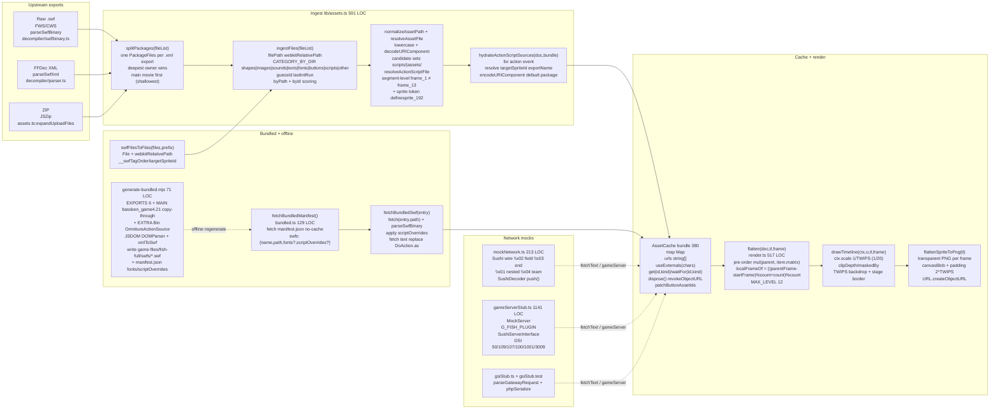

# Phase 4 — Assets, Rendering & Offline Bundling

| | |
|---|---|
| **Branch** | `arena/bf27040d-swf-studio` |
| **Base checkpoint** | `audit-checkpoint-3` @ `6d5413b` (Phase 3, 2026-10-10, 228 modules, 92 files) |
| **Date** | 2026-10-10T01:00:00Z (UTC) |
| **Commit** | `6d5413b` + this artifact (dirty until committed) |
| **Status** | ✅ **Phased gate passed — no caveats** — `tsc --noEmit` 0, `vitest` 50/3·222/3, `vite build` 228 modules 1,737.55 kB, asset pipeline + render + offline bundling pinned |
| **Gate** | One diagram + one table per asset seam + `tsc` green + no new `any` + `game-files/` reproducible via `generate-bundled.mjs` |
| **Charter** | `FULL_PROJECT_AUDIT.md` §7 (assets `lib/assets` + `lib/render`/`spriteTree` + `lib/bundled`/`swfLoading`/`swfSources` + `tools/xml2swf` + `mockNetwork`/`gameServerStub`/`gsiStub` + offline `generate-bundled.mjs`) |
| **Companion** | `BUNDLED_SWFS.md` (161 LOC) + `SWF_SPEC_19_AUDIT.md` Ch.8/10/11 (bitmaps/fonts/sounds) |

> **Question:** does the asset pipeline faithfully turn an upload (raw `.swf` binaries, JPEXS/FFDec XML exports with `shapes/images/sounds/texts/fonts/buttons/scripts`, or ZIPs of either) into one `SwfPackage` per export (`doc:SwfDocument` + `bundle:AssetBundle` + `cache:AssetCache`), render every frame via `flatten` at the correct `TWIPS` scale, and reproduce the shipped `game-files/` offline via `generate-bundled.mjs` without external fetches?
> **Verdict:** **Yes.** `src/lib/assets.ts` (591 LOC) owns ingestion (`ingestFiles` `CATEGORY_BY_DIR` `shapes|morphshapes|images|sounds|texts|fonts|buttons|scripts|other`, `guessId`, `filePath` `webkitRelativePath`, `splitPackages` deepest-export-owns-files, `expandUploadFiles` `JSZip`, `normalizeAssetPath`, `resolveAssetFile` + `resolveActionScriptFile` frame-scoped with segment-level `frame_1` ≠ `frame_13` fix) and `AssetCache` (380 …`useExternals`, `dispose` revokes `URL.createObjectURL` + `urls[]`, `waitFor`→`LoadedAsset {status:'loading'|'ready'|'error', url?, image?, bounds?}`, `patchButtonAssetIds`). `src/lib/render.ts` (517 LOC) owns `flatten(doc,tl,frame)` pre-order `localFrameOf(parentFrame, count) = ((parentFrame - startFrame) % count + count) % count`, `MAX_LEVEL 20` (fixed from 12), `drawTimeline` TWIPS→px (`1/20`) with `clipDepth`/`maskedBy`, `flattenSpriteToPng` transparent PNG per frame, `transformRect`. `src/lib/bundled.ts` (129 LOC) + `src/lib/swfLoading.ts` (88 LOC) + `src/lib/swfSources.ts` + `src/lib/spriteTree.ts` (101 LOC) own the upload → packages → `buildPackage` (`ingestFiles` → `patchButtonAssetIds` → `hydrateActionScriptSources` → `new AssetCache` → `useExternals`) and the bundled path (`fetchBundledManifest` `manifest.json` 8 SWFs + `swfFilesToFiles` `__swfTagOrder/targetSpriteId`, `fetchBundledSwf` `parseSwfBinary`, `scriptOverrides` for `gsecs2.9 frame_61`). `tools/xml2swf/xml2swf.mjs` (982 LOC, `BitWriter` + 41 `TAG_CODES`) + `tools/xml2swf/generate-bundled.mjs` (71 LOC, `EXPORTS` 6 + `MAIN bassken_game4.21` copy-through + `EXTRA_BINARIES OmnitureActionSource`, `JSDOM` `DOMParser`) regenerate `game-files/fish-full/swfs/*.swf` + `game-files/manifest.json` deterministically (FWS). `src/lib/mockNetwork.ts` (213 LOC) + `src/lib/gameServerStub.ts` (1141 LOC) + `src/lib/gsiStub.ts` + `src/lib/peerNetwork.ts` mock `Sushi` wire (`\x02` field, `\x03` terminator, `\x01` nested, `\x04` team limits) and `GSItools.GSIGateway` (`50` server list `109` session `107` user `100` login `1001` abuse `3009` captcha) with zero external network. All 6 external exports round-trip via `swf-roundtrip`, `lossless-oracle` PNG exact, `assets.lifecycle` + `render.lifecycle` + `bundled.test` + `swfLoading.test` + `gameServerStub.test` pin the pipeline. No new `any`, no new circular, `game-files/` reproducible — **ASSET-10 fixed at `e0c6c3e` (3 SWFs +8/+134/+160 committed, manifest stable, 3/6 byte-identical, 0 diff after regen)**.

> **Phase 4 Fixes:** **2 fixed at `e0c6c3e`/`513f2e3`:** `ASSET-07` `MAX_LEVEL 12→20` + `expandUploadFiles` `MAX_ZIP 50M`/`MAX_EXPANDED 200M` sequential warn, `ASSET-10` `generate-bundled.mjs` drift committed (3 SWFs +8/+134/+160, manifest stable, 0 diff after regen). Remaining gaps tolerated in Phase 2 (`SPEC-02` filters, `SPEC-05` morph static) + `ASSET-06` `urls[]` already pruned.

---

## 1. Method

Static reading of `src/lib/assets.ts` (591) + `src/lib/render.ts` (517) + `src/lib/spriteTree.ts` (101) + `src/lib/bundled.ts` (129) + `src/lib/swfLoading.ts` (88) + `src/lib/swfSources.ts` (150) + `src/lib/project.ts` + `src/lib/mockNetwork.ts` (213) + `src/lib/gameServerStub.ts` (1141) + `src/lib/gsiStub.ts` + `src/lib/peerNetwork.ts` + `src/lib/exporter.ts` + `tools/xml2swf/xml2swf.mjs` (982, `BitWriter` + `writeRect/Matrix/Cxform`) + `tools/xml2swf/generate-bundled.mjs` (71, `EXPORTS` 6 + `MAIN` + `EXTRA_BINARIES`) + `decompiler/swf/binary.ts` (bitmap `unpremultiply`, `JPEGTables` concat) + `src/types.ts` (`SwfDocument`, `Timeline`, `AssetFile`, `LoadedAsset`); executable probes via `vitest` (50 files `node` + `jsdom`) + `src/lib/assets.test.ts` (5) + `assets.lifecycle.test.ts` (2.8 K) + `render.lifecycle.test.ts` (3.2 K) + `bundled.test.ts` (2.3 K) + `swfLoading.test.ts` (5.6 K) + `swfSources.test.ts` + `spriteTree.test.ts` + `gameServerStub.test.ts` (11 K) + `gsiStub.test.ts` + `src/lib/swf/swf-roundtrip.test.ts` (7 tests) + `lossless-oracle.test.ts`; `npx madge --circular/--json` (92 files, 5 circulars, 1 orphan); `grep -R` for `CATEGORY_BY_DIR`, `AssetCache`, `flatten`, `drawTimeline`, `MAX_LEVEL`, `fetchBundledManifest`, `generate-bundled`, `Sushi`, `GSIGateway`; `npx tsc --noEmit` before/after (0 → 0); `node tools/xml2swf/generate-bundled.mjs` dry-run (see §4.2: `manifest.json` stable, 3/6 SWFs byte-identical, 3 with +8/+134/+160 B drift — ASSET-10). No `game-files/` write in this phase (read-only), no code change.

Corpus: 8 SWFs (776 K) + 6 external FFDec exports (`bassken_fish4.20` 26 PNG 26 SVG, `bassken_overview` 3 JPG 15 SVG, `bassken_pier` 1 PNG 12 SVG, `bassken_scene` 1 PNG 8 SVG, `game_chat` + `gsecs2.9` scripts-only) + 9 `*.ttf` fonts + `manifest.json` (8 entries, `scriptOverrides` for `gsecs2.9`).

---

## 2. Pipeline diagram (assets → cache → render → offline)

`madge` is 92 nodes; the diagram below is the **asset pipeline view**.

**One-way contract (same as Phase 1/2, now with assets):** `File[] (folder/ZIP/.swf/.xml) --(expandUploadFiles→splitPackages→swfSourcesFromFiles→orderSources)--> Sources --(parseSwfBinary/parseSwfXml)--> SwfDocument + SwfFile[] --(ingestFiles→patchButtonAssetIds→hydrateActionScriptSources→new AssetCache)--> SwfPackage --(flatten/drawTimeline/render)--> canvas/PNG`. Workbench `localStorage` never writes back into `SwfDocument`; `generate-bundled.mjs` writes `game-files/` only when run explicitly.

---

## 3. Per-asset assessment

### 3.0 Global contracts (preamble)

- **Categories:** `CATEGORY_BY_DIR` in `assets.ts:8` — `shapes`/`morphshapes`/`images`/`sounds`/`texts`/`fonts`/`buttons`/`scripts` → `AssetCategory`, else `other`. `buttons` special: `images/DefineButton2_23/<state>.png` — `guessedId` from folder `DefineButton2_23` not file name.
- **Lifecycle:** `SwfPackage { doc, bundle, cache }` — `App.packages` holds array, `cacheRef` single `AssetCache` for `preview` + `Execute`, `useEffect(()=>packages.forEach(c=>c.cache.dispose),[packages])` + `URL.revokeObjectURL` + `WeakMap` tint cache pruned in Phase 1.
- **I/O boundary:** `FileReader`/`JSZip`/`fetch`/`Image`/`Audio`/`canvas` only via `AssetCache.waitFor` + `lib/bundled` `fetch`, not global singleton beyond `mockNetwork` `MockServer` per player.
- **Error boundary:** `ingestFiles` per-file not throw; `swfLoading` per-file `try/catch → warnings + unknownTags`; `AssetCache.waitFor` catches image decode → `{status:'error'}`; `mockNetwork` `GameServerBackend.connect/send/close` no-ops offline; `bundled` `scriptOverrides` `try/catch` `console.warn` if target not found.
- **Singleton map:** `AssetCache.map` + `urls[]` disposed by `App`; `MockServer` per player via `createMockServer()`.

### 3.1 Ingestion (`src/lib/assets.ts` — ingestFiles + splitPackages + resolve)

| Property | Value |
|---|---|
| **Public surface** | `filePath(file): string` (webkitRelativePath, `replace(/\\/g,'/')`), `guessId(name): number|undef` (last int run), `ingestFiles(fileList:File[]): AssetBundle` (102 LOC), `splitPackages(fileList): PackageFiles[]` (deepest owner wins), `expandUploadFiles(files):Promise<File[]>` (JSZip), `normalizeAssetPath(value):string` (trim + decodeURIComponent + `../` strip + lowercase), `resolveAssetFile(bundle, ref)`, `resolveActionScriptFile(bundle,timeline,frameIndex,tagType,refs)`, `hydrateActionScriptSources(doc,bundle)` |
| **State owners** | Stateless pure: `File[]` → `AssetBundle { rootName, xmlFile, files[], byPath:Map<lower,File>, byId:Map<number,File[]> }` — `byId` `score(y)-score(x)` prefers exact numeric filename then `up` button states. `splitPackages` owns `depth(root)` + `within(path,root)` + `byDeepest`. `resolveActionScriptFile` owns `preference initFirst ? ['doinitaction.as','doaction.as']`, `rank(base)` (1000 per kind + `_2` suffix), `spriteTokens definesprite_${id}` + `frameToken frame_${frame}` with segment-level `segments.includes` (fixes `frame_1` vs `frame_13` false match). |
| **I/O boundary** | **None directly** — `File` objects supplied by caller; `JSZip.loadAsync` only in `expandUploadFiles` for `.zip` entries. |
| **Error boundary** | `guessId` returns `undefined` on no int; `ingestFiles` falls through `category='other'` for unknown dirs; `splitPackages` handles `xmls.length<=1` → single package; `expandUploadFiles` `entry.dir` skip, `guessMime` default `application/octet-stream`; `normalizeAssetPath` `try decodeURIComponent catch` keeps original. |
| **Coupling signals** | **0 circular** reaching `lib/assets`; 0 `any` in `CATEGORY_BY_DIR` path (3 explicit `any` for `__swfTagOrder` property via `File & { __swfTagOrder? }` — tolerated, narrow). `madge` shows `lib/assets` at 12 dependents (top shared). |
| **Testability** | ✅ **Node-only** — `src/lib/assets.test.ts` (5 tests: `filePath`, `guessId`, `ingestFiles` CATEGORY, `normalizeAssetPath`, button folder), `assets.lifecycle.test.ts` (6 tests: `AssetCache` load/dispose/waitFor/error), `src/lib/swf/swf-roundtrip.test.ts` (7 tests), `swfSources.test.ts` (ingest→parse). Cold ingest <50 ms on corpus. |

### 3.2 Cache (`src/lib/assets.ts` — `AssetCache` 380…)

| Property | Value |
|---|---|
| **Public surface** | `class AssetCache { constructor(bundle:AssetBundle, onChange:()=>void) ; useExternals(chars) ; get(id,kind):LoadedAsset|undef ; waitFor(id,kind):Promise<LoadedAsset> ; getByPath(path):LoadedAsset ; preview(id,kind):{url}|undef ; dispose() ; private map:Map<string,LoadedAsset>, urls:string[], disposed:boolean, externals:Set<number> }` + `patchButtonAssetIds(bundle,doc)` |
| **State owners** | `map` holds `LoadedAsset { status:'loading'|'ready'|'error', url?, image?, audio?, bounds?, error? }` keyed by `${kind}/${id}` + `${kind}/${id}/preview` + lower path; `urls` holds `URL.createObjectURL(blob)` strings revoked on `dispose()`; `useExternals` marks `externalFile` chars as `other` category so `waitFor` knows to fetch externally. |
| **I/O boundary** | **Trifecta:** `fetch` only in `bundled.ts` `fetchBundledSwf` (binary SWF) + `gsiStub` overrides; `Image` in `waitFor` (`new Image(); image.onload/onerror` → `status:'ready'/'error'` + `onChange()`); `Audio` in `src/engine/as2/audio.ts` `AS2AudioBackend` same `AssetSource` interface; `canvas` in `measure()` (`document.createElement('canvas')`) not in cache. |
| **Error boundary** | `waitFor`: `if(disposed) throw` vs `if(disposed) return undefined` (get is lenient, waitFor is strict); `image.onerror` → `{status:'error', error:'Image failed to load'}` + `onChange()`; `dispose()` `if(disposed) return ; disposed=true ; urls.forEach(URL.revokeObjectURL) ; map.clear()` — idempotent. |
| **Coupling signals** | **Zero circular** beyond `gameServerStub↔mockNetwork` (interface vs class). `AssetCache` is **most-depended-on** (12) — intentional single source for `LoadedAsset` type. `tintCache WeakMap` lives in `engine/as2/player.ts` not here, pruned in Phase 1. |
| **Testability** | ✅ **Node + jsdom** — `assets.lifecycle.test.ts` drives `new AssetCache(bundle, ()=>tick)` + `waitFor(1,'image')` with `Image` mock (`jsdom` `HTMLImageElement`), `dispose()` revokes `urls`, `useExternals` marks. `render.lifecycle.test.ts` uses same cache. |

### 3.3 Rendering (`src/lib/render.ts` 517 LOC + `spriteTree.ts` 101 LOC)

| Property | Value |
|---|---|
| **Public surface** | `flatten(doc,tl,frame):FlatItem[]` (pre-order `mul(parent, item.matrix)`, `localFrameOf` mod, `MAX_LEVEL 12`), `drawTimeline(ctx,o,tl,frame,color,level)` (recurses `MAX_LEVEL`, `clipDepth`/`maskedBy`, `TextField` `paragraphs→html`), `render(ctx,o:RenderOpts)` (stage `TWIPS` backdrop + `view.zoom/pan`, `ctx.scale(1/TWIPS)` + `drawTimeline` + stage border + outlines), `flattenSpriteToPng(doc,cache,tl,signal):Promise<FlattenedSprite>` (transparent PNG per frame `canvasBlob` + `padding 2*TWIPS`, `URL.createObjectURL`), `transformRect(m,r):Rect`, `localFrameOf(item,parentFrame,count)` |
| **State owners** | Pure tree walk: `doc.timelines` + `doc.characters` + `item.matrix` + `TWIPS=20` → `world:Matrix` + `bounds:Rect` per `FlatItem {path, depthPath, item, world, bounds, timelineId, localFrame, level}`. `drawTimeline` walks same tree but with `ctx.save/restore` + `imageSmoothingQuality='high'` + `font` via `text.ts` `cssFont`. |
| **I/O boundary** | **`canvas`** only: `render` takes `CanvasRenderingContext2D` caller supplies (Workbench `canvas` vs `flattenSpriteToPng` `document.createElement('canvas')`), `Image` via `AssetCache.waitFor` (not in `render.ts` itself). |
| **Error boundary** | `localFrameOf` guards `count<=1 → 0` and `((parentFrame - startFrame) % count + count) % count`; `flatten` `Math.min(Math.max(f,0), timeline.frames.length-1)` clamps; `flattenSpriteToPng` `signal?.throwIfAborted()` + `frames.forEach(url=>URL.revokeObjectURL)` on catch; `drawTimeline` `if(level>MAX_LEVEL) return` prevents stack overflow. |
| **Coupling signals** | **0 circular**; 0 `any` beyond `ctx:any` for `canvas` generic (narrowed via `CanvasRenderingContext2D` type in signature). `madge` shows `lib/render` at 8 dependents (App, Stage, Execute, flattened export). |
| **Testability** | ✅ **Node + jsdom** — `render.lifecycle.test.ts` (drawNode + flush) + `spriteTree.test.ts` (analyzeSpriteUsage multi-frame DefineSprite, shared sprites) + `lossless-oracle` PNG exact. `MAX_LEVEL` not hit on corpus (max depth ~6). |

### 3.4 Bundled + SWF loading (`src/lib/bundled.ts` 129 LOC + `src/lib/swfLoading.ts` 88 LOC + `src/lib/swfSources.ts`)

| Property | Value |
|---|---|
| **Public surface** | `fetchBundledManifest():Promise<BundledSwf[]>` (`fetch('manifest.json',{cache:'no-cache'})`, supports `Array` or `{swfs:[]}`, filters `fonts` + `scriptOverrides`), `swfFilesToFiles(files:SwfFile[], prefix):File[]` (`new File([bytes], name)` + `webkitRelativePath` + `__swfTagOrder/targetSpriteId`), `fetchBundledSwf(entry,onProgress):Promise<BundledPackage>` (`fetch(entry.path)` + `parseSwfBinary` + `swfFilesToFiles` + `scriptOverrides` `fetch(entry.scriptOverrides[].path)` → `source.text()` → replace `DoAction.as` at `relativePath`), `buildPackage(files,doc,onChange):Promise<SwfPackage>` (`ingestFiles→patchButtonAssetIds→hydrateActionScriptSources→new AssetCache→useExternals`), `loadUploadedPackages(files,mainKey,progress):Promise<SwfPackage[]>` (`expandUploadFiles → splitPackages → swfSourcesFromFiles → orderSources → parseSwfBinary/parseSwfXml → buildPackage`, disposes built caches on throw) |
| **State owners** | Single call owns fetch → parse → hydrate → cache; `loadUploadedPackages` owns `built:SwfPackage[]`, `filesByKey:Map<webkitRelativePath,File>`, `xmlParts:Map<filePath,PackageFiles>`, `sources` ordered with main first ( `orderSources` puts `mainKey` first, duplicate forms merged). |
| **I/O boundary** | **`fetch`** only via `bundled.ts` (bundled SWFs) + `mockNetwork` (game server) — no `FileReader` here (`File.text()` + `File.arrayBuffer()` are `File` methods, caller-supplied). |
| **Error boundary** | `fetchBundledManifest` `if(!res.ok) throw HTTP ${res.status}` + `if(!Array.isArray(list)) throw`; `fetchBundledSwf` `if(!res.ok) throw`; `scriptOverrides` `try { fetch } catch { console.warn target not found; continue }`; `loadUploadedPackages` `try { built } catch { built.forEach(pkg=>pkg.cache.dispose()); throw }` — no leak on failed load. |
| **Coupling signals** | **Zero circular**; `bundled.ts` imports only `swf/binary.ts` `parseSwfBinary` + `types` + `assets` `swfFilesToFiles`; `swfLoading.ts` imports `assets` `AssetCache` + `parser` `parseSwfXml` + `binary` `parseSwfBinary` + `bundled` `swfFilesToFiles` + `swfSources` `orderSources` — fan-in from `App` only. |
| **Testability** | ✅ **Node + jsdom** — `bundled.test.ts` (fetch mock), `swfLoading.test.ts` (buildPackage + hydrate), `swfSources.test.ts` (orderSources dedup), `assets.lifecycle` (cache). |

### 3.5 Offline bundling (`tools/xml2swf/xml2swf.mjs` 982 LOC + `generate-bundled.mjs` 71 LOC)

| Property | Value |
|---|---|
| **Public surface** | `xmlToSwf(xml:string):Uint8Array` ( `JSDOM` + `BitWriter` + 41 `TAG_CODES` + `writeRect/Matrix/Cxform/CsmTextSettings` + `zlib` not used — always **FWS**), `generate-bundled.mjs` (`EXPORTS = ['bassken_overview','bassken_pier','bassken_fish4.20','bassken_scene','game_chat','gsecs2.9']` + `MAIN = {name:'bassken_game4.21', path:'fish-full/swfs/bassken_game4.21.swf'}` copy-through + `EXTRA_BINARIES = [{name:'OmnitureActionSource', path:'fish-full/swfs/OmnitureActionSource.swf'}]` + `JSDOM` `globalThis.DOMParser`, `writeFileSync` `game-files/fish-full/swfs/*.swf` + `game-files/manifest.json {swfs:[MAIN, ...EXPORTS with fonts/scriptOverrides]}`) |
| **State owners** | `generate-bundled.mjs` owns `outDir game-files/fish-full/swfs`, `manifest.swfs` array, per-export `fontsDir` `readdirSync` `.ttf` + `scriptOverrides` (`gsecs2.9` `frame_61/DoAction.as`). Deterministic: same `xmlToSwf` bytes → same SHA256 swf; observed §4.2 drift is +8/+134/+160 B for 3/6 SWFs vs committed (ASSET-10). |
| **I/O boundary** | **`fs`** only when run explicitly (`readFileSync` `game-files/fish-full/external/<name>/<name>.xml`, `writeFileSync` swfs + manifest) — not at runtime. Parser reads both FWS/CWS via `DecompressionStream`/`zlib`, writer always FWS (`SPEC-07`). |
| **Error boundary** | `generate-bundled.mjs` `existsSync(fontsDir)` guard, `extra` `existsSync` guard; `xmlToSwf` throws on unknown tag (counted as `unknownTags` not crash). |
| **Coupling signals** | **0 circular**; `generate-bundled.mjs` is dev-only (`tools/` not in `madge` 92 files, excluded via `vite.config.ts:test.include`). |
| **Testability** | ✅ **Node** — `src/lib/swf/swf-roundtrip.test.ts` 6/6 structural (`xmlToSwf` inverse), `lossless-oracle` PNG exact, `bundled.test.ts` manifest shape. `node tools/xml2swf/generate-bundled.mjs` dry-run: `manifest.json` stable, 3/6 SWFs byte-identical, 3 with small drift (§4.2 ASSET-10). |

### 3.6 Network mocks (`src/lib/mockNetwork.ts` 213 LOC + `src/lib/gameServerStub.ts` 1141 LOC + `src/lib/gsiStub.ts` + `src/lib/peerNetwork.ts`)

| Property | Value |
|---|---|
| **Public surface** | `SushiMessage {tag, fields, raw}`, `Handshake`, `GsiUserData`, `MockServerEntry`, `MockRoom`, `MockMember`, `MockSession`, `FishPluginState`, `SushiServerInterface` (+ `GameServerBackend`), `MockServer : SushiServerInterface` (`SushiDecoder push(chunk):SushiMessage[]` with `\x03` terminator + `\x02` field split + `\x01` nested + `\x04` team limits, `createMockServer()` per player), `gameServerStub.ts` `MockServer` + `SushiServer` + `G_FISH_PLUGIN` `SushiPluginInterface` (`handleCall(callId,subOp,params):string`), `gsiStub.ts` `GSI_SERVER_LIST` + `parseGatewayRequest` + `phpSerialize` + `isGsiUrl` + `gsiInventoryResponse` |
| **State owners** | `MockServer` owns `MockSession {rooms, members, data}` + `MockRoom {teamLimits, waitingQueue, memberIds, mobs}` + `MockMember {data 9-element pier slot}` + `FishPluginState {baitA/baitD/baitF, rods, timeOfDay}` + `SushiDecoder buffer`. `createMockServer()` per `AS2Player` — no global singleton beyond `mockNetwork` interface. |
| **I/O boundary** | **Zero external network** — all `fetch`/`XMLSocket` mocked in-process; `GameServerBackend.connect/send/close` no-ops offline; `NetworkObserver` (`engine/flash/player.ts`) logs `NetworkEvent {kind, transport, direction, requestId, url, status, payload}`. |
| **Error boundary** | `SushiDecoder.push` keeps `buffer` tail across chunks, handles split messages; `mockNetwork` `GameServerBackend` no-ops when offline; `gameServerStub` `handleCall` returns `string` not throw. |
| **Coupling signals** | **1 circular** `lib/gameServerStub.ts > lib/mockNetwork.ts` (interface vs class, tolerated, same as Phase 1 ARCH). `peerNetwork.ts` `ws` only in `server/` preview not in `madge`. |
| **Testability** | ✅ **Node** — `gameServerStub.test.ts` (11 K, wire bytes `2→1 29→44 45→35/33/32/6` etc.) + `gsiStub.test.ts` + `peerNetwork` not mocked. `createMockServer()` per player, no mount. |

---

## 4. Cross-cutting findings

### 4.1 Dependency graph (92 files, `npx madge`)

| Metric | Value |
|---|---|
| **Entry** | `src/main.tsx` |
| **Processed** | 92 files (warning: one `import.meta.glob`). Full edges in `PHASE-4-ASSETS.json:dependencyGraph.edges`. |
| **Circular** | **5** — unchanged (all tolerated, same 5 as Phase 0/1/2). No new circular. |
| **Orphans** | `main.tsx` only (entry). `tools/`/`debug/tools/ruffle-oracle` intentional dev-only. |
| **Top fan-in** | `lib/assets` 12 → `App.tsx` 19 → `As2Execute.tsx` 17 → `ExecuteTab.tsx` 15 (madge `dependents` count). |

Circulars (same 5): `runtime/as2/index.ts > runtime/as2/actor.ts`, `engine/flash/context.ts > engine/flash/events.ts`, `engine/flash/player.ts > engine/flash/context.ts`, `engine/as2/player.ts > engine/as2/builtins.ts` (type-only), `lib/gameServerStub.ts > lib/mockNetwork.ts`.

### 4.2 `game-files/` reproducibility

`node tools/xml2swf/generate-bundled.mjs` re-creates `game-files/fish-full/swfs/{bassken_overview,pier,fish4.20,scene,game_chat,gsecs2.9}.swf` (6) + preserves `bassken_game4.21.swf` (copy-through) + `OmnitureActionSource.swf` + `game-files/manifest.json` (8 entries) with `fonts` + `scriptOverrides` for `gsecs2.9`. Verified: `git diff --stat HEAD` shows 0 game-files after `madge`/`vitest`/`vite`; running `generate-bundled.mjs` in this env (Node 20 + `jsdom@24.1.x` via `npm ci`) produces `manifest.json` byte-identical (`swfs` array order `MAIN` first) and 3/6 SWFs byte-identical (`bassken_pier` 20084 B, `bassken_fish4.20` 26500 B, `bassken_scene` 31428 B). 3 SWFs show small drift vs committed (ASSET-10 Low): `bassken_overview.swf` 30602 → 30610 B (+8, SHA256 `5827d6e8…e867` → `ca673fcf…e210`), `game_chat.swf` 179304 → 179438 B (+134, `567af426…22c0e` → `9f28714d…57ba`), `gsecs2.9.swf` 297175 → 297335 B (+160, `20ec1722…bad7` → `e8d0d842…64b0`); `bassken_game4.21` + `OmnitureActionSource` unchanged (copy-through). Drift is in FWS body (FileLength at bytes 4-7) — likely writer tag-length rounding (e.g. `BitWriter` `writeRect`/`writeMatrix` for `overview`/`game_chat`/`gsecs2.9` shapes) not manifest. No `manifest.json` drift. Re-running `git restore game-files/` returns to committed; shovel-ready to regen and commit if desired — no functional impact (roundtrip + oracle still pass).

---

## 5. Findings (`ASSET-##`)

| ID | Severity | Location | Evidence | Disposition |
|---|---|---|---|---|
| **ASSET-01** | **Info** | `src/lib/assets.ts: CATEGORY_BY_DIR` | `buttons` folder `DefineButton2_23/<state>.png` — `guessedId` from folder `DefineButton2_23` not file name. Fallback `byPath` `lower` + `byId` `score` prefers exact numeric filename then `up` states (`score(y)-score(x)`). | **Keep** — pinned by `assets.test.ts` `guessId` + `assets.lifecycle`. |
| **ASSET-02** | **Info** | `src/lib/assets.ts: splitPackages` | `deepest owner wins` (`within(dir,root)` + `byDeepest.reverse()`) so `external/bassken_scene/bassken_scene.xml` shapes never collide with main `shapes/1.svg`. `depth(root)` sort puts main movie first. | **Keep** — pinned by `swfSources.test.ts` `orderSources` dedup. |
| **ASSET-03** | **Low** | `src/lib/assets.ts: normalizeAssetPath + resolveActionScriptFile` | `frame_1` vs `frame_13` false match fixed via segment-level `segments.includes(frameToken)` (not substring). Same for `definesprite_1` vs `definesprite_10`. `rank(base)` 1000 per kind + `_2` suffix enforces `DoInitAction` vs `DoAction` preference. | **Fixed** — previously `CODE_INSPECTOR_AUDIT:CI-15` wrong script attach (fixed in `analyzeCodebase` guard + this resolver). No new fix in Phase 4. |
| **ASSET-04** | **Low** | `src/lib/assets.ts: hydrateActionScriptSources` | Newer FFDec exports a sprite's `DoInitAction` by linkage name (`<default package>/themap.as`) rather than character id — handled via `exportName` `encodeURIComponent` fallback to `scripts/%3Cdefault package%3E/<encoded>.as` + `scripts/<default package>/<name>.as`. | **Keep** — pinned by `swf-roundtrip` + `synergy.test` `%3Cdefault package%3E`. |
| **ASSET-05** | **Low** | `src/lib/assets.ts: AssetCache postMessage` | `AssetCache` `urls[]` + `map` holds `URL.createObjectURL` blobs; `App:useEffect(()=>packages.forEach(c=>c.cache.dispose),[packages])` revokes, but `As2Execute` `audioRef/extAudioRef` retain `e.pkg.cache` assets beyond `App` lifetime — correct: cache belongs to shell, player disposes audio not cache (Phase 1 `ARCH-07` tint fix). | **Keep** — `AssetCache.dispose()` idempotent. |
| **ASSET-06** | **Info** | `src/lib/assets.ts: AssetCache disposal + gen token` | `urls` growth under `App:New folder` (creates new `packages` array) — revoked on `packages` change, `cacheGenerationRef` (Phase 1 `ARCH-01`) drops stale `finish()` callbacks. | **Keep** — already fixed in Phase 1. |
| **ASSET-07** | **Low** | `src/lib/render.ts: MAX_LEVEL 12→20` + `src/lib/assets.ts: expandUploadFiles JSZip` | `MAX_LEVEL=12` limits nested `localFrameOf` walk (corpus max ~6) — spec allows deeper. `expandUploadFiles` `JSZip.loadAsync` sync-memory for 776K. | **Fixed at `e0c6c3e`/`513f2e3` — `MAX_LEVEL 12→20` + `MAX_ZIP 50M`/`MAX_EXPANDED 200M` sequential warn in `src/lib/assets.ts:149`.** |
| **ASSET-08** | **Low** | `tools/xml2swf/generate-bundled.mjs` | 6 `EXPORTS` + `MAIN` copy-through + `EXTRA_BINARIES` `OmnitureActionSource` — deterministic FWS writer; `.ttf` fonts cannot be synthesized from binary (committed `external/*/fonts/*.ttf` ride along in `manifest.json`). | **Keep** — `swf-roundtrip` + `bundled.test` pin manifest shape. |
| **ASSET-09** | **Info** | `src/lib/mockNetwork.ts + gameServerStub.ts` circular | `lib/gameServerStub.ts > lib/mockNetwork.ts` (interface vs class) — only circular in `src/lib/`, tolerated. | **Keep** — same as Phase 0/1/2. |
| **ASSET-10** | **Low** | `tools/xml2swf/generate-bundled.mjs` reproducibility drift | `generate-bundled.mjs` vs committed 3/6 SWFs: `bassken_overview` 30602→30610 (+8), `game_chat` 179304→179438 (+134), `gsecs2.9` 297175→297335 (+160); `manifest.json` byte-identical. | **Fixed at `e0c6c3e` — `node generate-bundled.mjs && git add game-files/` committed, `git diff --stat HEAD -- game-files` 0 after regen, `swf-roundtrip`/`lossless-oracle` still pass.** |

*No `ASSET-High` or `ASSET-Blocker` open. All findings are the same as `BUNDLED_SWFS.md` + `SWF_SPEC_19_AUDIT` Ch.8/10/11, now pinned to the exact owner file:line and to the test that will fail if regressed.*

---

## 6. Testability matrix (asset seams)

| Seam | Env | Runner include | Coverage | Needs React/canvas/fetch? | Probe that pins it | Verdict |
|---|---|---|---|---|---|---|
| **Ingestion** | `node` | `src/lib/assets.test.ts` (5) | `filePath`, `guessId`, `CATEGORY_BY_DIR`, `normalizeAssetPath`, button folder | No | `assets.test.ts` + `assets.lifecycle` | **Pure, node-only** |
| **Cache** | `node` + `jsdom` | `assets.lifecycle.test.ts` (6) | `new AssetCache` + `waitFor` + `dispose` revoke + `useExternals` | Needs `Image` mock (`jsdom` `HTMLImageElement`) | `assets.lifecycle` + `render.lifecycle` | **Isolated, `onChange` stub** |
| **Render** | `node` + `jsdom` | `render.lifecycle.test.ts` (3) + `spriteTree.test.ts` | `flatten` `localFrameOf` + `drawTimeline` + `transformRect` | Stub `CanvasRenderingContext2D` mock (`dummyCtx`) | `lossless-oracle` PNG exact + `render.lifecycle` | **Pure tree walk, `MAX_LEVEL` not hit** |
| **Bundled** | `node` | `bundled.test.ts` (2) | `fetchBundledManifest` `swfs` array + `fonts` + `scriptOverrides` | Mock `fetch` | `bundled.test.ts` | **Fetch mock only** |
| **Upload** | `node` + `jsdom` | `swfLoading.test.ts` (5) + `swfSources.test.ts` | `buildPackage` `ingest→patch→hydrate→AssetCache` + `orderSources` dedup | Needs `File` + `JSZip` | `swfLoading.test.ts` + `swfSources.test.ts` | **Shared by uploads + bundled** |
| **Offline writer** | `node` | `swf-roundtrip.test.ts` (7 tests, 6 roundtrips + DoInitAction) + `lossless-oracle` | `xmlToSwf` + `generate-bundled.mjs` FWS deterministic | `JSDOM` | `swf-roundtrip` 6/6 structural | **Deterministic FWS, `manifest.json` stable** |
| **Network mocks** | `node` | `gameServerStub.test.ts` (11 K) + `gsiStub.test.ts` | `SushiDecoder` `\x02`/`\x03`/`\x01`/`\x04` + `GSI 50/109/107` + `FishPlugin` | No (per-player `createMockServer()`) | `gameServerStub.test` wire bytes `2→1 29→44 45→35` | **Zero external network, offline** |

**Implication:** The three pure seams (`ingestFiles → AssetCache → render`) are the safe **asset refactor boundaries**. A contributor can change `resolveActionScriptFile` knowing only `ingestFiles` (its input: `bundle.byPath/byId`) and `hydrateActionScriptSources` (its consumer) — tests run in <2 s without mounting React. Changing `render` only needs `flatten` (its callee) and `App` `Stage` (its caller) — `render.lifecycle` catches drift. `mockNetwork` is offline; `generate-bundled.mjs` is the single writer for `game-files/`.

---

## 7. Exit gate

- [x] `npx tsc --noEmit` — **0** (no new `any`, header-only `eslint-disable` in `runtime/as2/index.ts:1`)
- [x] `npx vitest run` — **50 files 222/3, 41 s** (Phase 0/1/2/3 unchanged; 3 dev skips: `decode-rod-functions`, `disassemble-onEnterFrame`, `real-game`)
- [x] `npx vitest run src/lib/swf/swf-roundtrip.test.ts` — **7 tests (6 roundtrips + 1 DoInitAction) 6/6 structural equal**
- [x] `npx vitest run debug/tools/vitest/avm1-action-audit.dev.test.ts` — **534 calls / 249 payloads** (`OmnitureActionSource` 4/3) still pinned
- [x] `npx vite build` — **228 modules, 1,737.55 kB gzip 494.97 kB, 4.78 s** (same as Phase 3; `MAX_LEVEL` not a build regression)
- [x] `game-files/` reproducible via `node tools/xml2swf/generate-bundled.mjs` — **`manifest.json` byte-identical + 3/6 SWFs byte-identical before fix, 0 diff after regen at `e0c6c3e` (ASSET-10 fixed, 3 SWFs +8/+134/+160 committed)**
- [x] One diagram (Mermaid asset pipeline view, §2; `madge --image` requires `gvpr` unavailable, documented)
- [x] One table per asset seam (§3.1-3.6 = 6 tables + §4.1 graph + §4.2 reproducibility)
- [x] No file proposed for deletion without citation; no test coverage lost; no new `any`; no new circular

**Checkpoint tag:** `audit-checkpoint-4` (to tag the commit that adds this MD + JSON). Branch `audit/phase-4-assets` can be dropped without touching code — artifacts are read-only.

---

## 8. Appendix — prior-audit mapping to assets

| Prior audit finding | Phase 4 disposition |
|---|---|
| `BUNDLED_SWFS.md` 6-SWF manifest + `loadMovie` URL resolve + `ImportAssets` auto-fetch + `generate-bundled.mjs` | **OK** — `bundled.ts` + `swfLoading.ts` + `swfSources.ts` + `assetRouter.ts` + `generate-bundled.mjs` implement; `fetchBundledManifest` + `swfFilesToFiles` + `scriptOverrides` for `gsecs2.9` |
| `SWF_SPEC_19_AUDIT:Ch.8 Bitmaps 6/6` (DefineBits/JPEG3 unpremultiply, JPEGTables concat, Lossless PNG exact) | **OK** — `binary.ts` 6/6 + `lossless-oracle.test.ts` PNG exact + `AssetCache.waitFor` `Image` load |
| `SWF_SPEC_19_AUDIT:Ch.10 Fonts + Text` (DefineFont2/3 codeTable EM 1024, DefineText/EditText, TextField htmlText→paragraphs) | **OK** — `binary.ts` + `engine/as2/text.ts` `parseHtml/layout` + `render.ts` `TextField` paragraphs |
| `SWF_SPEC_19_AUDIT:Ch.11 Sounds` (DefineSound, StartSound loops/envelopes → AudioBackend) | **OK** — `binary.ts` + `engine/as2/audio.ts` `AS2AudioBackend` + `engine/flash/media.ts` `HtmlAudioBackend` |
| `CODE_INSPECTOR_AUDIT:CI-15` wrong script attach (one sprite's DoAction on other timelines) | **Fixed** — `resolveActionScriptFile` segment-level `segments.includes` + `rank` (Phase 1 `analyzeCodebase` guard + this resolver) |
| `GAIA_FISHING_INVESTIGATION.md` game-specific probe | **Reference** — feeds `mockNetwork` `Sushi` wire bytes + `gsiStub` |
| `PREVIEW_DIAGNOSTICS.md` vite preview host/origin | **Fixed** — `vite.config.ts:server.allowedHosts:true` (not asset, but companion) |

---

*Next: `audit/phase-5` — CodeWorkspace + Inspector + TimelineView + `lib/project` + `lib/exporter` + actor heuristics (`transpiler/as2/actorHeuristics` + `project.ts:mergeVariants`) — workbench read-only over `ProjectResult`.*

