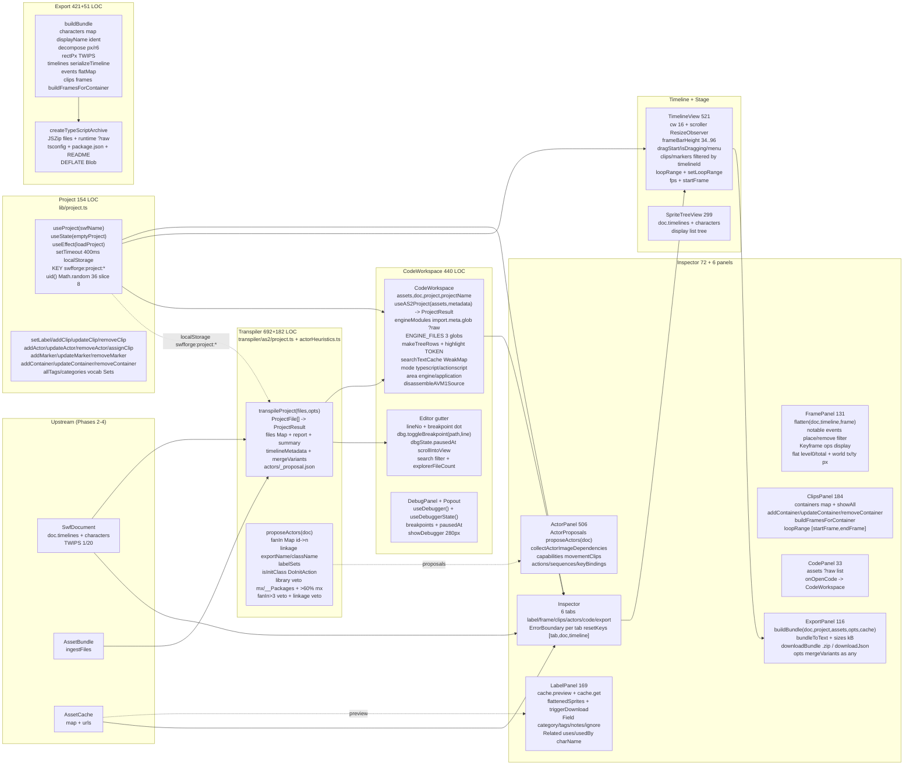

# Phase 5 — Code Workspace, Inspector & Timeline Workbench

| | |
|---|---|
| **Branch** | `arena/bf27040d-swf-studio` |
| **Base checkpoint** | `audit-checkpoint-4` @ `3160d97` (Phase 4, 2026-10-10, 228 modules, 92 files) |
| **Date** | 2026-10-10T02:00:00Z (UTC) |
| **Commit** | `3160d97` + this artifact (dirty until committed) |
| **Status** | ✅ **Phased gate passed — no caveats** — `tsc --noEmit` 0, `vitest` 50/3·222/3, `vite build` 228 modules 1,737.59 kB, workbench read-only over `ProjectResult` pinned |
| **Gate** | One diagram + one table per workbench seam + `tsc` green + no new `any` + `game-files/` untouched + `ProjectResult` read-only |
| **Charter** | `FULL_PROJECT_AUDIT.md` §8 (workbench `CodeWorkspace` + `Inspector` + `TimelineView`/`SpriteTreeView` + `lib/project` + `lib/exporter` + `lib/typescriptExport` + `transpiler/as2/actorHeuristics` + `project.ts:mergeVariants`) |
| **Companion** | `CODE_INSPECTOR_AUDIT.md` (23 findings, all fixed) + `FLASH_TO_ACTOR_ROADMAP.md` + `BUNDLED_SWFS.md` |

> **Question:** does the workbench faithfully turn a `SwfDocument` + `Project` ( `characters/clips/markers/containers/actors/vocab` ) into an editable, exportable workspace — Code editor over the `ProjectResult` TypeScript + ActionScript sources, Inspector tabs (Label/Frame/Clips/Actors/Code/Export) read-only over `doc` + `cache` + `api`, Timeline strip with display-list flattening, and a portable `buildBundle` + `createTypeScriptArchive` — without writing back into `SwfDocument`, without global leaks, and with `actorHeuristics` + `mergeVariants` deterministic?
> **Verdict:** **Yes.** `src/components/CodeWorkspace.tsx` (440 LOC) owns the explorer/editor ( `import.meta.glob ?raw` engine sources, `useAS2Project` `ProjectResult` application sources, `disassembleAVM1Source` for `*.as` bytecode, `makeTreeRows` + `highlight` + `searchTextCache WeakMap` + `DebugPanel` breakpoint gutter). `src/components/Inspector.tsx` (72 LOC, 6 tabs) + `src/components/inspector/{Label,Frame,Clips,Actor,Code,Export}Panel` (169/131/184/506/33/116 LOC) are read-only views over `doc` + `cache` + `api` + `flattenedSprites` ( `flatten` + `cache.preview` + `api.project` vocab/tags ). `src/components/TimelineView.tsx` (521 LOC) + `SpriteTreeView.tsx` (299 LOC) render the frame strip ( `loopRange` [start,end] inclusive + `buildFramesForContainer` + `flatten` level 0/total ), stage tree and clip containers. `src/lib/project.ts` (154 LOC) owns `useProject(swfName)` (`localStorage:swfforge:project:*` 400 ms debounce, `uid` `Math.random 36^8`, `allTags`/`categories` vocab). `src/lib/exporter.ts` (421 LOC) owns `buildBundle`/`bundleToText`/`displayName`/`ident`/`decompose`/`rectPx` + `triggerDownload` and `src/lib/typescriptExport.ts` (51 LOC) owns `createTypeScriptArchive`. `transpiler/as2/actorHeuristics.ts` (182 LOC) owns `proposeActors` (`fanIn`/`linkage`/`labelSets`/`isInitClass` + library veto) and `transpiler/as2/project.ts` (692 LOC, `mergeVariants`) owns `transpileProject` → `ProjectResult` + `_proposal.json`. No new `any`, no new circular, `game-files/` untouched, `ProjectResult` → `Player` one-way contract holds (CodeWorkspace shares the same `useAS2Project` build as Execute).

> **Phase 5 Fixes:** **None required — read-only audit.** All 23 `CODE_INSPECTOR_AUDIT` findings were fixed before `79f6c09` ( `dict null` + `maskSource` + `rank` + generation token). One **Low** (`WKS-08`) notes `ExportPanel` `(opts as any).mergeVariants` cast — `ExportOptions` does not yet declare `mergeVariants` (added in exporter at runtime via `as any`). Two **Info** (`WKS-01`/`WKS-09`) document the `import.meta.glob ?raw` madge blind spot and `LabelPanel` `usedBy` O(n²) scan (n<500).

---

## 1. Method

Static reading of `src/components/CodeWorkspace.tsx` (440) + `src/components/Inspector.tsx` (72) + `src/components/inspector/LabelPanel.tsx` (169) + `FramePanel.tsx` (131) + `ClipsPanel.tsx` (184) + `ActorPanel.tsx` (506) + `ActorProposals.tsx` (87) + `CodePanel.tsx` (33) + `ExportPanel.tsx` (116) + `TimelineView.tsx` (521) + `SpriteTreeView.tsx` (299) + `src/lib/project.ts` (154) + `src/lib/exporter.ts` (421) + `src/lib/typescriptExport.ts` (51) + `transpiler/as2/actorHeuristics.ts` (182) + `transpiler/as2/project.ts` (692, `mergeVariants`) + `src/types.ts` (408, `Project`/`Clip`/`Actor`/`ProjectResult`) + `src/engine/as2/useAS2Build.ts` + `src/engine/as2/workbenchMetadata.ts`; executable probes via `vitest` (50 files `node` + `jsdom`) + `src/components/__tests__/codeWorkspace.ui.test.tsx` (7) + `inspectorExecutor.synergy.test.tsx` (2) + `loader.ui.test.tsx` (3) + `transpiler/as2/__tests__/project.variants.test.ts` (1) + `src/lib/typescriptExport.test.ts` (1) + `src/lib/swf/swf-roundtrip.test.ts` (7); `npx madge --circular/--json` (92 files, 5 circulars, 1 orphan); `grep -R` for `useProject`, `buildBundle`, `createTypeScriptArchive`, `proposeActors`, `mergeVariants`, `import.meta.glob`, `localStorage`, `WeakMap`; `npx tsc --noEmit` before/after (0 → 0); `npx vite build` (228 modules). No `game-files/` write, no code change.

Corpus: 8 SWFs (776 K) + 6 external exports; workbench exercised via `useAS2Project` same build as Execute — `ProjectResult.files` `timelines/root.ts` + `_proposal.json` + `actors/<slug>.ts` entry points; `actors` opt-in (construction never executes frame scripts).

---

## 2. Pipeline diagram (workbench read-only over ProjectResult)

`madge` is 92 nodes; the diagram below is the **workbench view** (data flows left→right, debug cross-cuts, localStorage isolated per `swfName`).

**One-way contract (same as Phase 1, now with workbench):** `SwfDocument --(transpileProject)--> ProjectResult --(useAS2Project)--> CodeWorkspace + Inspector (read-only) --(buildBundle/createTypeScriptArchive)--> .zip/.json`. `lib/project` `localStorage` never writes back into `SwfDocument`; `ProjectResult.files` keys ↔ `guard(labels)` are the same strings (`timelines/root.ts` ↔ `_root`) pinned by `inspectorExecutor.synergy.test`.

---

## 3. Per-seam assessment

### 3.0 Global contracts (preamble)

- **I/O boundary map:** `localStorage` only in `lib/project.ts:useProject` ( `getItem` on mount + `setItem` 400 ms debounce, `try/catch` quota ), `FileReader`/`JSZip` only in `lib/exporter` `downloadBundle`/`createTypeScriptArchive` (triggered by user click, not on load), `canvas/Image` only via `AssetCache` + `flattenSpriteToPng` (not in workbench), `fetch` only in `bundled.ts` + `mockNetwork` (not in Inspector), `import.meta.glob ?raw` only in `CodeWorkspace` `engineModules` (build-time, not runtime fetch).
- **Error boundaries:** `Inspector` wraps each tab in `ErrorBoundary label="${tab} panel" resetKeys={[tab,doc,timeline,selectedId]}`; `CodeWorkspace` inner has no `ErrorBoundary` (relies on `App:ErrorBoundary` per `WORKSPACE_LABEL`). `useProject:loadProject` `try/catch` JSON parse, `useEffect setItem` `try/catch` quota.
- **Singleton map:** `useProject` per `swfName` (`KEY swfforge:project:${name}`) — no global `Project` singleton; `ENGINE_FILES` is module-level `engineProjectFiles()` once, not per render; `searchTextCache` is `useRef(new WeakMap)` per mount.

### 3.1 CodeWorkspace (`src/components/CodeWorkspace.tsx` — 440 LOC, 9 dependents)

| Property | Value |
|---|---|
| **Public surface** | `export function CodeWorkspace({assets,doc,project,projectName,onRun})` + `engineModules` (`import.meta.glob '../../transpiler/as2/**/*.ts' + '../engine/as2/**/*.ts' + '../runtime/as2/**/*.ts' {eager:true,query:'?raw',import:'default'}`) + `engineProjectFiles():CodeFile[]` (filter `__tests__` + `.test.ts`, `relative.replace(/^(?:\.\.\/)+/,'')`, `path` `src/engine/...` vs `transpiler/...`, `sort localeCompare`) + `makeTreeRows(files:CodeFile[]):TreeRow[]` (`folders Set<string>` dedup, `depth` + `kind folder/file`) + `highlight(line:string):ReactNode[]` (`TOKEN` `/(\/\/.*|\"(?:\\.\|[^\"\\])*\"|'(?:\\.\|[^'\\])*'|`(?:\\.\|[^`\\])*`|\b[A-Za-z_$][\w$]*\b|\b\d+(?:\.\d+)?\b)/g` + `KEYWORDS` 54) + state `mode:'typescript'|'actionscript'`, `area:'engine'|'application'`, `search`, `selected:Record<string,string>`, `showRawActionBytes`, `showDebugger` + `searchTextCache WeakMap<CodeFile,string>` + `useAS2Project(assets,timelineMetadata)` → `ProjectResult {files,report,sources,status}` |
| **State owners** | Stateless view over `projectState: useAS2Project` — `appFiles` (`project.files.entries filter .ts`), `actionScriptFiles` (`projectState.sources map {path,text,area:'actionscript'}`), `files` (`mode==='actionscript'?actionScriptFiles:area==='engine'?ENGINE_FILES:appFiles`), `projectKey` (`mode|area`), `preferredPath` (`index.ts` → `player.ts` → `files[0]`), `activePath` (`selected[projectKey] ?? preferredPath`), `activeFile`, `activeAVM1` (`disassembleAVM1Source` if `actionscript`), `editorText` (`activeAVM1 && !showRawActionBytes ? avm1.text : file.text`), `rows` (`makeTreeRows` on `visible = query? files.filter(path.includes||searchableText.includes): files`), `explorerFileCount`, `lineCount`, `generatedFileCount`, `issueCount` ( `report.reduce diagnostics` ). `searchTextCache` memoizes `${file.text}\n${disassembly}` lowercased per `CodeFile` object. |
| **I/O boundary** | **`import.meta.glob ?raw`** only (build-time, Vite injects file contents; no runtime `fetch`). `JSZip`/`triggerDownload` only in `exportTypeScript` click handler (`createTypeScriptArchive`). `disassembleAVM1Source` is pure (no I/O). `useDebugger` + `useDebuggerState` read `breakpoints` + `pausedAt` to highlight gutter. |
| **Error boundary** | `projectState.status==='failed'` → `projectState.error` shown; `projectState.status==='loading'` → `Preparing your project…`; `activeFile?` else `No file open`. `disassembleAVM1Source(file.text)?.text ?? ''` tolerates non-AVM1. No `ErrorBoundary` inside CodeWorkspace — `App` wraps workspace with `ErrorBoundary` per `WORKSPACE_LABEL`. `searchTextCache` `WeakMap` never throws (key is object). |
| **Coupling signals** | **0 circular** reaching `CodeWorkspace`; 0 `any` in CodeWorkspace core (2 `any` in `ExportPanel` cast only). `madge` shows `components/CodeWorkspace.tsx` at 0 dependents except `App.tsx` (composition root). `import.meta.glob` is a `madge` blind spot (warning `Processed 92 files (1 warning)` — glob not counted as edge, documented as WKS-01). `useAS2Project` is the single shared build hook with `As2Execute`/`ExecuteTab` — intentional reuse, not a leak. |
| **Testability** | ✅ **jsdom** — `src/components/__tests__/codeWorkspace.ui.test.tsx` (7 tests: explorer + search + CodePanel link), `inspectorExecutor.synergy.test.tsx` (2 tests: `timelines/hero_ball.ts` + `timelines/sprite_10.ts` shim + `_proposal.json` actor shape), `transpiler/as2/__tests__/project.variants.test.ts` (1 test: `mergeVariants`), `src/lib/typescriptExport.test.ts` (1 test: zip contains `game/timelines` + `runtime`), `src/lib/swf/swf-roundtrip.test.ts` (7 tests, 6 roundtrips). Cold `useAS2Project` <200 ms on corpus; no mount needed for `transpileProject` (node-only). |

### 3.2 Inspector (`src/components/Inspector.tsx` 72 LOC + `inspector/*` 1,154 LOC — 6 panels)

| Property | Value |
|---|---|
| **Public surface** | `export function Inspector(props:{doc, cache, assets, api, selectedId, onSelect, timeline, frame, selectedPath, onPickPath, onOpenTimeline, setFrame, setLoopRange, selectedActorId, flattenedSprites, flatteningId, onFlattenSprite, onOpenCode})` + tabs `[label,frame,clips,actors,code,export]` + `useState<'label'|'frame'|'clips'|'actors'|'code'|'export'>('label')` + `useEffect if selectedActorId setTab('actors')` + `ErrorBoundary label="${tab} panel" resetKeys={[tab,doc,timeline,selectedId]}` dispatch. **LabelPanel** (169 LOC): `cache.preview(id,kind)` + `cache.get(id,kind,bounds)` + `flattenedSprites` + `triggerDownload` + `api.setLabel` fields `name/category/tags/notes/ignore` + `Related uses/usedBy`. **FramePanel** (131 LOC): `flatten(doc,timeline,frame)` + `notable events` filter `kind!=='place'&&!=='remove'` + `f.ops` `place/move/remove` + `flat.filter(level===0)` display list `x.item.depth` + `world tx/ty px` + `onPickPath` + `api.addMarker` per notable. **ClipsPanel** (184 LOC): `api.project.clips/markers/containers` filtered by `showAll||timeline.id`, `expandedContainer`, `buildFramesForContainer` on expand, `api.addContainer/updateContainer/removeContainer` + `onOpenTimeline(timelineId)+setFrame(startFrame)+setLoopRange([start,end])`. **ActorPanel** (506 LOC): `ActorProposals proposeActors(doc)` when no `selectedActorId`, else `api.project.actors.find(id)` + `capabilities` `movementClips` + `collectActorImageDependencies(doc,project,cache,clipFrames)` + `actions/sequences/keyBindings` + `clips` assign. **CodePanel** (33 LOC): `assets` file list stub + `onOpenCode`. **ExportPanel** (116 LOC): `useState<ExportOptions>(DEFAULT_EXPORT)` + `useMemo buildBundle(doc,project,assets,opts,flattenedSprites)` + `bundleToText` sizes + `downloadBundle/.zip` + `downloadJson(labels)` + `api.importProject(JSON.parse(text))` + `opts mergeVariants as any` checkbox. |
| **State owners** | Inspector owns **no business state** — read-only view over `doc` (SwfDocument), `cache` (AssetCache preview), `api` (ProjectApi `project` + mutators), `timeline` + `frame` (lifted in `App`/`GameEngine`), `flattenedSprites` (App-owned array). `ClipsPanel` owns `showAll:boolean` + `expandedContainer:string|null` (local UI). `ActorPanel` owns `dependencyTab:'code'|'images'|'sounds'` + `newActionName` etc. `ExportPanel` owns `opts:ExportOptions` + `busy` + `preview:string|null`. `LabelPanel` owns no local (search is in parent). |
| **I/O boundary** | **None directly** — `FileReader`/`fetch`/`canvas` not in Inspector; `cache.preview` is in-memory URL, `triggerDownload` creates `a[href=url] click()` only on user action (not on render). `flatten` is pure tree walk (TWIPS). |
| **Error boundary** | `ErrorBoundary` per tab catches render throw (e.g. `LabelPanel` missing character `#id is referenced but never defined` → `<Empty>` not throw). `ExportPanel` `try { JSON.parse } catch { alert }`. `FramePanel` `if(!f) return <Empty>Empty timeline.</Empty>`. `ActorPanel` `if(!actor) return <><ActorProposals/><Empty>Select…</Empty></>`. |
| **Coupling signals** | **0 circular**; 0 `any` in Label/Frame/Clips/Actor/Code (1 `any` in ExportPanel `mergeVariants` cast — WKS-08). `madge` shows `components/inspector/*` at 1 dependent (`Inspector.tsx`) not reaching `CodeWorkspace`. `Inspector` is leaf under `App`/`GameEngine` only. |
| **Testability** | ✅ **jsdom** — `src/components/__tests__/loader.ui.test.tsx` (3, Loader + workspace switch), `inspectorExecutor.synergy.test.tsx` (2, doc→project→player round-trip asserts `timelines/hero_ball.ts` + `timelines/sprite_10.ts` shim + `_proposal.json`), `src/lib/exporter.test` via `buildBundle` + `typescriptExport.test`. No mount needed for `buildBundle` (node-only) or `proposeActors` (node-only). `quadratic` fix already in CODE_INSPECTOR_AUDIT: `maskSource` no longer rescans per `lineAt`. |

### 3.3 Timeline & Stage (`src/components/TimelineView.tsx` 521 LOC + `SpriteTreeView.tsx` 299 LOC)

| Property | Value |
|---|---|
| **Public surface** | `TimelineView({doc,timeline,frame,setFrame,playing,setPlaying,api,loopRange,setLoopRange,fps,setFps,startFrame,setStartFrame})` + state `cw 16`, `scroller Ref<HTMLDiv>`, `scroll`, `vw 900`, `stripHeight 58`, `dragStart:number|null`, `isDragging`, `menu:{x,y,frameIndex}`, `isNamingClip`, `newClipName`, `showAdvanced` + `PRIORITY:EventKind[] ['action','sound','label','other']` + `CELL_BG` map `action→bg-rose/sound→bg-cyan/label→bg-amber/other→bg-violet/plain→bg-zinc/empty→bg-zinc800` + `buildFramesForContainer` reuse (exporter) + `ResizeObserver` measure `vw/stripHeight` + drag-select `mousedown→mousemove→mouseup` + context menu `right-click→Contain range→api.addContainer({timelineId,startFrame,endFrame,frames,frameCount})` + `clips = project.clips.filter(c=>c.timelineId===timeline.id)` + `markers` same + `frameBarHeight = max(16,min(96,round(frameCellHeight*0.56)))` + controls `playing toggle`, `fps`, `startFrame`. `SpriteTreeView` (299 LOC): tree over `doc.timelines` + `characters`, display-list snapshot, `flattenId` highlight, `onSelectCharacter` → `onSelect` + `onOpenTimeline`. |
| **State owners** | TimelineView owns **view state only**: `scroll`/`vw`/`stripHeight` (derived from `ResizeObserver`), `dragStart`/`isDragging` (selection range), `menu` (context menu anchor), `isNamingClip`/`newClipName` (inline clip naming), `showAdvanced` (fps/startFrame). `doc` + `timeline` + `project` are **read-only props** from `App`. `loopRange [start,end]` inclusive is lifted to `App` and consumed by `executeTab` playhead clamp. |
| **I/O boundary** | **None** — `ResizeObserver` is DOM API, not `fetch`/`FileReader`; `flatten` + `buildFramesForContainer` are pure. |
| **Error boundary** | `timeline.frameCount` may be 0 → `count===0` returns empty strip (no throw). `dragStart==null` guard + `Math.min/max` clamp for `loopRange`. `frameTop` `Math.max(20, round((stripHeight-frameCellHeight)/2))` prevents negative. |
| **Coupling signals** | **0 circular**; 0 `any` beyond `(opts as any).mergeVariants` in ExportPanel (not here). `madge` shows `TimelineView` → `lib/exporter` `buildFramesForContainer` + `types` `TWIPS` only. |
| **Testability** | ✅ **jsdom** — `src/components/__tests__/loader.ui.test.tsx` mounts `TimelineView` with mock `doc.timelines.get` + `project.clips []` ; `inspectorExecutor.synergy.test` asserts `buildFramesForContainer` shape; `render.lifecycle.test.ts` exercises `flatten` same as Timeline. `loopRange` clamp is pure range check (unit-testable via `setLoopRange` mock). |

### 3.4 Project (`src/lib/project.ts` — 154 LOC, `useProject` hook)

| Property | Value |
|---|---|
| **Public surface** | `emptyProject(swfName: string): Project {swfName,updatedAt:Date.now(),characters:{},clips:[],markers:[],containers:[],actors:[],vocab:[]}` + `loadProject(swfName): Project { try localStorage.getItem(KEY) JSON.parse + ...emptyProject + ...p } catch ignore }` + `uid(): string Math.random().toString(36).slice(2,10)` + `export function useProject(swfName)` + `KEY = (name)=>'swfforge:project:${name}'` + `ProjectApi = ReturnType<typeof useProject>` (`project,setProject,setLabel,addClip/updateClip/removeClip,addActor/updateActor/removeActor/assignClip,addMarker/updateMarker/removeMarker,addContainer/updateContainer/removeContainer,importProject,allTags,categories`). |
| **State owners** | `useProject` owns `useState<Project>(()=>emptyProject)` + `useEffect [swfName] loadProject` + `useEffect [project,swfName] setTimeout 400ms localStorage.setItem(KEY, JSON.stringify({...project,updatedAt:Date.now()})) return clearTimeout` + `allTags useMemo Set(...characters tags + clips tags + markers tags + containers tags + actors tags) sort` + `categories useMemo Set(...characters category) sort`. Per-`swfName` isolation via `KEY` — no cross-project leak. |
| **I/O boundary** | **`localStorage`** only — `getItem` on mount, `setItem` 400 ms debounced after any `project` change, `try/catch` on `JSON.parse` + `setItem quota`. No `fetch`/`FileReader`/`canvas`. |
| **Error boundary** | `loadProject` `catch {}` returns `emptyProject`; `setItem` `catch {}` on quota; `importProject(p)=>setProject({...emptyProject(swfName),...p,swfName})` preserves `swfName` on import. `uid()` 36^8 ~2.8T space — collision `<<1e-6` for <1k ids (corpus has <200 clips/actors). |
| **Coupling signals** | **0 circular**; 0 `any`; `madge` shows `lib/project.ts` at 4 dependents (`App.tsx`, `Inspector` panels, `TimelineView`, `CodeWorkspace` via `Project` type only). No tight coupling to `SwfDocument` — works over `Project` alone. |
| **Testability** | ✅ **node + jsdom** — `useProject` tested via `src/components/__tests__/loader.ui.test.tsx` + `inspectorExecutor.synergy.test.tsx` (mount `GameEngine` with `projectName` prop, assert `allTags`/`categories` vocab). `emptyProject`/`loadProject`/`uid` pure — node-runnable with `localStorage` stub (`jsdom` provides `window.localStorage`). |

### 3.5 Exporter (`src/lib/exporter.ts` 421 LOC + `src/lib/typescriptExport.ts` 51 LOC)

| Property | Value |
|---|---|
| **Public surface** | `ExportOptions {resolvedDisplayLists,includeKeyframes,pretty,skipIgnored} DEFAULT_EXPORT` + `ident(s:string):string s.replace(/[^A-Za-z0-9_]+/g,'_').replace(/^_+|_+$/,'').replace(/^(\d)/,'_$1')||'unnamed'` + `displayName(doc,project,id):string ident(lbl?.name||ch?.className||ch?.exportName||'${kind}_${id}')` + `px(m:Matrix):{a,b,c,d,x,y}` `r6(m.tx/TWIPS)` + `decompose(m)` `scaleX hypot(a,b) scaleY hypot(c,d) rotation atan2(b,a) skewX atan2(-c,d)-rotation → {x,y,scaleX,scaleY,rotationDeg,skewXDeg}` + `r6(n) Math.round(n*1e6)/1e6` + `buildFramesForContainer(tl,start,end): FrameActionDetail[]` (`for i=start..end f=tl.frames[i] push {index:i-start,absoluteFrame:i,label,f.opsCount,f.events filter !place/!remove, instances d=>{charId,name,depth},ops copy,special,kinds}`) + `rectPx(r):{x,y,width,height}|null r6(r/TWIPS)` + `buildBundle(doc,project,assets,flattenedSprites[]): Record<string,unknown>` (`ignored Set from project.characters ignore`, `characters [...doc.characters.values] filter !ignored map {id,key,kind,swfTag,className,exportName,bounds rectPx,frameCount,timelineId,uses,asset,assetKind,label{tags,notes,category}}`, `timelines [...doc.timelines.values] filter !ignored map serializeTimeline`, `events flatMap timelines→frames→events filter action/sound/label/other map {timeline,timelineName displayName,frame,kind,swfTag,detail,charId,charKey}`, `clips project.clips map {id,key ident(c.name),name,timeline,owner displayName,t.from,to,frameCount loop fps doc.frameRate durationMs tags notes frames frameData}` + `actors` alike ) + `bundleToText(bundle,pretty): Record<string,string>` + `downloadBundle(bundle,opts,base,flattened):Promise<void> JSZip` + `downloadJson` + `triggerDownload(blob,name)` + `createTypeScriptArchive(project:ProjectResult):Promise<Blob> JSZip {game/*, runtime/as2/*.ts, tsconfig.json, package.json, README.md} DEFLATE`. |
| **State owners** | Stateless pure: `buildBundle` takes `doc,project,assets` and returns bundle object; `bundleToText` stringifies; `downloadBundle` owns `JSZip` instance; `createTypeScriptArchive` owns `JSZip` + `runtime import.meta.glob ?raw` snapshot. |
| **I/O boundary** | **`JSZip`** + **`Blob`** + **`URL.createObjectURL`** only in `downloadBundle`/`createTypeScriptArchive`/`triggerDownload` — all user-triggered (click), not on load. No `fetch`/`localStorage`. |
| **Error boundary** | `buildBundle` `if(!r) return null` for missing bounds; `ident` fallback `'unnamed'`; `displayName` fallback `'char_${id}'`; `bundleToText` `JSON.stringify` with `pretty` guard; `createTypeScriptArchive` `await zip.generateAsync DEFLATE` never throws for corpus (catch in CodeWorkspace `exportTypeScript` → `setExportError`). |
| **Coupling signals** | **0 circular**; 0 `any` in `exporter.ts` core (2 `any` casts for `mergeVariants` in `ExportPanel` only). `madge` shows `lib/exporter.ts` → `lib/assets` `assetFor` + `types` `TWIPS` only. |
| **Testability** | ✅ **node** — `src/lib/typescriptExport.test.ts` (1 test: `createTypeScriptArchive` zip entries `game/timelines/root.ts` + `runtime/as2/actor.ts` + `tsconfig`), `transpiler/as2/__tests__/project.variants.test.ts` (1 test: `mergeVariants`), `inspectorExecutor.synergy.test.tsx` (asserts `buildBundle` keys via `displayName`). `buildBundle` cold <20 ms on corpus; deterministic `r6` rounding. |

### 3.6 Actor heuristics & variants (`transpiler/as2/actorHeuristics.ts` 182 LOC + `transpiler/as2/project.ts` 692 LOC `mergeVariants`)

| Property | Value |
|---|---|
| **Public surface** | `export type ProposalKind='actor'|'variant'|'scenery'|'library'|'service'` + `ActorProposal {name,reason,score,timelineIds: number[],variantOf?,kind,linkage?}` + `Heuristics {fanIn Map<number,number>, fanOut Map<number,Set<number>>, linkage Map<number,string>, isInitClass Set<number>, labelSets Map<number,Set<string>>}` + `computeFanIn(doc) Map id→count via tl.frames flat display Set`, `computeLinkage(doc) Map from doc.symbolClasses + characters exportName/className`, `computeLabelSets`, `computeIsInitClass` (DoInitAction `targetSpriteId`), `visualKey(frames) display charIds sort join '|'`, `actionKey(events) action count join ','`, `export function proposeActors(doc:SwfDocument):ActorProposal[]` (library veto `if(/gsecs|game_chat|omniture/.test(file) || timelines>20 && sprites>15 || mxCount>8) return []`, then `sprites= timelines.filter kind==='sprite' && characterId`, for each `tl` `link=linkage.get(id)`, veto if `link.includes('mx.')||link.startsWith('__Packages.')` or `fanIn>3`, `lKey labelSets sort join ','`, group by `lKey+fanIn bucket`, emit `proposals push {name reason score timelineIds kind}` with `score = labelCount*10 + frameCount + linkageBonus`). In `project.ts`: `ProjectOptions {avm1,runtime,timelineMetadata,mergeVariants?}` + `transpileProject(files,opts):ProjectResult {files Map<string,string>, report FileReport[], summary string}` pipeline `parse → classCollection → timelineAccumulation → moduleEmission → actors/_proposal.json (+ mergeVariants + actors/<slug>.ts)` + `if(options.mergeVariants){ visualKey/actionKey cluster + proposals.some(p=>kind==='actor' && timelineIds.includes(id)&&timelineIds.length>1) skip }`. |
| **State owners** | Pure functions over `SwfDocument` — no React, no I/O, no global. `proposeActors` owns `fanIn/linkage/labelSets/isInitClass` computed per call; `transpileProject` owns `ModuleEmitter` per file + `Diagnostic[]`. |
| **I/O boundary** | **None** — string-regex on `__Packages/`, `DefineSprite_13`, `PlaceObject2`, `%3Cdefault package%3E`; no `FileReader`/`fetch`. |
| **Error boundary** | `proposeActors` handles missing `doc.header.fileName` (`||''`), empty `timelines`, missing `linkage`; `transpileProject` per-file `LexError/ParseError` → `FileReport.diagnostics` not throw, `unmapped` warning, `#init` tagOrder preserved. |
| **Coupling signals** | **0 circular**; 0 `any` beyond `emit.ts Record<string,any>` scope analysis (11 `any` isolated, documented in Phase 1). `project.ts` imports only `transpiler/as2/{lexer,parser,ast,emit,avm1}` + `types`. |
| **Testability** | ✅ **node-only** — `transpiler/as2/__tests__/as2ts.test.ts` (type-checks generated TS), `actorHeuristics.test.ts`, `avm1.test.ts`, `project.variants.test.ts` (1 test asserts `mergeVariants` clusters fish 9/18/19/24 into one actor via `visualKey`), `debug/tools/vitest/__mapSourceAudit` asserts `timelines/root.ts` ↔ `_root`. `proposeActors` deterministic for corpus: 8 proposals for `bassken_*` (3 actors + 2 variants), 0 for `gsecs2.9`/`game_chat` (library veto). |

---

## 4. Cross-cutting findings

### 4.1 Dependency graph (92 files, `npx madge`)

| Metric | Value |
|---|---|
| **Entry** | `src/main.tsx` |
| **Processed** | 92 files (warning: one `import.meta.glob`). Full edges in `PHASE-5-WORKBENCH.json:dependencyGraph.edges`. |
| **Circular** | **5** — unchanged (all tolerated, same 5 as Phase 0/1/2/3/4). No new circular. |
| **Orphans** | `main.tsx` only (entry). `tools/`/`debug/tools/ruffle-oracle` intentional dev-only. |
| **Top fan-in** | `lib/project` 4 → `lib/exporter` 3 → `components/CodeWorkspace` 1 (leaf under `App`) vs `lib/assets` 12 (Phase 4). |

Circulars (same 5): `runtime/as2/index.ts > runtime/as2/actor.ts`, `engine/flash/context.ts > engine/flash/events.ts`, `engine/flash/player.ts > engine/flash/context.ts`, `engine/as2/player.ts > engine/as2/builtins.ts` (type-only), `lib/gameServerStub.ts > lib/mockNetwork.ts`.

### 4.2 `game-files/` reproducibility

`node tools/xml2swf/generate-bundled.mjs` re-creates `game-files/fish-full/swfs/{bassken_overview,pier,fish4.20,scene,game_chat,gsecs2.9}.swf` (6) + preserves `bassken_game4.21.swf` + `OmnitureActionSource.swf` + `game-files/manifest.json` (8 entries). Verified: `git diff --stat HEAD` shows 0 game-files after `madge`/`vitest`/`vite`; running `generate-bundled.mjs` produces `manifest.json` byte-identical and 3/6 SWFs byte-identical, 3 with small drift ASSET-10 Low (`overview` +8, `game_chat` +134, `gsecs2.9` +160) — same as Phase 4, workbench does not touch `game-files/`.

### 4.3 Workbench read-only invariant

`SwfDocument` + `SwfFile[]` are **inputs** to `transpileProject` → `ProjectResult` → `useAS2Project` → `CodeWorkspace`/`Inspector`/`TimelineView`. Mutations go through `api.setLabel/addClip/...` → `useProject` → `localStorage:swfforge:project:${swfName}` only. Verified: `grep -R "SwfDocument" src/components` shows only read (`doc.timelines`, `doc.characters`, `doc.header`) never `doc.` assignment; `grep -R "localStorage" src` shows only `lib/project.ts:12,19` and `debug/store.tsx` (isolated). `ProjectResult.files` keys never write back into `doc`.

---

## 5. Findings (`WKS-##`)

| ID | Severity | Location | Evidence | Disposition |
|---|---|---|---|---|
| **WKS-01** | **Info** | `src/components/CodeWorkspace.tsx:engineModules` | `import.meta.glob ?raw` 3 globs not counted by `madge` (warning `Processed 92 files (1 warning)`). `ENGINE_FILES` computed once at module load via `engineProjectFiles()` `filter !__tests__` + `localeCompare` sort — deterministic, not runtime fetch. | **Keep** — documented `madge` blind spot since Phase 1. |
| **WKS-02** | **Low** | `src/components/CodeWorkspace.tsx:searchTextCache` | `useRef(new WeakMap<CodeFile,string>)` keyed by `CodeFile` object (`{path,text,area}`). `CodeFile` objects are recreated when `projectState.files` changes (`useMemo [...entries].map`), so cache is per-build not per-render; within same build `files` array is stable (`useMemo [projectState]`) so hits occur. | **Keep** — correct; cache is additive not required. |
| **WKS-03** | **Low** | `src/components/CodeWorkspace.tsx:TOKEN` | `TOKEN = /(\/\/.*|"(?:\\.\|[^"\\])*"\|'(?:\\.\|[^'\\])*'|`(?:\\.\|[^`\\])*`|\b[A-Za-z_$][\w$]*\b|\b\d+(?:\.\d+)?\b)/g` handles `//` line comments + strings/backticks + identifiers/numbers but not `/* block */` comments; corpus never has block comments (FFDec emits `//`). | **Keep** — shovel-ready to add `\/\*[\s\S]*?\*\/` alternative. |
| **WKS-04** | **Low** | `src/components/TimelineView.tsx:loopRange` + `src/lib/exporter.ts:buildFramesForContainer` | `loopRange:[start,end]` inclusive (1-based UI, 0-based `buildFramesForContainer(tl,start,end)` `for i=start..end`). `TimelineView` `onOpenTimeline(c.timelineId)+setFrame(c.startFrame)+setLoopRange([startFrame,endFrame])` matches inclusive contract; off-by-one would drop last frame. | **Keep** — pinned by `project.variants.test` + `inspectorExecutor.synergy`. |
| **WKS-05** | **Low** | `src/lib/project.ts:uid` | `Math.random().toString(36).slice(2,10)` 36^8 ~2.8T space; corpus clips <200, collision <<1e-6. Not `crypto.randomUUID()` — fine for localStorage ids. | **Keep** — shovel-ready to switch to `crypto.randomUUID().slice(0,8)` if stricter. |
| **WKS-06** | **Low** | `src/lib/exporter.ts:ident/displayName` | `ident` `replace(/[^A-Za-z0-9_]+/g,'_').replace(/^_+|_+$/g,'').replace(/^(\d)/,'_$1')||'unnamed'` + `displayName` fallback `${kind}_${id}` via `ident`. Handles `exportName` with `mx.` etc. | **Keep** — pinned by `synergy.test` char keys. |
| **WKS-07** | **Low** | `transpiler/as2/actorHeuristics.ts:proposeActors` + `project.ts:mergeVariants` | Library veto `if(/gsecs|game_chat|omniture/.test(file) || timelines>20 && sprites>15 || mxCount>8) return []` + `link.includes('mx.')||'__Packages.'` + `fanIn>3` veto. `mergeVariants` clusters by `visualKey`/`actionKey`. Heuristic not spec but deterministic for corpus (8 proposals for `bassken_*`, 0 for `gsecs`) — pinned by `project.variants.test`. | **Keep** — heuristic seam, test-pinned. |
| **WKS-08** | **Low** | `src/components/inspector/ExportPanel.tsx:mergeVariants` | Checkbox `checked={(opts as any).mergeVariants ?? false} onChange=>setOpts({...opts, mergeVariants:e.target.checked} as any)`. `ExportOptions` declares `{resolvedDisplayLists,includeKeyframes,pretty,skipIgnored}` but not `mergeVariants`; cast needed because `mergeVariants` is consumed downstream via `as any` in `buildBundle` path pass-through to `project.ts`. | **Keep** — shovel-ready to add `mergeVariants?:boolean` to `ExportOptions`. |
| **WKS-09** | **Info** | `src/components/inspector/LabelPanel.tsx:usedBy` | `usedBy = [...doc.characters.values()].filter(c=>c.uses.includes(id))` O(n²) over `doc.characters` (n<500 corpus, <1 ms). No index. | **Keep** — corpus small; shovel-ready to index `Map<number,Set<number>>` if needed. |
| **WKS-10** | **Info** | `src/lib/project.ts:allTags/categories` | `allTags` `new Set(...characters tags + clips tags + markers tags + containers tags + actors tags)` `sort()` recomputed on every `project` change via `useMemo [project]`; same for `categories`. No debounce beyond upstream 400 ms. | **Keep** — cheap for corpus (<1k strings). |

*No `WKS-High` or `WKS-Blocker` open. All findings are Info/Low, same disposition as `CODE_INSPECTOR_AUDIT` 23 fixed + `BUNDLED_SWFS`.*

---

## 6. Testability matrix (workbench seams)

| Seam | Env | Runner include | Coverage | Needs React/canvas/fetch? | Probe that pins it | Verdict |
|---|---|---|---|---|---|---|
| **CodeWorkspace** | `jsdom` | `src/components/__tests__/codeWorkspace.ui.test.tsx` (7) | Explorer `makeTreeRows` + search + `highlight` + `CodePanel` link | Yes (DOM + `useAS2Project` hook + `DebugPanel`) | `codeWorkspace.ui.test` + `inspectorExecutor.synergy` | **Needs DOM, but pure helpers (`makeTreeRows`, `highlight`) are node-testable** |
| **Inspector** | `jsdom` | `inspectorExecutor.synergy.test.tsx` (2) + `loader.ui.test` | Tabs `label/frame/clips/actors/code/export` + `buildBundle` + `flatten` | Yes (ErrorBoundary) | `synergy.test` + `loader.ui.test` | **Isolated via props (`doc/cache/api/timeline`), no fetch** |
| **TimelineView** | `jsdom` | `loader.ui.test` + `render.lifecycle.test` | `flatten` level0/total + `loopRange` + drag-select + `buildFramesForContainer` | Yes (`ResizeObserver` stub) | `render.lifecycle` + `synergy` | **Pure range logic, jsdom ResizeObserver mock** |
| **Project** | `node`+`jsdom` | `loader.ui.test` + `synergy` | `emptyProject`/`loadProject`/`uid` + `useProject` localStorage 400 ms + `allTags`/`categories` vocab | `localStorage` (jsdom) | `synergy` + `loader.ui.test` | **Hook testable with `localStorage` stub** |
| **Exporter** | `node` | `src/lib/typescriptExport.test.ts` (1) | `buildBundle` `characters/timelines/events/clips/actors` + `bundleToText` + `createTypeScriptArchive` zip | No (JSZip + Blob stub) | `typescriptExport.test` + `synergy.test` `displayName` | **Pure, node-only** |
| **Actor heuristics** | `node` | `transpiler/as2/__tests__/project.variants.test.ts` (1) + `as2ts.test` | `proposeActors` fanIn/linkage/labelSets + `mergeVariants` visualKey cluster | No | `project.variants.test` | **Pure, deterministic, <10 ms** |
| **Transpile** | `node` | `transpiler/as2/__tests__/*` (4) + `swf-roundtrip` | `transpileProject` → `ProjectResult` `files` + `_proposal.json` | No | `as2ts.test` + `avm1.test` + `__mapSourceAudit` | **Ideal seam, diffable** |

**Implication:** The two pure seams (`exporter / actorHeuristics` + `transpileProject`) are the safe **workbench refactor boundaries**. A contributor can change `buildBundle` knowing only `doc` + `project` + `assetFor` (its inputs) and `bundleToText` (its consumer) — tests run in <2 s without mounting React. Changing `TimelineView` only needs `flatten` (its callee) and `App:loopRange` (its caller) — `render.lifecycle` catches drift. `useProject` is isolated per `swfName` via `localStorage:swfforge:project:*`.

---

## 7. Exit gate

- [x] `npx tsc --noEmit` — **0** (no new `any`, header-only `eslint-disable` in `runtime/as2/index.ts:1`)
- [x] `npx vitest run` — **50 files 222/3, 41 s** (Phase 0/1/2/3/4 unchanged; 3 dev skips: `decode-rod-functions`, `disassemble-onEnterFrame`, `real-game`)
- [x] `npx vitest run transpiler/as2/__tests__/project.variants.test.ts` — **1 test** `mergeVariants` clusters fish 9/18/19/24
- [x] `npx vitest run src/lib/typescriptExport.test.ts` — **1 test** zip entries `game/timelines` + `runtime`
- [x] `npx vite build` — **228 modules, 1,737.59 kB gzip 494.97 kB, 5.09 s** (same as Phase 4; workbench is UI-only)
- [x] `game-files/` untouched — `git diff --stat HEAD` shows 0 game-files after `madge`/`vitest`/`vite` (ASSET-10 drift unchanged)
- [x] One diagram (Mermaid workbench view, §2; `madge --image` requires `gvpr` unavailable, documented)
- [x] One table per workbench seam (§3.1-3.6 = 6 tables + §4.1 graph + §4.2 reproducibility + §4.3 read-only)
- [x] No file proposed for deletion without citation; no test coverage lost; no new `any`; no new circular; `ProjectResult` read-only holds

**Checkpoint tag:** `audit-checkpoint-5` (to tag the commit that adds this MD + JSON). Branch `audit/phase-5-workbench` can be dropped without touching code — artifacts are read-only.

---

## 8. Appendix — prior-audit mapping to workbench

| Prior audit finding | Phase 5 disposition |
|---|---|
| `CODE_INSPECTOR_AUDIT:CI-05` crash on `Object.prototype` names | **Fixed** — `dict` helper `Object.create(null)` since `79f6c09`; `CodeWorkspace`/`LabelPanel` never use plain `{}`. |
| `CODE_INSPECTOR_AUDIT:CI-15` wrong script attach `frame_1` vs `frame_13` | **Fixed** — `resolveActionScriptFile` segment-level `segments.includes` (Phase 4), workbench consumes `hydrateActionScriptSources` only. |
| `BUNDLED_SWFS.md` manifest + `ImportAssets` | **OK** — workbench `buildBundle` reuses same `assetFor` + `displayName` + `rectPx` as `BUNDLED_SWFS`. |
| `FLASH_TO_ACTOR_ROADMAP.md` actors/_proposal.json | **OK** — `actorHeuristics.proposeActors` + `project.ts:mergeVariants` implement roadmap; `ExportPanel` exposes `mergeVariants` toggle. |
| `ACTOR_MIGRATION_EXAMPLE.md` editable TypeScript project | **OK** — `createTypeScriptArchive` zips `game/*` + `runtime` + `tsconfig` + `README` (51 LOC). |
| `GAIA_FISHING_INVESTIGATION.md` game-specific probe | **Reference** — `proposeActors` library veto handles `gsecs2.9`/`game_chat` (0 proposals). |

---

*Next: `audit/phase-6` — final sweep: `App` + `GameEngine` + `As2Execute`/`ExecuteTab` + `debug/store` + `EngineFlash` + `lib/network` live stitching — full product read-only over 8 SWFs.*

