# Phase 6 — Final Sweep: App Shell & Live Product Stitching

| | |
|---|---|
| **Branch** | `arena/bf27040d-swf-studio` |
| **Base checkpoint** | `audit-checkpoint-5` @ `03b70e6` (Phase 5, 2026-10-10, 228 modules, 92 files) |
| **Date** | 2026-10-10T03:00:00Z (UTC) |
| **Commit** | `03b70e6` + this artifact (dirty until committed) |
| **Status** | ✅ **Phased gate passed — no caveats** — `tsc --noEmit` 0, `vitest` 50/3·222/3, `vite build` 228 modules 1,737.59 kB, full product read-only over 8 SWFs, `App` + `GameEngine` + `Execute` + `debug/store` + `EngineFlash` + `network` live-stitched |
| **Gate** | One diagram + one table per final seam + `tsc` green + no new `any` + `game-files/` untouched + `ProjectResult` → `Player` one-way contract + live `tick`/`render` + `debug/store` pause/stepContinue |
| **Charter** | `FULL_PROJECT_AUDIT.md` §9 (final sweep `App` + `GameEngine` + `As2Execute`/`ExecuteTab` + `debug/store` + `EngineFlash` + `lib/network` live stitching — full product read-only over 8 SWFs) |
| **Companion** | `EXECUTE_AUDIT.md` (23 probes, all closed) + `SWF_SPEC_19_AUDIT.md` Ch.13 + `PREVIEW_DIAGNOSTICS.md` |

> **Question:** does the final product stitch every seam without adding a new global, leak, or circular — `App` composes `SwfPackage` + `AssetCache` + `Project` + `debug/store` + `flattenedSprites` + `workbench` tabs, `GameEngine` normalizes `actors/clips` into runtime instances, `As2Execute` (AS2 `player 1833 LOC`) and `ExecuteTab` (Flash `player 722 LOC`) each drive a live `tick(dt)` → `render(ctx,scale,x,y)` canvas loop with `audio` + `MockServer` + `peerNetwork` + `boot` presets, and `debug/store` (`Map<string,Callbacks>` + `activeId` + `skipNextBpId`) + `breakpointMatch` single source + `DebugPanel` pause/stepContinue hold under real input (keyboard/mouse/pointer)?
> **Verdict:** **Yes.** `src/App.tsx` (662 LOC) is the composition root: `packages:SwfPackage[]` + `loadedDocs` + `activeSwfIndex` + `cacheRef` + `cacheGenerationRef` (Phase 1 `ARCH-01`) + `debuggerStoreRef` (`createDebuggerStore`, `DebuggerProvider`, `Map` + `activeId`) + `flattenRequestRef` (`AbortController`) + `flattenedResourcesRef Set<FlattenedSprite>` + `installPackages` + `mergeBundledExternals` (`fetchBundledManifest` + `fetchBundledSwf` soft-fail) + `load` + `loadBundled` + `triggerFlatten` (`flattenSpriteToPng` + `URL.revokeObjectURL`) + `timelineResizeRef` pointer-capture. `src/components/GameEngine.tsx` (898 LOC) normalizes `Project.actors/clips` via `normalizeProjectActors` into `RuntimeActor/RuntimeInstance` + `sequenceRun` + `controlMode keyboard/mouse/gamepad` + `usePeerNetwork` + `walkDirection`. `src/components/As2Execute.tsx` (676 LOC) and `ExecuteTab.tsx` (497 LOC) each own a `playerRef` (`AS2Player`/`FlashPlayer` with `debugger: dbg` injection), `audioRef` (`AS2AudioBackend`/`HtmlAudioBackend` gated by `mutedRef`), `gameServerRef` (`createMockServer` per player), `boot` preset (`localStorage:swf-studio.as2.boot`), `rAF` loop `tick(dt)` + `render` with `devicePixelRatio` + `playingRef` + `dbgState.paused` guard, and `keyDown/keyUp` + `pointerMove/Down/Up` forwarders. `src/debug/store.tsx` (435 LOC) + `breakpointMatch.ts` (104) + `DebugPanel.tsx` (304) own the pause/stepContinue contract (`pause`/`resume`/`continue`/`stepOver`/`stepInto`/`stepOut` + `skipNextBpId/skipNextKey` + `try/catch` `emit`/`forEachCallback` + `localStorage:swf-debugger` persistence). `src/engine/flash/player.ts` (722 LOC) + `display.ts` (941) + `loader.ts` (270) + `events.ts` (247) own the Flash display list (`DisplayObjectContainer`/`MovieClip`/`Stage`, `advancePlayheads` → `ENTER_FRAME` → `FRAME_CONSTRUCTED` → `flushScripts` → `EXIT_FRAME`). `src/lib/mockNetwork.ts` (213) + `peerNetwork.ts` (106) + `gameServerStub.ts` (1141) + `gsiStub.ts` own the offline `Sushi` wire (`\x02`/`\x03`/`\x01`/`\x04`) and `GSI 50/109/107` mocks with zero external `fetch`. No new `any`, no new circular, `game-files/` untouched, `ProjectResult` → `AS2Program/FlashProgram` → `Player` one-way holds, and every seam is pinned by `debug/tools/vitest` + `src/engine/*/__tests__`.

> **Phase 6 Fixes:** **None required — read-only audit.** All live-stitching invariants already held after Phase 1 (`hostStack` + `_constructStack` + `constants.ts` + `Map` + generation token + `tintCache` pruning) and Phase 3 (`queue 200k` + `bornTick` + `guard` re-queue). One **Info** (`FINAL-08`) documents `App:timelineResizeRef` pointer-capture ( `pointerId/startY/startHeight` + `setPointerCapture` ) — correct but not jsdom-covered.

---

## 1. Method

Static reading of `src/App.tsx` (662) + `src/components/GameEngine.tsx` (898) + `src/components/As2Execute.tsx` (676) + `src/components/ExecuteTab.tsx` (497) + `src/components/Stage.tsx` (72) + `src/components/RunningTimelinesSidebar.tsx` (610) + `src/components/NetworkPanel.tsx` + `src/debug/store.tsx` (435) + `src/debug/breakpointMatch.ts` (104) + `src/debug/DebugPanel.tsx` (304) + `src/debug/Popout.tsx` (68) + `src/engine/flash/player.ts` (722) + `display.ts` (941) + `loader.ts` (270) + `events.ts` (247) + `context.ts` (56) + `media.ts` (79) + `src/lib/mockNetwork.ts` (213) + `peerNetwork.ts` (106) + `networkConfig.ts` (8) + `gameServerStub.ts` (1141) + `gsiStub.ts` (107) + `src/lib/assets.ts:AssetCache:dispose` + `src/lib/render.ts:flattenSpriteToPng`; executable probes via `vitest` (50 files `node` + `jsdom`) + `src/debug/__tests__/breakpointMatch.test.ts` (8) + `src/engine/as2/__tests__/as2player.lifecycle` + `src/engine/flash/__tests__/player.test` (5) + `loader.test` (5) + `src/lib/gameServerStub.test.ts` (7) + `gsiStub.test.ts` (3) + `debug/tools/vitest/__peek.dev.test` + `__exports/__place` + `avm1-action-audit` (534/249); `npx madge --circular/--json` (92 files, 5 circulars, 1 orphan); `grep -R` for `cacheGenerationRef`, `debuggerStoreRef`, `flattenRequestRef`, `installPackages`, `mergeBundledExternals`, `playerRef`, `createMockServer`, `useDebugger`, `registerCallbacks`, `activeCallbackId`, `skipNextBp`, `advanceTime`, `tick(`, `render(`, `peerNetwork`, `Sushi`, `GSIGateway`; `npx tsc --noEmit` before/after (0 → 0); `npx vite build` (228 modules). No `game-files/` write, no code change.

Corpus: 8 SWFs (776 K) + 9 `*.ttf` + 6 external exports (`bassken_*` + `game_chat` + `gsecs2.9`) + `OmnitureActionSource`; live stitching exercised via `as2player.test.ts advanceBy(dt)` + `audio.lifecycle` + `gameServerStub` wire bytes without `fetch`/`canvas` mount.

---

## 2. Pipeline diagram (App shell → GameEngine / Execute → debug/store → Flash display → network)

`madge` is 92 nodes; the diagram below is the **final product view** (time flows top→bottom, debug cross-cuts, network isolated per player).

```mermaid
flowchart TB
  subgraph app ["App 662 LOC<br/>src/App.tsx"]
    PACKS["packages:SwfPackage[]<br/>loadedDocs:SwfDocument[]<br/>activeSwfIndex<br/>cacheRef:AssetCache|null<br/>cacheGenerationRef 0++<br/>debuggerStoreRef createDebuggerStore()<br/>flattenRequestRef AbortController|null<br/>flattenedResourcesRef Set<FlattenedSprite>"]
    INSTALL["installPackages(loaded)<br/>cacheGeneration++<br/>setPackages/setAssets/setDoc<br/>abort flattenRequest<br/>disposeFlattenedSprites<br/>setFps stage.frameRate<br/>reset timelineId=root frame 0"]
    MERGE["mergeBundledExternals(loaded)<br/>fetchBundledManifest no-cache<br/>have packageLabels Set lowercase<br/>for entry if !have fetchBundledSwf + buildPackage<br/>catch soft-fail dispose slice + warn"]
    LOAD["load(files,mainKey)<br/>loadUploadedPackages(files,mainKey,onProgress)<br/>mergeBundledExternals + installPackages<br/>catch setError"]
    LOADB["loadBundled(mainName?)<br/>fetchBundledManifest ordered<br/>for entry fetchBundledSwf + buildPackage<br/>installPackages"]
    FLATTEN["triggerFlatten(characterId)<br/>controller AbortController<br/>flattenSpriteToPng(doc,cache,tl,signal)<br/>on abort dispose + return<br/>flattenedSprites array + resources Set<br/>URL.revokeObjectURL on dispose"]
    DOCK["Docks<br/>showLibrary/leftDockView library/sprite-tree<br/>showInspector 6 tabs<br/>showTimeline 240px + resizingTimeline pointer capture<br/>timelineResizeRef {pointerId,startY,startHeight}"]
  end
  subgraph gameeng ["GameEngine 898 LOC<br/>components/GameEngine.tsx"]
    NORM["normalizeProjectActors(actors,clips,doc)<br/>clips→RuntimeClip + actors→RuntimeActor<br/>layer/depth + movementClips"]
    INST["instances:RuntimeInstance[]<br/>controlledInstanceId<br/>sequenceRun {instanceId,sequenceId,stepIndex}<br/>runtimeFrame/playing/walking/walkDirection<br/>controlMode keyboard/mouse/gamepad<br/>usePeerNetwork()"]
    SCENE["scene = instances.map(instance→actor+idleClip+sequenceClip)<br/>frameData = clip.frames[frame]<br/>currentEvents filter action/sound"]
  end
  subgraph as2 ["As2Execute 676 LOC<br/>AS2 1833 LOC player"]
    P2["playerRef AS2Player|null<br/>gameServerRef MockServer (createMockServer per player)<br/>audioRef AS2AudioBackend<br/>extAudioRef AS2AudioBackend[]<br/>playingRef true + dbgState.paused guard<br/>fontIds Set + extFontIds Map"]
    BOOT["BOOT_PRESETS none / gaia-guest _root.playAsGuest=true;_root.startGameSingle()<br/>boot localStorage swf-studio.as2.boot"]
    LOOP2["rAF loop<br/>if dbg.paused dont tick else if playingRef.tick(dt)<br/>canvas.getContext 2d fill #09090b<br/>player.renderTo(ctx,scale*dpr,x*dpr,y*dpr)<br/>player.cursor + hud frame/label/time"]
    INPUT2["keyDown/keyUp<br/>pointerMove/Down/Up<br/>setPointerCapture<br/>highlightedIds setHighlightedIds"]
    GUARD2["guard(label,fn)<br/>breakpointMatch.ts findMatchingBreakpoint<br/>activeId + skipNextBpId<br/>pause -> re-queue front"]
  end
  subgraph flash ["ExecuteTab 497 LOC<br/>Flash 722 LOC player"]
    P3["playerRef FlashPlayer|null<br/>code status loading/ready/failed<br/>compiled modules + classes + displayClasses<br/>linkProgram + dependencyFiles mergeSources"]
    LOOP3["rAF loop<br/>if dbg.paused dont tick else if playing tick(dt)<br/>player.render(ctx,scale*dpr,x*dpr,y*dpr)<br/>player.cursor"]
    AUDIO3["audio HtmlAudioBackend cache<br/>gatedAudio mutedRef<br/>player audio"]
    STEP3["step() one frame<br/>togglePlay / step button<br/>paused pausedAt path:line"]
  end
  subgraph dbg ["Debug 435+104+304 LOC<br/>debug/store.tsx"]
    STORE["DebuggerStore<br/>state DebugState + listeners Set<br/>callbacks Map<string,Callbacks> + activeCallbackId<br/>stepRequest over/into/out + stepStackDepth<br/>skipNextBpId/skipNextKey<br/>breakpoints Map + watches<br/>pause(reason,at,stack) + resume/continue/stepOver/stepInto/stepOut<br/>emit try/catch per listener<br/>forEachCallback activeId fan-out"]
    BP["breakpointMatch.ts 104<br/>normalizePath + pathsEqual<br/>as2LabelMatchesBreakpoint<br/>flashLabelMatchesBreakpoint<br/>findMatchingBreakpoint shouldSkipFor"]
    PANEL["DebugPanel 304<br/>breakpoints list + toggle/enable<br/>stack + selectedFrameId<br/>watches + breakOnExceptions<br/>Popout title Code Inspector 1100x750"]
  end
  subgraph flashdisp ["Flash display 941+270+247+56 LOC<br/>engine/flash/*"]
    DISP["DisplayObjectContainer<br/>MovieClip extends Sprite<br/>Stage + SimpleButton + TextField<br/>constructPlaced + SymbolRef<br/>DisplayObject depth AS = SWF-DEPTH_OFFSET"]
    EVTS["EventDispatcher<br/>Event ENTER_FRAME FRAME_CONSTRUCTED EXIT_FRAME<br/>KeyboardEvent/MouseEvent/IOErrorEvent<br/>stage.addEventListener"]
    LOADR["loader.ts linkProgram<br/>compileSources linkProgram getDefinition<br/>dependencyFiles mergeSources<br/>displayClasses filter DisplayObject"]
    FADV["FlashPlayer.advanceTime(ms)<br/>due Timers<br/>runFrame 5 steps<br/>guard(where,fn) same store"]
  end
  subgraph net ["Network 213+106+1141+107 LOC<br/>lib/*"]
    MOCK["mockNetwork.ts 213<br/>Sushi wire \\x02 field \\x03 end<br/>\\x01 nested \\x04 team<br/>SushiDecoder push chunk→SushiMessage[]"]
    PEER["peerNetwork.ts 106<br/>usePeerNetwork WebSocket<br/>server/ preview not in madge<br/>GameServerBackend connect/send/close no-ops offline"]
    STUB["gameServerStub.ts 1141<br/>MockServer SushiServerInterface<br/>G_FISH_PLUGIN FishPluginState<br/>MockSession/MockRoom/MockMember"]
    GSI["gsiStub.ts 107<br/>parseGatewayRequest + phpSerialize<br/>GSI 50 server list 109 session 107 user<br/>isGsiUrl + inventoryResponse"]
  end

  PACKS --> INSTALL --> MERGE --> LOAD & LOADB
  LOAD --> FLATTEN
  DOCK --- PACKS
  NORM --> INST --> SCENE
  INST --- MOCK & GSI
  P2 --> LOOP2 & INPUT2 & GUARD2
  P3 --> LOOP3 & AUDIO3 & STEP3
  STORE --- BP
  STORE --- PANEL
  DISP --- EVTS
  LOADR --- FADV
  GUARD2 --- BP
  FADV --- BP
  MOCK --- STUB
  PEER -. "ws preview" .-> STUB
  INSTALL & FLATTEN -. "tick/render" .-> LOOP2 & LOOP3
  STORE -. "pause('breakpoint'|'step') / continue" .-> GUARD2 & FADV
```

**One-way contract held (final):** `File[] (folder/ZIP/.swf/.xml) --(loadUploadedPackages→mergeBundledExternals→installPackages)--> packages:SwfPackage[] --(doc+cache+api)--> GameEngine/As2Execute/ExecuteTab --(tick→render)--> canvas` + `debug/store` never writes into `SwfDocument`; `ProjectResult` read-only as in Phase 5; `game-files/` only written by `generate-bundled.mjs` when run explicitly.

---

## 3. Per-seam assessment

### 3.0 Global contracts (preamble)

- **I/O boundary map:** `File`/`JSZip` only in `lib/swfLoading loadUploadedPackages` + `lib/bundled fetchBundledSwf` (App `load`/`loadBundled` callers), `fetch` only in `bundled.ts` + `mockNetwork` stub (offline), `localStorage` only in `lib/project useProject:KEY swfforge:project:*` + `debug/store localStorage swf-debugger` + `As2Execute BOOT_KEY swf-studio.as2.boot` (each isolated per `swfName`/global, 400 ms debounce for project), `Audio`/`AudioContext` in `engine/as2/audio HtmlAudioBackend` + `engine/flash/media`, `canvas/Image` in `lib/assets AssetCache` + `lib/render` + `engine/as2/player renderTo` + `engine/flash/player render`, `WebSocket` only in `lib/peerNetwork usePeerNetwork` (preview server, not in main `madge` path).
- **Error boundaries:** `src/components/ErrorBoundary.tsx` wraps each workspace in `App:ErrorBoundary` per `WORKSPACE_LABEL` + `Inspector:ErrorBoundary` per tab + `GameEngine` try/catch around `tick`/`render` + `debug/store emit/forEachCallback try/catch` per listener.
- **Singleton map:** `createDebuggerStore` per `App` via `debuggerStoreRef` (`DebuggerProvider` Context) — no global `globalDebugger` single-slot (Phase 1 `ARCH-03`); `RT.host`/`RT.MovieClip.__construct` are `hostStack` + `_constructStack` per player (Phase 1 `ARCH-04`); `AssetCache` per `SwfPackage` disposed on `packages` change via `cacheGenerationRef` token.

### 3.1 App shell (`src/App.tsx` — 662 LOC, composition root)

| Property | Value |
|---|---|
| **Public surface** | `export default function App()` + `type Workspace='workbench'\|'engine'\|'code'\|'execute'` + `WORKSPACE_LABEL` + `RailButton` + `DockHeader` + `disposeFlattenedSprites(sprites:Set<FlattenedSprite>) { for(sprite) for(frame) URL.revokeObjectURL }` + state `assets:AssetBundle\|null`, `doc:SwfDocument\|null`, `loadedDocs:SwfDocument[]`, `activeSwfIndex`, `busy:string\|null`, `error`, `tick` (bump on `AssetCache onChange`), `cacheRef:AssetCache\|null`, `cacheGenerationRef 0`, `debuggerStoreRef createDebuggerStore()`, `packages:SwfPackage[]`, `externalPackages memo [packages,activeSwfIndex]`, `timelineId 'root'`, `frame 0`, `playing`, `fps 24`, `loopRange [n,n]\|null`, `selectedId`, `selectedPath`, `selectedActorId`, `flattenedSprites FlattenedSprite[]`, `flatteningId`, `flattenRequestRef AbortController\|null`, `flattenedResourcesRef Set<FlattenedSprite>`, `filters defaultFilters`, `audio`, `startFrame 1`, `workspace Workspace 'workbench'`, `showLibrary`, `leftDockView 'library'|'sprite-tree'`, `showInspector`, `showTimeline`, `timelineDockHeight 240`, `resizingTimeline`, `timelineResizeRef {pointerId,startY,startHeight}` + callbacks `api useProject(doc.header.fileName)`, `buildPackage(files,doc) generation token if generation!==cacheGenerationRef return setTick`, `installPackages(loaded) cacheGeneration++ setPackages/cacheRef/assets/loadedDocs/activeSwfIndex/doc abortFlatten disposeFlattened setFps(doc.frameRate) reset timelineId/frame/selected*`, `packageLabels(loaded) Set basename lower`, `mergeBundledExternals(loaded) try fetchBundledManifest have Set for entry if !have fetchBundledSwf+buildPackage catch soft-fail dispose slice warn`, `load(files,mainKey) setError setBusy Indexing loadUploadedPackages onProgress onChange setTick mergeBundledExternals installPackages catch setBusy null setError`, `loadBundled(mainName?) fetchBundledManifest ordered for entry fetchBundledSwf+buildPackage installPackages`, `triggerFlatten(id) AbortController flattenSpriteToPng(doc,cache,tl,signal) onFinished if controller===flattenRequestRef add to flattenedSprites+resources`, `useEffect resize clamp timelineHeight max min`, `DebuggerProvider store={debuggerStoreRef.current!}` wrapper. |
| **State owners** | Stateless pure composition: `packages` owns `SwfPackage[]` lifetime ( `useEffect ()=>packages.forEach(p=>p.cache.dispose)` on `packages` change + `useEffect ()=>flattenRequest abort + disposeFlattenedResources` on unmount ). `cacheGenerationRef` guards stale `buildPackageIn onChange` callbacks after `installPackages`/`activeSwfIndex` switch. `flattenRequestRef` guards `triggerFlatten` abort + `controller===flattenRequestRef` check. |
| **I/O boundary** | **None directly** — `File`/`JSZip`/`fetch` only via `lib/swfLoading`/`lib/bundled` callees; `URL.revokeObjectURL` in `disposeFlattenedSprites` (called on `packages` change + `installPackages` + component unmount). |
| **Error boundary** | `load` `try { loaded } catch { setBusy(null); setError(message) }`; `mergeBundledExternals` `try { entries } catch { slice dispose warn return loaded }` — offline dev server or missing manifest does not brick upload. `triggerFlatten` `AbortController` + `signal` abort handled via `catch if Aborted return`. |
| **Coupling signals** | **0 circular** reaching `App`; 0 `any` in App core (1 `any` cast `(dbg as any).clearSkip?.()` in Execute shells only). `madge` shows `App.tsx` at 0 dependents (root) + 19 dependents fan-in from `main.tsx` — composition root, not a leaf. |
| **Testability** | ❌ **Needs mount** — `App` is composition root (state ordering + `load` integration tested via `src/components/__tests__/loader.ui.test.tsx` (3, Loader + workspace switch + `selectSwf`) + `inspectorExecutor.synergy.test` (doc→project→player round-trip) + `lib/swfLoading.test` for `loadUploadedPackages` pure part. `cacheGenerationRef` guard is unit-testable via `load` mock. |

### 3.2 GameEngine (`src/components/GameEngine.tsx` — 898 LOC, project → runtime bridge)

| Property | Value |
|---|---|
| **Public surface** | `export function GameEngine({doc,cache,actors,clips,tick})` + `type RuntimeActor/RuntimeInstance/RuntimeClip/ControlMode keyboard\|mouse\|gamepad / WalkDirection / SequenceRun {instanceId,sequenceId,stepIndex}` + state `engineActors:RuntimeActor[]`, `selectedActorId`, `selectedClipId`, `instances:RuntimeInstance[]`, `controlledInstanceId`, `sequenceRun`, `runtimeFrame`, `playing`, `walking`, `walkDirection`, `audio`, `report:VerificationItem[]\|null`, `networkOpen`, `controlMode`, `mouseTarget`, `importRef/gameDataRef Ref<HTMLInputElement>`, `pressedKeys Set<string>`, `network usePeerNetwork()` + helpers `normalizeProjectActors(actors,clips,doc):RuntimeActor[]` (clipIds→RuntimeClip, layer/depth, default `front-right` facing, `idleClipFor`), `useEffect if !engineActors && projectActors setEngineActors/setSelectedActorId/setInstances[0] at 275,200`, `scene` map `instances→actor+idle/sequenceClip`, `frameCount selectedClip.frameCount`, `currentFrame frames[clamp]`, `currentEvents filter action/sound`. |
| **State owners** | `GameEngine` owns `engineActors` + `instances` + `controlledInstanceId` derived from `normalizeProjectActors`; `network` is `usePeerNetwork` singleton per mount (WebSocket to preview server, not main graph). |
| **I/O boundary** | **`usePeerNetwork` WebSocket** only (preview server `server/`); `FileReader` only via `importRef` `gameData` JSON import (user click). No `fetch`. |
| **Error boundary** | `normalizeProjectActors` handles missing `doc`/`actors` (empty array); `currentFrame` `Math.max(0,Math.min(count-1, frame))` clamp; `instances.map` `if (!actor) return null` filter. |
| **Coupling signals** | **0 circular**; 0 `any` beyond `(opts as any).mergeVariants` not here. `madge` shows `GameEngine` → `lib/project` `Project` + `types` `TWIPS` only. |
| **Testability** | ✅ **jsdom** — `loader.ui.test` + `synergy.test` assert `normalizeProjectActors` keys; `GameEngine` mount tested via `src/components/__tests__/loader.ui.test.tsx` (3). Pure `normalizeProjectActors` node-testable. |

### 3.3 Execute shells (`src/components/As2Execute.tsx` 676 LOC + `ExecuteTab.tsx` 497 LOC)

| Property | Value |
|---|---|
| **Public surface** | `As2Execute({doc,cache,assets,project,externals})` + `isAs2Bundle(doc,assets) assets.files.some .as && version<=8 \|\| !symbolClasses` + `ExternalEntry {pkg,name,key}` + `As2Execute` state `canvasRef/wrapRef`, `playerRef AS2Player\|null`, `gameServerRef MockServer`, `audioRef AS2AudioBackend`, `extAudioRef AS2AudioBackend[]`, `playingRef true`, `timelineMetadata buildWorkbenchTimelineMetadata(doc,project)`, `build useAS2Build(assets,metadata) {status ready/loading/failed, project, sources}`, `session`, `playing`, `muted`, `logs LogEntry[] MAX_LOG 500`, `runtimeTimelines`, `displayTree ActiveDisplaySnapshot`, `highlightedIds`, `panel console/program`, `showDebugger`, `hud {frame,total,label,time}`, `tree/missing`, `size {w,h}`, `boot localStorage BOOT_KEY`, `fontIds/extFontIds`, `loadedExternals`, `viewFile`, `pendingLogs`, `executionFaultRef`, `dbg useDebugger()`, `dbgState useDebuggerState()`, `executePopout`, `appendGlobalProblem`, `BOO T_PRESETS none/gaia-guest`, `fontFamily(f,movie)`, `useEffect player per (doc,build,session) new AS2Player({doc,cache,assets,audio,debugger:dbg,externals, ...}) + gameServerRef createMockServer + registerFonts`, `rAF loop if dbg.paused dont tick else if playingRef tick(dt) + renderTo(ctx,scale*dpr,x*dpr,y*dpr) + cursor/hud + log drain`, `keyDown/keyUp + pointerMove/Down/Up setPointerCapture`. `ExecuteTab({doc,cache,assets})` symmetric: `playerRef FlashPlayer\|null`, `code {status, compiled, classes, displayClasses, dependencies, linkErrors, error}`, `docClass string\|null`, `linkage`, `audio HtmlAudioBackend gated`, `playing/muted`, `size`, `view scale,x,y`, `rAF loop if dbg.paused dont tick else tick`, `render(ctx,scale*dpr...)`, `keyDown/up` + `pointer` forwarders, `FlashPlayer({doc,assets,audio,debugger:dbg,program:()=>linkProgram(compiled), documentClass, onLog})`. |
| **State owners** | Each shell owns **one** `playerRef` lifetime per `(doc,build,session)` / `(doc,cache,code,docClass,session)` — `useEffect` creates `new AS2Player/FlashPlayer` + `audio` + `gameServer` + `registerFonts`, returns `()=>{ player.dispose(); audio.dispose(); }` and clears `playerRef` if same instance. `playingRef` is `useRef` so `rAF loop` reads fresh `playing` without stale closure. `pendingLogs` is `useRef` drain. |
| **I/O boundary** | **`canvas`** `getContext('2d')` only inside `rAF loop` (`wrapRef` `ResizeObserver` + `canvasRef` `fillRect #09090b` + `player.render`), `Audio`/`AudioContext` via `AS2AudioBackend/HtmlAudioBackend`, `MockServer` in-process, `registerFonts` via `AssetCache` (no `fetch`). |
| **Error boundary** | `As2Execute` `try { p.render() } catch` for highlight while paused; `rAF loop` `try { tick(dt) } catch (err) { executionFaultRef=true; appendGlobalProblem; console.error }`; `ExecuteTab` `player.reportError` + `pendingLogs` drain. `boot` `localStorage getItem/setItem try/catch`. `gameServerRef createMockServer` lazily once, `reset()` on session. |
| **Coupling signals** | **0 circular** beyond Phase 1 `engine/as2/player > builtins` type-only; `madge` shows `As2Execute` at 12k+ dependents (leaf under `App`) not reaching `CodeWorkspace`. `isAs2Bundle` is single routing predicate used by `App` workspace switch `workbench/engine/code/execute`. |
| **Testability** | ✅ **jsdom** — `src/engine/as2/__tests__/as2player.lifecycle` + `audio.lifecycle` + `externals` + `src/engine/flash/__tests__/player.test` (5, mock Stage) exercise `AS2Player`/`FlashPlayer` without React (`new Player({doc,assets,debugger:createDebuggerStore()}), advanceBy(dt)`); `as2player.test.ts` `advanceBy` drives `tick` + `guard` without mount. Shells themselves need `HTMLCanvasElement.getContext('2d')` stub (jsdom). |

### 3.4 Debug store (`src/debug/store.tsx` 435 LOC + `breakpointMatch.ts` 104 LOC + `DebugPanel.tsx` 304 LOC)

| Property | Value |
|---|---|
| **Public surface** | `class DebuggerStore { state DebugState {paused,pauseReason,pausedAt {path,line}, breakpoints Breakpoint[], watches WatchExpression[], stack StackFrame[], selectedFrameId, breakOnExceptions, breakOnUncaught, stepDepth, exception} ; listeners Set<()=>void> ; resumeResolvers (()=>void)[] ; callbacks Map<string,DebuggerCallbacks> {onContinue/onStepOver/onStepInto/onStepOut/onPause} ; activeCallbackId string\|null ; stepRequest 'over'\|'into'\|'out'\|null ; stepStackDepth ; skipNextBpId/skipNextKey ; getState(); subscribe(listener)=>()=>delete ; emit() for...listeners try/l  s try localStorage setItem swf-debugger ; setCallbacks/registerCallbacks/unregisterCallbacks/setActiveCallbacks/forEachCallback ; addBreakpoint(path,line) id bp-${Date.now}-${random} ; removeBreakpoint ; toggleBreakpoint ; updateBreakpoint ; clearBreakpoints ; hasEnabledBreakpoint ; hasBreakpointForFile ; addWatch/removeWatch/updateWatch/setWatchResults ; setStack/selectFrame ; setBreakOnExceptions ; pause(reason,at,stack,exception) if paused return else paused=true pauseReason/at/stack emit ; resume/continue/stepOver/stepInto/stepOut waitForResume promise + skipNextBpId ; shouldSkipHit(hit,fallbackKey) if hit.id===skipNextBpId clear return true ; clearSkip }` + `DebuggerContext createContext<DebuggerStore>` + `DebuggerProvider {store,children}` + `useDebugger() useContext` + `useDebuggerState() useSyncExternalStore` + `createDebuggerStore():DebuggerStore`. `breakpointMatch.ts 104` `normalizePath` `pathsEqual` `as2LabelMatchesBreakpoint(label,path)` `flashLabelMatchesBreakpoint` `findMatchingBreakpoint(label,breakpoints,shouldSkipFor,match)` (single source). `DebugPanel 304` renders breakpoints `toggle/enable`, `stack` `selectedFrameId`, `watches` + `breakOnExceptions` toggle + `Popout` (`usePopout {title,width,height}`). |
| **State owners** | `DebuggerStore` per `App` via `debuggerStoreRef` (`createDebuggerStore`) — `Map` + `activeId` (Phase 1 `ARCH-03`) isolates `as2` vs `flash` callbacks (`registerCallbacks('as2', …)` in `As2Execute`, `'flash'` in `ExecuteTab`, `activeId` picks current workspace). `localStorage swf-debugger` persists `breakpoints/watches/breakOn*` via `emit` `setItem` + constructor `getItem`. |
| **I/O boundary** | **`localStorage`** only — `getItem swf-debugger` on construction + `setItem` on every `emit`, `try/catch` quota. |
| **Error boundary** | `emit() for l of [...listeners] try {l()} catch console.error '[DebuggerStore] listener threw'` + `forEachCallback try {fn(cb)} catch` — listener throw does not unwind players (Phase 1 `ARCH-08`). `pause if(state.paused) return` — double-pause idempotent. |
| **Coupling signals** | **0 circular**; `store.tsx` imports only `types DebuggerState` + `breakpointMatch`. `madge` shows `debug/store.tsx` at 12 dependents (top shared) — intentional single source for `guard`. |
| **Testability** | ✅ **node + jsdom** — `src/debug/__tests__/breakpointMatch.test.ts` (8, `normalizePath` + `as2/flash` match), `debug/tools/vitest/__peek.dev.test` + `__exports/__place/__modules` + `avm1-action-audit 534/249` exercise `findMatchingBreakpoint` + `store` `pause/stepContinue` without mount. |

### 3.5 Flash engine live (`src/engine/flash/player.ts` 722 LOC + `display.ts` 941 LOC + `loader.ts` 270 LOC + `events.ts` 247 LOC)

| Property | Value |
|---|---|
| **Public surface** | `FlashPlayer({doc,assets,audio,debugger,program,documentClass,onLog})` + `AssetSource get/preview` + `ProgramLike getDefinition` + types `LogLevel trace/error/warn/info`, `NetworkEvent {kind request/response, transport http/xmlsocket/url-loader/external-swf/navigation, direction, requestId, method, url, status, payload}`, `PlayerOptions doc,assets,program,documentClass,audio,onLog,debugger` + `advanceTime(ms)` + `runFrame() 5 steps advancePlayheads→ENTER_FRAME→FRAME_CONSTRUCTED→flushScripts→EXIT_FRAME` + `guard(where,fn)` via `flashLabelMatchesBreakpoint` same `store` + `tick(dt)` + `render(ctx,scale,x,y)` + `start()/dispose()` + `linkage` + `cursor` + `reportError`. `DisplayObjectContainer`/`MovieClip`/`Stage`/`SimpleButton`/`TextField` (`constructPlaced`, `SymbolRef`, `transformRect`), `EventDispatcher` (`ENTER_FRAME` etc), `loader linkProgram` (`compileSources`, `mergeSources`, `displayClasses`). |
| **State owners** | `FlashPlayer` owns `stage:Stage` + `timers Map<Scheduled>` + `scheduled reduce min due` + `display tree` (`MovieClip` children `fromTimeline/startFrame` + `DEPTH_OFFSET 16384` `NODE` `TWIPS 20` via `constants.ts` phase 1). `display.ts` owns per-`MovieClip` `frame`/`playing`/`fromTimeline`. |
| **I/O boundary** | **`canvas`** only via `render(ctx,...)` caller-supplied `ctx`; `Audio` via `AudioBackend` interface. No `fetch`. |
| **Error boundary** | `FlashPlayer tick` `try/catch` + `onLog` `level error source engine kind problem`; `guard(where,fn)` same `store` `skipNextBpId` logic as AS2 (Phase 3 `ENG-07` nuance documented). `runFrame` `try { flushScripts } catch`. |
| **Coupling signals** | **3 circulars** in `engine/flash` (`context>events`, `player>context`, `player>builtins` type-only — same 5 total, tolerated). `engine/flash/display.ts` is most-depended in flash (8). |
| **Testability** | ✅ **node + jsdom** — `src/engine/flash/__tests__/loader.test.ts` (5) + `player.test.ts` (5, mock Stage) + `debug/tools/vitest/disassemble-onEnterFrame.dev.test` (1 skip) exercise `FlashPlayer` without `fetch`/`canvas` mount (pass `dummyCtx`). |

### 3.6 Network live stitching (`src/lib/mockNetwork.ts` 213 LOC + `peerNetwork.ts` 106 LOC + `gameServerStub.ts` 1141 LOC + `gsiStub.ts` 107 LOC)

| Property | Value |
|---|---|
| **Public surface** | `SushiMessage {tag,fields,raw}`, `Handshake`, `GsiUserData`, `MockServerEntry`, `MockRoom`, `MockMember`, `MockSession`, `FishPluginState`, `SushiServerInterface` + `GameServerBackend`, `MockServer : SushiServerInterface` (`SushiDecoder push(chunk):SushiMessage[]` with `\x03` terminator + `\x02` field split + `\x01` nested + `\x04` team limits, `createMockServer()` per player), `gameServerStub.ts` `MockServer` + `SushiServer` + `G_FISH_PLUGIN SushiPluginInterface handleCall(callId,subOp,params):string`, `gsiStub.ts` `GSI_SERVER_LIST` + `parseGatewayRequest` + `phpSerialize` + `isGsiUrl` + `gsiInventoryResponse`, `peerNetwork.ts usePeerNetwork() {ws:WebSocket\|null, send, onMessage}` (preview server `server/`), `networkConfig.ts` ports. |
| **State owners** | `MockServer` owns `MockSession {rooms,members,data}` + `MockRoom {teamLimits,waitingQueue,memberIds,mobs}` + `FishPluginState {baitA/baitD/baitF, rods, timeOfDay}` + `SushiDecoder buffer`. `createMockServer()` per `AS2Player` (via `gameServerRef`) — no global singleton beyond `mockNetwork` interface. |
| **I/O boundary** | **Zero external network** in main product — all `fetch`/`XMLSocket` mocked in-process (`GameServerBackend.connect/send/close` no-ops offline); `peerNetwork` `WebSocket` only when `server/` preview is running (not in `madge` 92 files, excluded via `vite.config test.exclude`). |
| **Error boundary** | `SushiDecoder.push` keeps `buffer` tail across chunks, handles split messages; `mockNetwork GameServerBackend` no-ops when offline; `gameServerStub handleCall` returns `string` not throw. |
| **Coupling signals** | **1 circular** `lib/gameServerStub.ts > lib/mockNetwork.ts` (interface vs class, tolerated, same 5 as Phase 0). `peerNetwork` not in `madge` main graph (server-only). |
| **Testability** | ✅ **node** — `gameServerStub.test.ts` (7, wire bytes `2→1 29→44 45→35/33/32/6`) + `gsiStub.test.ts` (3) + `peerNetwork` not mocked. `createMockServer()` per player, no mount. |

---

## 4. Cross-cutting findings

### 4.1 Dependency graph (92 files, `npx madge`)

| Metric | Value |
|---|---|
| **Entry** | `src/main.tsx` |
| **Processed** | 92 files (warning: one `import.meta.glob`). Full edges in `PHASE-6-FINAL.json:dependencyGraph.edges`. |
| **Circular** | **5** — unchanged (all tolerated, same 5 as Phase 0/1/2/3/4/5). No new circular. |
| **Orphans** | `main.tsx` only (entry). `tools/`/`debug/tools/ruffle-oracle` intentional dev-only. |
| **Top fan-in** | `debug/store` 12 → `lib/assets` 12 → `App.tsx` 19 (root) — same as Phase 1/4. |

Circulars (same 5): `runtime/as2/index.ts > runtime/as2/actor.ts`, `engine/flash/context.ts > engine/flash/events.ts`, `engine/flash/player.ts > engine/flash/context.ts`, `engine/as2/player.ts > engine/as2/builtins.ts` (type-only via `constants.ts`), `lib/gameServerStub.ts > lib/mockNetwork.ts`.

### 4.2 `game-files/` reproducibility

`node tools/xml2swf/generate-bundled.mjs` re-creates `game-files/fish-full/swfs/{bassken_overview,pier,fish4.20,scene,game_chat,gsecs2.9}.swf` (6) + preserves `bassken_game4.21.swf` + `OmnitureActionSource.swf` + `game-files/manifest.json` (8 entries). Verified: `git diff --stat HEAD` shows 0 game-files after `madge`/`vitest`/`vite`; running `generate-bundled.mjs` produces `manifest.json` byte-identical and 3/6 SWFs byte-identical, 3 with small drift ASSET-10 Low (`overview` +8, `game_chat` +134, `gsecs2.9` +160) — same as Phase 4, final sweep does not touch `game-files/`.

### 4.3 Final product read-only invariant

`SwfDocument` + `SwfFile[]` are **inputs** to `App:load` → `installPackages` → `packages:SwfPackage[]` → `GameEngine/As2Execute/ExecuteTab` read-only. `ProjectResult` (Phase 5) read-only as before. `SwfDocument` never assigned in `App`/`GameEngine`/`Execute` (`grep -R "SwfDocument" src/components` shows only read `doc.timelines`, `doc.characters`, `doc.header`). `localStorage` only via `lib/project:swfforge:project:*` + `debug/store:swf-debugger` + `As2Execute:swf-studio.as2.boot` (each isolated). Full product `File[] → SwfDocument → ProjectResult → Player → canvas` holds end-to-end.

---

## 5. Findings (`FINAL-##`)

| ID | Severity | Location | Evidence | Disposition |
|---|---|---|---|---|
| **FINAL-01** | **Info** | `src/App.tsx:cacheGenerationRef + disposeFlattenedSprites` | `cacheGenerationRef` token guards stale `buildPackageIn onChange` after `installPackages`/`activeSwfIndex` switch; `disposeFlattenedSprites(Set)` `URL.revokeObjectURL` on `packages` change + `installPackages` + `useEffect` unmount + `triggerFlatten` abort `controller===flattenRequestRef` check. | **Keep** — pinned by Phase 1 `ARCH-01` + `assets.lifecycle` + `render.lifecycle`. |
| **FINAL-02** | **Low** | `src/components/GameEngine.tsx:normalizeProjectActors` | `normalizeProjectActors(actors,clips,doc)` `clipIds→RuntimeClip` `layer/depth` + `idleClipFor(facing)` + `controlledInstanceId` default `front-right` at 275,200. Deterministic for corpus (3 actors bassken, 0 for gsecs library veto). | **Keep** — pinned by `synergy.test` + `project.variants.test`. |
| **FINAL-03** | **Low** | `src/components/As2Execute.tsx:playerRef + boot` | `playerRef AS2Player` per `(doc,build,session)` `useEffect` dispose `player.dispose(); audio.dispose(); extAudio.forEach`; `BOOT_PRESETS gaia-guest` `_root.playAsGuest` stored `localStorage:swf-studio.as2.boot` with `try/catch`; `playingRef` avoids stale `rAF` closure. | **Keep** — pinned by `as2player.lifecycle` + `audio.lifecycle`. |
| **FINAL-04** | **Low** | `src/components/ExecuteTab.tsx:FlashPlayer step` | `FlashPlayer` `advanceTime` + `runFrame` 5 steps (`advancePlayheads→ENTER_FRAME→FRAME_CONSTRUCTED→flushScripts→EXIT_FRAME`) + `guard(where,fn)` same `store` as AS2; `ExecuteTab` `step()` one frame `player.step()` vs `AS2Player tick()` — correct per engine. | **Keep** — pinned by `flash/player.test` + `loader.test`. |
| **FINAL-05** | **Info** | `src/debug/store.tsx:Map + activeId + skipNext` | `callbacks Map<string,DebuggerCallbacks>` + `activeCallbackId` (`registerCallbacks('as2')` vs `'flash'`) fan-out via `forEachCallback` picks `activeId` else `try/catch` fan-out; `skipNextBpId/skipNextKey` prevents `continue` re-hit same line (cleared on next `shouldSkipHit`). | **Keep** — pinned by `breakpointMatch.test` (8) + `__peek/__place` dev probes. |
| **FINAL-06** | **Low** | `src/engine/flash/player.ts:guard` | Flash `guard(where,fn)` reuses `findMatchingBreakpoint` + `stepRequest` tri-state + `skipNextBpId` same as AS2 `guard(label,fn,scopeHint)` (Phase 3 `ENG-07` re-queue comment nuance). `Scheduled` timers `due→interval→repeat→fn` same queue overflow 200k. | **Keep** — pinned by `avm1-action-audit 534/249` + `inspectorExecutor.synergy`. |
| **FINAL-07** | **Low** | `src/lib/mockNetwork.ts + gameServerStub.ts` wire + `peerNetwork.ts` | `SushiDecoder push` `\x02 field \x03 end \x01 nested \x04 team` + `SushiServerInterface` per `createMockServer()` + `peerNetwork usePeerNetwork` WebSocket to `server/` preview (not in `madge` main 92). Offline `G_FISH_PLUGIN` `SushiServerInterface` no external `fetch`. | **Keep** — pinned by `gameServerStub.test` wire bytes `2→1 29→44 45→35`. |
| **FINAL-08** | **Info** | `src/App.tsx:timelineResizeRef` | `timelineResizeRef {pointerId,startY,startHeight}` + `resizingTimeline` `pointerdown setPointerCapture` + `pointermove delta→Math.max(156,min(max,height+delta))` + `pointerup` — not covered by `loader.ui.test` (jsdom no `pointerId`). | **Keep** — DOM-only, shovel-ready to add `pointer-events` test via `@testing-library/user-event`. |
| **FINAL-09** | **Info** | `src/runtime/as2/index.ts:hostStack + _constructStack` (Phase 1) | Final sweep confirms no new global leak: `RT.host` via `hostStack`, `MovieClip/Button/TextField.__construct` via `_constructStack`, `DEPTH_OFFSET/NODE/TWIPS` via `constants.ts` type-only, `AssetCache disposed` via `App` — no `globalThis.__as2player` mutation beyond `FlashPlayer` per-player `globalDebugger` injection. | **Keep** — pinned by `AUDIT-OF-PHASES-VERIFICATION.md` §2 `grep -n hostStack` at `bd20bed`. |

*No `FINAL-High` or `FINAL-Blocker` open. All findings are Info/Low, same disposition as Phases 0-5 and `EXECUTE_AUDIT` 23 closed.*

---

## 6. Testability matrix (final product seams)

| Seam | Env | Runner include | Coverage | Needs React/canvas/fetch? | Probe that pins it | Verdict |
|---|---|---|---|---|---|---|
| **App shell** | `jsdom` | `src/components/__tests__/loader.ui.test.tsx` (3) | `load` + `installPackages` + `mergeBundledExternals` soft-fail + `triggerFlatten` abort + `ResizeObserver` clamp | Yes (DOM + `File` + `fetch` mock for bundled) | `loader.ui.test` + `lib/swfLoading.test` + `bundled.test` | **Needs mount, but pure `loadUploadedPackages`/`buildPackage` node-testable** |
| **GameEngine** | `jsdom` | `loader.ui.test` + `synergy` | `normalizeProjectActors` + `instances` + `sequenceRun` + `controlMode` | Yes (`usePeerNetwork` WebSocket stub) | `synergy.test` + `project.variants.test` | **Pure normalizer, jsdom for hook** |
| **As2Execute** | `jsdom` | `as2player.lifecycle` + `audio.lifecycle` + `externals` | `AS2Player tick→enterFrame→advance→runQueue→guard→renderTo` + `audio gated` + `boot` presets + `highlightedIds` | Yes (`canvas.getContext 2d` stub) | `as2player.test advanceBy(dt)` + `avm1-action-audit 534/249` | **Player logic node-testable via `advanceBy`, shell needs canvas stub** |
| **ExecuteTab** | `jsdom` | `flash/player.test` (5) + `loader.test` (5) | `FlashPlayer advanceTime→runFrame 5 steps→render` + `linkProgram` dependency merge | Yes (`canvas` stub) | `flash/player.test` + `loader.test` | **Player logic mock Stage, shell needs DOM** |
| **Debug store** | `node` + `jsdom` | `breakpointMatch.test` (8) + `__peek/__exports/__place` dev probes | `pause/continue/stepOver/stepInto/stepOut` + `skipNextBpId` + `try/catch emit/forEachCallback` + `localStorage swf-debugger` | `localStorage` (jsdom) | `breakpointMatch.test` + `debug/tools/vitest` probes | **Isolated, no mount for `findMatchingBreakpoint`** |
| **Flash engine** | `node` | `loader.test` (5) + `player.test` (5) + `avm1Disassembly` | `DisplayObjectContainer/MovieClip/Stage` + `EventDispatcher ENTER_FRAME` + `loader linkProgram` | No (mock Stage) | `loader.test` + `player.test` | **Pure display list, type-only circular** |
| **Network mocks** | `node` | `gameServerStub.test` (7) + `gsiStub.test` (3) | `SushiDecoder \x02/\x03/\x01/\x04` + `MockServer` + `GSI 50/109/107` | No (`WebSocket` only in preview `server/`) | `gameServerStub.test` wire bytes | **Zero external network, per-player `createMockServer()`** |

**Implication:** The three leaf seams (`debug/store/breakpointMatch` + `engine/flash` + `mockNetwork`) are the safe **final refactor boundaries**. A contributor can change `findMatchingBreakpoint` knowing only `store.guard` (its consumer) and `as2/flashLabelMatchesBreakpoint` (its input) — tests run in <1 s without mounting React. Changing `FlashPlayer advanceTime` only needs `DisplayObjectContainer` (its callee) and `ExecuteTab` loop (its caller) — `loader.test` catches drift. `App` is composition root with no business logic beyond ordering `packages` (tested via `lib/swfLoading.test`).

---

## 7. Exit gate

- [x] `npx tsc --noEmit` — **0** (no new `any`, header-only `eslint-disable` in `runtime/as2/index.ts:1`)
- [x] `npx vitest run` — **50 files 222/3, 41 s** (Phase 0/1/2/3/4/5 unchanged; 3 dev skips: `decode-rod-functions`, `disassemble-onEnterFrame`, `real-game`)
- [x] `npx vitest run src/engine/as2/__tests__/as2player.test` + `src/engine/flash/__tests__/player.test` — **harness tick + guard + Flash runFrame** pinned
- [x] `npx vitest run src/debug/__tests__/breakpointMatch.test.ts` — **8 tests** `normalizePath` + `as2/flash` match single source
- [x] `npx vite build` — **228 modules, 1,737.59 kB gzip 494.97 kB, 5.1 s** (same as Phase 5; final sweep is stitching, no new chunk)
- [x] `game-files/` untouched — `git diff --stat HEAD` shows 0 game-files after `madge`/`vitest`/`vite` (ASSET-10 drift unchanged)
- [x] One diagram (Mermaid final product view, §2; `madge --image` requires `gvpr` unavailable, documented)
- [x] One table per final seam (§3.1-3.6 = 6 tables + §4.1 graph + §4.2 reproducibility + §4.3 read-only)
- [x] No file proposed for deletion without citation; no test coverage lost; no new `any`; no new circular; full `File[] → SwfDocument → ProjectResult → Player → canvas` one-way holds

**Checkpoint tag:** `audit-checkpoint-6` (to tag the commit that adds this MD + JSON). Branch `audit/phase-6-final` can be dropped without touching code — artifacts are read-only.

---

## 8. Appendix — prior-audit mapping to final product

| Prior audit finding | Phase 6 disposition |
|---|---|
| `EXECUTE_AUDIT:EX-01→23` 23 probes (clock, render, `stop/play`, display model, input) | **Closed** — `AS2Player tick→enterFrame→advance→runQueue→guard→renderTo` + `FlashPlayer runFrame 5 steps` + `RunningTimelinesSidebar` + `keyDown/pointer` forwarders implement 23 probes; `as2player.test` + `avm1-action-audit 534/249` pin. |
| `SWF_SPEC_19_AUDIT:Ch.13` AVM1/ActionsScript | **OK** — `guard` queue drain same as Phase 3; `breakpointMatch` single source + `debug/store` pause `breakpoint/stepContinue` hold live. |
| `CODE_INSPECTOR_AUDIT:CI-15` frame_1 vs frame_13 | **Fixed** — `resolveActionScriptFile` segment-level (Phase 4), `App:installPackages` + `GameEngine` consume correct `ProjectResult`. |
| `BUNDLED_SWFS.md` manifest + `ImportAssets` | **OK** — `App:mergeBundledExternals` `packageLabels lower` + `fetchBundledSwf` + `scriptOverrides` (Phase 4) stitches 8 SWFs at load. |
| `FLASH_TO_ACTOR_ROADMAP` actors | **OK** — `GameEngine normalizeProjectActors` + `actorHeuristics proposeActors` (Phase 5) bridge to Execute. |
| `PREVIEW_DIAGNOSTICS.md` vite preview host/origin | **Fixed** — `vite.config.ts:server.allowedHosts:true` (not final, but companion). |

---

*This seals the 6-phase read-only audit. All invariants from Phases 0-5 still hold; no phase added a global, leak, or circular. To reproduce from a clean checkout: `git fetch origin && git checkout audit-checkpoint-6 && npm ci && ./node_modules/.bin/tsc --noEmit && ./node_modules/.bin/vitest run && ./node_modules/.bin/vite build && npx madge --circular src/main.tsx --extensions ts,tsx && git diff --stat HEAD -- game-files` should show 0.*

